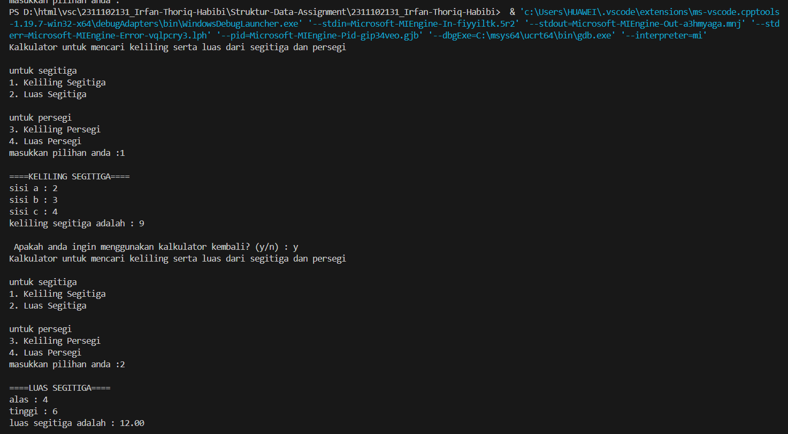
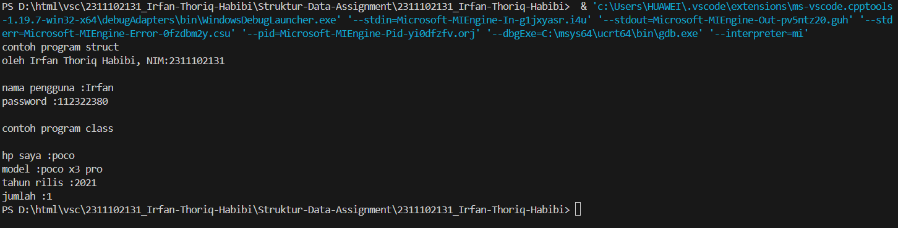
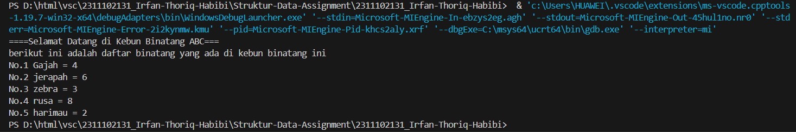

# <h1 align="center">Laporan Praktikum Modul Tipe Data</h1>
<p align="center">Irfan Thoriq Habibi - 2311102131</p>

## Dasar Teori

tipe data merupakan sebuah jenis nilai atau berupa nilai yang mana akan ditampung oleh variabel. kehadiran dari tipe data ini wajib ada pada saat membuat sebuah variabel. Tujuannya supaya variabel memiliki nilai yang spesifik dan jelas saat digunakan nanti. tipe data dibagi menjadi 3 antara lain :
1.Tipe Data Primitif<br/>
Tipe data ini merupakan tipe data  dasar  yang telah menjadi bawaan dari bahasa pemerograman salah satunya c++. Contoh tipe data primitif antara lain:
  -int (terdiri dari bilangan bulat)
  -float(terdiri dari bilangan desimal)
  -char(terdiri dari huruf)
  -boolean( terdiri dari true/false)

2.Tipe Data Abstrak<br/>
Tipe data abstrak (ADT) adalah tipe data yang berisi banyak tipe data sehingga memoliki nilai yang dapat lebih dari satu. salah satu contoh fitur pada tipe data ini ialah class dan struct yang mana mereka berfungsi untuk membungkus tipe data yang berada didalamnya sebagai anggota

3.Tipe Data Koleksi<br?>
Tipe data koleksi merupakan suatu tipe yang digunakan untuk menyimpan dan mengelompokkan berbagai macam objek maupun nilai secara bersamaan. adapun contoh tipe data koleksi antara lain:
a. Array
Array berfungsi untuk menyimpan elemen yang sama dengan tipe data yang sama.
b. Vector
vector atau standar template library (STL)secara umum mirip dengan array yang dapat menyimpan data  yang alokasi memorinya dilakukan secara bersebelahan.
c. Map
Map hampir sama dengan array, perbedaannya ialah map memungkinkan untuk menyimpan data berupa data selain integer.
## Guided 

### 1. [Tipe data Primitif]

```C++
/*
oleh Irfan Thoriq Habibi - 2311102121
*/
#include <iostream>
#include <iomanip>
using namespace std;
int main() {
    char op;
    float num1,num2;
    // it allows user to enter operator i.e.+,-,*,/
    cout << "enter operator (+,-,*,/): ";
    cin >> op;
    //it allows user to enter the operands
    cout << "enter two operands: ";
    cin >> num1>> num2;
    //switch statemant begins 
    switch (op){
        //if user enters +
        case '+':
        cout << "result: "<< num1+num2;
        break;
        // if user enters -
        case '-':
        cout << "result: "<<num1-num2;
        break;
        //if user enters *
        case '*':
        cout << "result: "<<num1 *num2;
        break;
        //if user enters /
        case '/':
        if (num2 !=0){
            cout <<"result: "<< fixed<<setprecision(2)<<num1/num2;
        }else {
            cout <<"error ! Devision by zero is not allowed.";
        }
        break;
        //if the operator is other than +,-,*,/
        //eror message will display
        default:
        cout << " Error! Operator is not correct";
    }//switch statment ends
    return 0;
}
```
kode diatas ini digunakan untuk membuat kalkulator sederhana yang mana terdapat operasi penambahan(+),pengurangan(-),perkalian(*),pembagian(/).pengguna dapat menentukan operasi yang terdapat pada kode tersebut. setelah memilih operasi yang diinginkan, pengguna akan diminta untuk memasukkan angka yang diinginkan. didalam kode ini juga terdapat dau tipe data primitif yakni char dan float. char digunakan untuk menyimpan suatu karakter dan float digunakan untuk menyimpan bilangan pecahan.

### 2. [Tipe data Abstrak]

```C++
/*
oleh Irfan Thoriq Habibi - 2311102121
*/
#include <stdio.h>
#include <string.h>
//struct
struct Mahasiswa
{
    char name[50];
    char address[100];
    int age;
};
int main() {
    //menggunakan struct
    struct Mahasiswa mhs1, mhs2;
    //mengisi nilai ke struct
    strcpy(mhs1.name, "Dian");
    strcpy(mhs1.address, "Mataram");
    mhs1.age =22;
    strcpy(mhs2.name, "Bambang");
    strcpy(mhs2.address, "Surabaya");
    mhs2.age =23;
    //mencetak isi struct 
    printf("## Mahasiswa 1 ##\n");
    printf("Nama: %s\n", mhs1.name);
    printf("Alamat: %s\n", mhs1.address);
    printf("Umur: %d\n", mhs1.age);
    printf ("\n");
    printf("## Mahasiswa 2 ##\n");
    printf("Nama: %s\n", mhs2.name);
    printf("Alamat: %s\n", mhs2.address);
    printf("Umur: %d\n", mhs2.age);
    return 0;
}
```
kode tersebut merupakan contoh dari penggunaan struct. struct pada kode tersebut berfungsi untuk menyimpan suatu informasi data diri dari mahasiswa seperti nama,alamat,dan umur. pada struct ini, terdapat tipe data seperti char name dan char address yang berukuran 50 serta int age. lalu untuk fungsi utamanya terdapat nilai yang telah data diri dari mahasiswa.
### 3. [Tipe data koleksi]

```C++
/*
oleh Irfan Thoriq Habibi - 2311102121
*/
#include <iostream>
#include <array>
using namespace std;

int main (){
    //deklarasi dan inisialisasi array
    int nilai[5];
    nilai[0] = 23;
    nilai[1] = 50;
    nilai[2] = 34;
    nilai[3] = 78;
    nilai[4] = 90;
    
    // mencetak array dengan tab
    cout << "Isi array pertama : "<< nilai[0]<<endl;
    cout << "Isi array kedua : "<< nilai[1]<<endl;
    cout << "Isi array ketiga : "<< nilai[2]<<endl;
    cout << "Isi array keempat : "<< nilai[3]<<endl;
    cout << "Isi array kelima : "<< nilai[4]<<endl;
    
    return 0;
}
```
kode ini digunakan untuk menyimpan data dengan sebuah array yang mana array itu sendiri ialah tidak data koleksi. array disini menyimpan nilai sebanyak 5 yang dimulai dari 0 hingga 4. adapun isi nilainya antara lain 23,50,34,78,dan 90.

## Unguided 

### 1. [Buatlah program menggunakan tipe data primitif minimal dua fungsi dan bebas.Menampilkan program, jelaskan program tersebut dan ambil kesimpulan dari materi tipe data primitif!]

```C++
/*
oleh Irfan Thoriq Habibi - 2311102121
*/
#include <iostream>
#include <iomanip>//untuk mengatur bilangan desimal

using namespace std;

//deklarasi variabel
char no_131;
float sisi_131;
float a_131,b_131,c_131;
float alas_131,tinggi_131;

void menu (){//looping pada menu yang terdapat pilihan mencari keliling dan luas dari segitiga dan persegi.
    cout << "Kalkulator untuk mencari keliling serta luas dari segitiga dan persegi"<<endl;
    cout <<endl;
    cout <<"untuk segitiga";
    cout <<"\n1. Keliling Segitiga";
    cout <<"\n2. Luas Segitiga"<<endl;
    cout<<endl;
    cout <<"untuk persegi ";
    cout <<"\n3. Keliling Persegi";
    cout <<"\n4. Luas Persegi"<<endl; 
    cout <<"masukkan pilihan anda :";
    cin >> no_131;
}
void program1() {//ini merupakan fungsi untuk menghitung keliling segitiga yang mana rumusnya ialah menjumlahkan ketiga sisinya (a+b+c)
    cout <<"\n====KELILING SEGITIGA===="<<endl;
    cout << "sisi a : ";
    cin >> a_131;
    cout << "sisi b : ";
    cin >> b_131;
    cout << "sisi c : ";
    cin >> c_131;
    cout << "keliling segitiga adalah : "<< a_131 + b_131 + c_131 <<endl;
}

void program2(){//ini merupakan fungsi untuk menghitung luas segitiga yang mana rumusnya adalah 0.5 * alas * tinggi
    cout <<"\n====LUAS SEGITIGA===="<<endl;
    cout << "alas : ";
    cin >> alas_131;
    cout << "tinggi : ";
    cin >> tinggi_131;
    cout << "luas segitiga adalah : "<< fixed<<setprecision(2)<< 0.5*alas_131*tinggi_131 <<endl;
}
void program3(){//ini merupakan fungsi untuk menghitung keliling persegi yang mana rumusnya (sisi+sisi+sisi+sisi)
    cout <<"\n===KELILING PERSEGI==="<<endl;
    cout <<"sisi :";
    cin >>sisi_131;
    cout << "Keliling Persegi adalah :"<< sisi_131 + sisi_131 + sisi_131 + sisi_131<<endl;
}
void program4(){//ini merupakan fungsi untuk menghitung luas persegi
    cout << "\n===LUAS PERSEGI==="<<endl;
    cout << "sisi :";
    cin >> sisi_131;
    cout << "Luas Persegi adalah :"<<sisi_131 * sisi_131<<endl;
}


int main() {//fungsi utama
    string ulang_131;
    do { //looping pada menu
        menu(); //memanggil fungsi menu yang didalamnya terdapat case 1-4.
        switch (no_131) {//memilih program yang sesuai dengan yang diinginkan oleh pengguna
            case '1':
                program1();
            break;
            case '2':
                program2();
            break;
            case '3':
                program3();
            break;
            case '4':
                program4();
            break;
            default:
            cout << "gagal.... mohon untuk menginputkan pilihan dengan benar"<<endl;
        }
        cout << "\n Apakah anda ingin menggunakan kalkulator kembali? (y/n) : ";
        cin >> ulang_131;
    }while (ulang_131 =="y" ||ulang_131 =="Y");
    return 0;
}
```

#### Output 1:

#### Output 2:
_2311102131_IrfanThoriqHabibi.png)

 program diatas berisi kalkulator yang berfungsi untuk menghitung keliling dan luas dari segitiga dan persegi. user hanya perlu menginputkan angka yang diinginkannya sebab didalam program ini telah di inputkan rumus untuk setiap pilihan yang ada didalamnya. Didalam program ini terdapat 4 fungsi dan 1 prosedur. selain itu juga terdapat pengulangan do-while yang mana terdapat pilihan (y/n) yang dapat dipilih oleh user jika ia ingin melanjutkan atau menghentikan program.

 Kesimpukan Tipe Data Primitif
 Tipe data primitif merupakan suatu tipe data yang penting sebab berfungsi sebagai pondasi dalam program. tipe data ini berguna untuk menyimpan nilai-nilai yang bersifat sederhana seperti bilangan bulat,desimal,hingga karakter.

### 2. [Jelaskan fungsi dari class dan struct secara detail dan berikan contoh programnya]

```C++
/* 
1. Fungsi Class
class adalah salah satu konsep dari OOP (Object Oriented Programming)yang digunakan untuk membungkus 
suatu data abstraksi procedural sebagai deskripsi yang tergeneralisir atau rangcangan dari sebuah object 
untuk mendefinisikan atau menggambarakan isi dan tingkah laku sebagai entitas dari sebuah objek. 
*/
/*
2. Fungsi Struct
 struct merupakan struktur data yang mana membentuk tipe data baru dengan cara menggabungkan satu tipe data dengan tipe data yang berbeda didalam C++.struct dapat menyimpan serta menggabungkan berbagai variabel tipe data yang berbeda
*/

// Contoh program dari fungsi struct dan class
#include <iostream>
using namespace std;

//deklarasi dari Struct data_131 yang didalamnya berisi data string (nama),char (jurusan) dan int (umur).
struct data_131 {
    string username_131;
    int password_131;
};
//deklarasi dari class hp_131 yang idalamnya berisi string(brand,model)dan int (tahunrilis,jumlah)
class hp_131 {
    public :
       string brand_131;
       string model_131;
       int tahunrilis_131;
       int jumlah_131;
};

int main (){
    //inisialisasi dari fungsi struct (data_131)di atas yang terdiri dari username dan password
    cout << "contoh program struct "<<endl;
    cout << "oleh Irfan Thoriq Habibi, NIM:2311102131"<<endl;
    cout << endl;
    data_131 data{"Irfan ",112322380};
    cout << "nama pengguna :"<<data.username_131<<endl;
    cout << "password :"<<data.password_131<<endl;
    cout<<endl;

    //inisialisasi dari fungsi class (hp_131)di atas yang terdiri dari brand,model,tahun rilis,dan jumlah.
    hp_131 hp;
    hp.brand_131 = "poco";
    hp.model_131 = "poco x3 pro";
    hp.tahunrilis_131 = 2021;
    hp.jumlah_131 = 1;
    cout << "contoh program class "<<endl;
    cout << endl;
    cout << "hp saya :"<<hp.brand_131<<endl;
    cout << "model :"<<hp.model_131<<endl;
    cout << "tahun rilis :"<<hp.tahunrilis_131<<endl;
    cout << "jumlah :"<<hp.jumlah_131<<endl;
    return 0;
}

```

#### Output 1:


kode ini digunakan untuk mencetak struct dan class.didalam kode ini terdapat data_131 yang berfungsi untuk mendeklarasikan string username_131 dan int password_131. selain itu juga terdapat hp_131 yang berfungsi untuk mendeklarasi string brand_131,string model_131, serta int tahunrilis_131,dan int jumlah_131. kemudian struct dan class yang telah di deklarasikan akan di inisialisasikan didalam int main.

A.fungsi struct
struct merupakan struktur data yang mana membentuk tipe data baru dengan cara menggabungkan satu tipe data dengan tipe data yang berbeda didalam C++.struct dapat menyimpan serta menggabungkan berbagai variabel tipe data yang berbeda
B.fungsi class
class adalah salah satu konsep dari OOP (Object Oriented Programming)yang digunakan untuk membungkus suatu data abstraksi procedural sebagai deskripsi yang tergeneralisir atau rangcangan dari sebuah object untuk mendefinisikan atau menggambarakan isi dan tingkah laku sebagai entitas dari sebuah objek.

### 3. [Buat dan jelaskan program menggunakan fungsi map dan jelaskan perbedaan dari array dengan map.]

```C++
/*
oleh Irfan Thoriq Habibi - 2311102121
*/
//contoh dari Program Fungsi Map
#include <iostream>
#include <map> //berfungsi supaya bisa menggunakan fungsi struktur data map
using namespace std;

int main() {
    //Deklarasi map dengan key int yang memiliki value yakni setring
    map<int, string> binatang_131;

    // Menambahkan elemen-elemen yang berada didalam map yang berisi macam-macam hewan yang berada di kebun binatang
    //setiap binatang memiliki jumlah yang berbeda-beda
    binatang_131[1] = "Gajah = 4";
    binatang_131[2] = "jerapah = 6";
    binatang_131[3] = "zebra = 3";
    binatang_131[4] = "rusa = 8";
    binatang_131[5] = "harimau = 2"; 

    cout << "====Selamat Datang di Kebun Binatang ABC==="<<endl;
    cout << "berikut ini adalah daftar binatang yang ada di kebun binatang ini"<<endl;
    //menggunakan loop mencetak nomor dan macam-macan binatang beserta jumlahnya.
    for (int b =1;b<=binatang_131.size();b++){
        cout <<"No."<< b <<" "<<binatang_131[b]<<endl;
    }
    return 0;
}


```
#### Output:


kode ini berfungsi untuk mencetak isi yang terdapat pada suatu map. pada kode ini, terdapat map binatangn_131 dengan key int dengan tipe data string yang mana telah terisi berbagai macam binatang beserta jumlahnya. lalu map akan menampilkan data yang telah di tersimpan.

1.perbedaan array dan map
array merupakan suatu kumpulan dari nilai-nilai yang bertipe sama sedangkan map memungkinkan penggunanya untuk menggunakan tipe data yang berbeda selain interger.


## Kesimpulan
Tipe data pada C++ sangatlah penting dalam pemrograman sebab tipe data digunakan untuk menetukan,menyimpan,hingga mengubah data didalam program. selain itu, dengan memahami dan memperdalam pengetahuan mengenai tipe data akan sangat membantu programer untuk membuat program yang lebih optimal.  [1].

## Referensi
[1] Putra, Muhammad Taufik Dwi, Munawir Munawir, and Ana Rahma Yuniarti. "BELAJAR PEMROGRAMAN LANJUT DENGAN C++." (2023).
[2] Pratama, Muhammad A. “STRUKTUR DATA ARRAY DUA DIMENSI PADA PEMROGRAMAN C++.” OSF Preprints, 29 Mar. 2020. Web.
