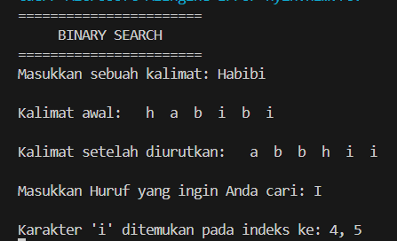
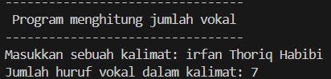
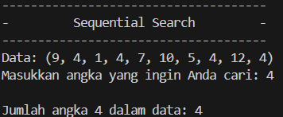

# <h1 align="center">Laporan Praktikum Modul ALGORITMA SEARCHING</h1>
<p align="center">Irfan Thoriq Habibi - 2311102131</p>

## Dasar Teori
A. Pengertian Algoritma Searching<br/>
Searching merupakan suatu proses dalam mencari nilai maupun kata didalam kumpulan data. searching sendiri dibagi menjadi 2 yakni sequential search dan binary search.<br/>
<br/>
a. Algoritma Sequential Search<br/>
   sequential search merupakan suatu proses membandingkan setiap elemen larik satu persatu secara berurutan, mulai dari awal hingga semua elemen dicari hingga ditemuka atau seluruh elemen telah habis diperiksa.<br/>
Berikut ini merupakan langkah-langkah pencarian dengan menggunakan sequential search :<br/>
1.Melakukan perbandingan secara berurutan terhadap data dengan menggunakan kata kunci.<br/>
2.sequential search melakukan looping(pengulangan) dari data awal hingga jumlah data-n.<br/>
3.Setiap looping(pengulangan) yang dilakukan, maka setiap karakter akan dilakukan pencocokan data dengan kata kunci yang telah di inputkan.<br/>
4.Jika data cocok dengan kata kunci yang telah diinputkan,maka data berhasil ditemukan dan pencarian akan dihentikan. Begitu juga sebaliknya, apabila data tidak cocok dengan kata kunci yang diinputkan hingga data terakhir, maka pencarian kata kunci didalam data akan dihentikan dan data tidak ditemukan.<br/>
<br/>
b. Algoritma Binary Search<br/>
   Binary Search merupakan suatu cara/tehnik dalam melakukan pencarian data dengan cara berulang kali membagi separuh dari jumlah data yang dicari sehingga memperkecil pencarian menjadi satu data. Algoritma ini digunakan untuk ketika memerlukan pencarian dengan waktu yang cepat.<br/>
Berikut ini merupakan langkah-langkah pencarian dengan menggunakan binary search :<br/>
1.Mengurutkan semua data terlebih dahulu yang dapat dilakukan secara ascending (depan-belakang) maupun descending (belakang-depan).<br/>
2.Membagi data dengan 2. jika data yang dicari lebih kecil dari data yang terletak ditengah, maka pencarian akan berlanjut ke arah kiri. Dan apabila data yang dicari lebih besar dari data yang berada di tengah, maka pencarian akan berlanjut ke arah kanan. Hal itu akan berulang hingga kata kunci yang diinputkan dapat ditemukan.<br/>

## Guided 

### 1. [Buatlah sebuah project dengan menggunakan sequential search sederhana untuk melakukan pencarian data.]

```C++
/*
Irfan Thoriq Habibi - 2311102131
*/
#include <iostream>

using namespace std;

int main (){
    int n = 10;
    int data[n] = {9,4,1,7,5,12,4,13,4,10};
    int cari = 10;
    bool ketemu = false;
    int i;

    for (i = 0; i < n; i++){
        if ( data [i]==cari){
            ketemu = true;
            break;
        }
    }
    cout << " Program Sequential search"<<endl;
    cout << "data : {9,4,1,7,5,12,4,13,4,10}"<<endl;

    if (ketemu){
        cout << "\nangka "<<cari<<" ditemukan pada indeks ke -"<<endl;
    }else{
        cout <<"data tidak diketemukan"<<endl;
    }
    return 0;
}
```
pada program sequential search ini, terdapat 10 data dengan urutan acak didalamnya. program ini berfungsi untuk mencari data dengan kata kunci "10" yang tersimpan pada indeks ke berapa. ketika program dijalankan, program akan mencari kata kunci "10" berada pada indeks ke berapa. setelah ketemu, program akan menampilkan pesan "angka 10 ditemukan pada indeks ke -9".

### 2. [Buatlah sebuah project untuk melakukan pencarian data dengan menggunakan Binary Search.]

```C++
/*
Irfan Thoriq Habibi - 2311102131
*/
#include <iostream>
#include <conio.h>
#include <iomanip>

 using namespace std;

int dataaray[7]= {1,8,2,5,4,9,7};
int cari;

void selection_sort(){
    int temp, min,i,j;
    for (i = 0; i <7; i++){
        min = i;
        for (j = i +1;j<7;j++){
            if (dataaray[j]<dataaray[min]){
                min = j;
            }
        }
        temp = dataaray[i];
        dataaray[i]=dataaray[min];
        dataaray[min] = temp;
    }
}
void binarysearch(){
    int awal,akhir,tengah;
    bool b_flag = false;
    awal = 0;
    akhir = 6;
    while (!b_flag && awal <= akhir){
        tengah = (awal + akhir)/2;
        if (dataaray[tengah <cari]){
            b_flag = true;
        }else if(dataaray[tengah] < cari){
            awal = tengah +1;
        }else{
            akhir = tengah -1;
        }
        }
        if (b_flag){
            cout <<"\nData ditemuka pada index ke - "<<endl;
        }else{
            cout<< "\nData tidak ditemukan"<<endl;
        }
    }
    int main (){
        cout << "binary search"<<endl;
        cout <<"\ndata :"<<endl;
        for ( int x = 0; x <7;x++){
            cout<<setw(3)<<dataaray[x];
        }
        cout<<endl;
        cout << "masukkan data yang ingin dicari";
        cin>>cari;
        cout <<"\ndata diurutkan :";
        selection_sort();
        for (int x = 0; x < 7;x++){
            cout<<setw(3)<<dataaray[x];
        }
        cout << endl;
        binarysearch;
        _getche();
        return 0;
    }
```
pada program binary search ini, terdapat 7 data (1,8,2,5,4,9,7)yang tersimpan didalam array. user disini dapat menginputkan angka berapa yang ingin dicarinya. berbeda dengan guided sebelumnya, pada binary search ini, data didalam array akan diurutkan terlebih dahulu secara ascending. yang awalnya (1,8,2,5,4,9,7) setelah diurutkan akan menjadi (1,2,4,5,7,8,9).setelah data pada array diurutkan, program akan mencari kata kunci "7" yang diinputkan oleh user berada pada indeks ke berapa. setelah data ditemukan, program akan menampilakn "Data ditemukan pada indeks ke- 4"(sebab data telah diurutkan secara ascending dan indeks dimulai dari 0).

## Unguided 

### 1. [Buatlah sebuah program untuk mencari sebuah huruf pada sebuah kalimat yang sudah di input dengan menggunakan Binary Search!]

```C++
/*
Irfan Thoriq Habibi - 2311102131
*/
#include <iostream>
#include <conio.h>
#include <iomanip>
using namespace std;

// Fungsi untuk mengurutkan array karakter menggunakan selection sort
void selectionsort_131(char dataArray_131[], int length) {
    int temp, min, i, j;
    for (i = 0; i < length - 1; i++) {
        min = i;
        for (j = i + 1; j < length; j++) {
            if (dataArray_131[j] < dataArray_131[min]) {
                min = j;
            }
        }
        temp = dataArray_131[i];
        dataArray_131[i] = dataArray_131[min];
        dataArray_131[min] = temp;
    }
}
// Fungsi untuk mencari karakter menggunakan binary search
void binarysearch_131(char dataArray_131[], int length, char cari) {
    int awal, akhir, tengah;
    bool b_flag = false;
    awal = 0;
    akhir = length - 1;
    int firstIndex = -1;

    // Cari indeks pertama dari karakter yang dicari menggunakan binary search
    while (awal <= akhir) {
        tengah = (awal + akhir) / 2;
        if (dataArray_131[tengah] == cari) {
            b_flag = true;
            firstIndex = tengah;
            akhir = tengah - 1;  
        } else if (dataArray_131[tengah] < cari) {
            awal = tengah + 1;
        } else {
            akhir = tengah - 1;
        }
    }

    if (b_flag) {
        cout << "\nKarakter '" << cari << "' ditemukan pada indeks ke- ";
        for (int i = firstIndex; i < length && dataArray_131[i] == cari; i++) {
            cout << i << " ";
        }
        cout << endl;
    } else {
        cout << "\nKarakter '" << cari << "' tidak ditemukan\n";
    }
}

int main() {
    char kalimat[30];
    char cari;

    cout << "\tBINARY SEARCH" << endl;
    cout << "\nMasukkan sebuah kalimat: ";
    cin.getline(kalimat, 30);

    // Menghapus spasi dan menghitung panjang kalimat tanpa spasi
    int n = 0;
    for (int i = 0; kalimat[i] != '\0'; i++) {
        if (kalimat[i] != ' ') {
            kalimat[n++] = kalimat[i];
        }
    }
    kalimat[n] = '\0';  // Null-terminate the string

    // Tampilkan data awal
    cout << "\nKalimat tanpa spasi: ";
    for (int i = 0; i < n; i++) {
        cout << setw(3) << kalimat[i];
    }
    cout << endl;

    // Urutkan data dengan selection sort
    selectionsort_131(kalimat, n);

    // Tampilkan data setelah diurutkan
    cout << "\nKalimat setelah diurutkan: ";
    for (int i = 0; i < n; i++) {
        cout << setw(3) << kalimat[i];
    }
    cout << endl;

    cout << "\nMasukkan Huruf yang ingin Anda cari: ";
    cin >> cari;

    // Cari Huruf menggunakan binary search dan tampilkan semua indeks
    binarysearch_131(kalimat, n, cari);

    _getche();
    return 0;
}

```
#### Output:


program ini merupakan program Binary search untuk mencari suatu karakter berada dalam indeks keberapa didalam suatu kalimat. disini, user menginputkan Habibi yang kemudian program mengurutkan tiap huruf secara ascending (dari awal hingga terakhir). setelah setiap huruf diurutkan, user menginputkan "i" untuk mencari karakter "i" berada pada indeks ke berapa. kemudian, program akan menampilkan bahwa karakter "i" ditemukan pada indeks ke 4,5.

### 2. [Buatlah sebuah program yang dapat menghitung banyaknya huruf vocal dalam sebuah kalimat!]

```C++
/*
Irfan Thoriq Habibi - 2311102131
*/
#include <iostream>
#include <string>
using namespace std;

// Fungsi untuk memeriksa apakah suatu karakter adalah huruf vokal
bool vokal_131(char huruf_131) {
    huruf_131 = tolower(huruf_131);  // Mengubah karakter menjadi huruf kecil untuk memudahkan pengecekan
    return huruf_131 == 'a' || huruf_131 == 'e' || huruf_131 == 'i' || huruf_131 == 'o' || huruf_131 == 'u';
}

// Fungsi untuk menghitung banyaknya huruf vokal dalam sebuah kalimat
int Banyakvokal_131(const string& kalimat_131) {
    int count = 0;
    for (char ch : kalimat_131) { 
        if (vokal_131(ch)) {  
            count++;  
        }
    }
    return count; 
}

int main() {
    string data_131;

    cout << "---------------------------------"<<endl;
    cout << " Program menghitung jumlah vokal "<<endl;
    cout << "---------------------------------"<<endl;
    cout << "Masukkan sebuah kalimat: ";
    getline(cin, data_131); 

    // Menghitung jumlah huruf vokal
    int Jumlavokal_131 = Banyakvokal_131(data_131); 
    cout << "Jumlah huruf vokal dalam kalimat: " << Jumlavokal_131 << endl;

    return 0;
}

```
#### Output:


program ini merupakan program sequential search yang berfungsi untuk menghitung jumlah huruf vokal pada suatu kata/kalimat. disini user menginputkan "irfan thoriq habibi"  untuk mencari berapakah jumlah huruf vokal dalam kalimat tersebut. kemudian, program akan menampilkan jumlah huruf vokal (a,i,u,e,o)yang berada dalam kalimat tersebut. Jumlah huruf vokal pada kalimat tersebut ialah "7"

### 3. [Diketahui data = 9, 4, 1, 4, 7, 10, 5, 4, 12, 4. Hitunglah berapa banyak angka 4dengan menggunakan algoritma Sequential Search!]

```C++
/*
Irfan Thoriq Habibi - 2311102131
*/

#include <iostream>
using namespace std;

int main() {
    // Deklarasi variabel dan inisialisasi nilai awal
    int n = 10; 
    int data_131[n] = {9, 4, 1, 4, 7, 10, 5, 4, 12, 4}; 
    int cari_131;
    int count = 0; 

    cout << "-------------------------------------" << endl;
    cout << "-         Sequential Search         -" << endl;
    cout << "-------------------------------------" << endl;
    cout << "Data: (9, 4, 1, 4, 7, 10, 5, 4, 12, 4)" << endl;
    cout << "Masukkan angka yang ingin Anda cari: ";
    cin >> cari_131;

    // Melakukan pencarian berurutan dalam array
    for (int i = 0; i < n; i++) {
        if (data_131[i] == cari_131) {
            count++;
        }
    }
    cout << "\nJumlah angka " << cari_131 << " dalam data: " << count << endl;

    return 0;
}

```
#### Output:


program ini merupakan program sequential search yang berfungsi untuk mencari jumlah angka dalam array. disini terdapat array yang menyimpan 10 data (9, 4, 1, 4, 7, 10, 5, 4, 12, 4) didalamnya. disini user menginputkan "4" untuk mencari berapa jumlah angka 4 didalam array tersebut. kemudian program akan menampilkan jumlah angka 4 yang tersimpan didalam array. jumlah angka 4 yang berada didalam data ialah "4".

## Kesimpulan
Algoritma searching dibagi menjadi 2 macam yakni sequential search dan binary search.Algoritma Sequential search merupakan metode pencarian yang paling sederhana dengan proses pencarian yang dilakukan secara beruntun. sedangkan Algortima Binary search merupakan suatu pencarian yang dgunakan ketika membutuhkan waktu yang cepat.[1].

## Referensi
[1] Markuci, Dian, and Cahyo Prianto. "Analisis perbandingan penggunaan algoritma Sequential Search dan Binary Search pada aplikasi surat perjalanan dinas." JATI (Jurnal Mahasiswa Teknik Informatika) 6.1 (2022): 110-119..<br/>
[2] Imamah, Nurul. "Perbandingan Algoritma Sequential Search Dan Algoritma Binary Search Pada Aplikasi Kamus Bahasa Indonesia Menggunakan Php Dan Jquery." COMPUTING| Jurnal Informatika 8.01 (2021): 1-6.