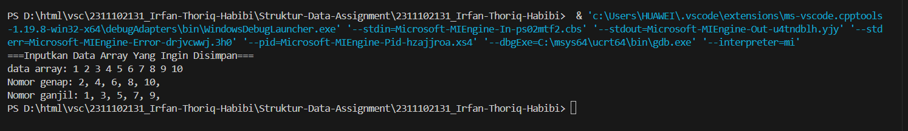
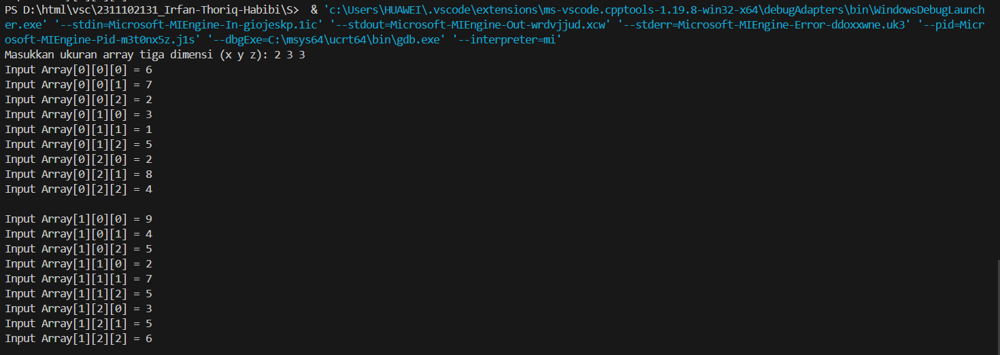
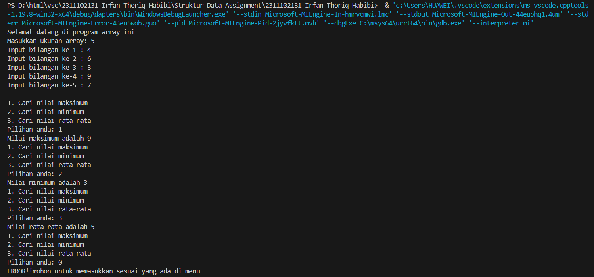

# <h1 align="center">Laporan Praktikum Modul Array</h1>
<p align="center">Irfan Thoriq Habibi - 2311102131</p>

## Dasar Teori

ARRAY<br/>
Pergertian Array<br/>
 Array merupakan suatu struktur atau tipe data yang terdiri dari  sejumlah elemen yang memiliki tipe data yang sama.semua elemen yang terdapat pada array beritipe sama dan telah tersusun secara sekuensial didalam memori komputer. array terbagi menjadi beberapa bagian antara lain :<br/>
- Array 1 dimensi<br/>
 array 1 dimensi merupakan array yang mena kumpulan elemen-elemennya sama dan tersusun didalam satu baris, tetapi isi dari setiap elemen dapat berbeda.contoh deklarasi array 1 dimensi seperti: int x [3];<br/>
- Array 2 dimensi<br/>
array 2 dimensi biasanya digambarkan sebagai matriks yang mana array ini adalah perluasan dari array 1 dimensi. Berbeda dari array 1 dimensi yang hanya terdiri dari sebuah bari dengan beberapa kolom elemen, array 2 dimensi dapat menggunakan beberapa bari dan juga beberapa kolom elemen yang bertipe sama. contoh deklarasi array 2 dimensi seperti int x [6][8];<br/>
- array 3 dimensi<br/>
 array 3 dimensi  berfungsi sebagai tipe data yang mengelola data dalam bentuk 3 dimensi. contoh deklarasi array 3 dimensi seperti : int x [4][5][6];<br/>

## Guided 

### 1. [Program input array 3 dimensi]

```C++
/*
oleh Irfan Thoriq Habibi - 2311102121
*/
#include <iostream>
using namespace std;
//PROGRAM INPUT ARRAY 3 DIMENSI
int main(){
    //Deklarasikan araay 
    int arr[2][3][3];
    //input elemen
    for (int x = 0; x < 2; x++){
        for (int y = 0; y < 3; y++){
            for ( int z = 0; z <3; z++){
                cout << "Input Array[" << x << "][" << y << "][" <<z << "] = ";
                cin >> arr [x][y][z];
            }
        }
        cout << endl;
    }
    // Output Array 
    for (int x = 0; x < 2; x++){
        for (int y = 0; y < 3; y++){
            for (int z = 0; z < 3; z++){
                cout << "Data Array[" << x << "][" << y << "][" << z << "] = " << arr[x][y][z] << endl;
            }
        }
    }
    cout << endl;
    // Tampilan array
    for  ( int x= 0; x < 2;x++){
        for (int y = 0; y < 3; y++){
            for ( int z = 0; z <3; z++){
                cout << arr[x][y][z] <<ends;
    }
    cout << endl;
}
cout << endl;
}
}
```
 Program ini digunakan untuk menyimpan array 3 dimensi. ketika program dijalankan, user diminta untuk menginputkan angka yang sesuai dengan jumlah atau ukuran elemen yang sudah ada didalam program. setelah menginputkan semua array, program akan menampilkan angka apa saja yang telah disimpannya.

### 2. [Program Mencari Nilai Maksimal pada Array]

```C++
/*
oleh Irfan Thoriq Habibi - 2311102121
*/
#include <iostream>
using namespace std;
int main (){
    int maks, a, i = 1, lokasi;
    cout <<"masukkan panjang array :";
    cin>>a; 
    int array[a];
    cout << " masukkan " << a << "angka\n";
    for ( i =0; i < a; i++){
        cout << " array ke-"<< (i) << ": ";
        cin >> array[i];
    }
    maks = array[0];
    for (i =0; i <a; i++){
        if  (array[i] > maks){
            maks = array[i];
            lokasi = i;
        }
    }
    cout << "Nilai maksimum adalah " << maks << " berada di array ke " <<lokasi <<endl;
}
```
program ini berfungsi untuk mencari nilai maksimum atau nilai terbesar dari bilangan yang telah diinputkan oleh user pada array. ketika dijalankan, program akan meminta user untuk menginput panjang dari array. setelah itu, program akan program akan meminta user untuk menginputkan angka atau nilai pada setiap array. contohnya jika user menginputkan panjang array itu 5, maka program akan meminta user untuk menginputkan angka atau nilai sebanyak 5 kali. angka dan nilai yang telah tersimpan akan dimunculkan mulai dari array ke-0 hingga array ke-4. lalu program akan mencari nilai maksimum atau terbesar dan akan menampilkan ada pada array keberapa.

## Unguided 

### 1. [Buatlah program untuk menampilkan output seperti berikut dengan data yang diinputkan oleh user]

```C++
/*
oleh Irfan Thoriq Habibi - 2311102121
*/
#include <iostream>
#include <array>

using namespace std;

int main() {
    //// Mendeklarasikan array untuk menyimpan data yang berukuran 10
    array<int, 10> data_131;
    int angka_131;

    // Input data array dari user
    cout << "===Inputkan Data Array Yang Ingin Disimpan=== "<<endl;
    cout << "data array: ";
    for (int i_131 = 0; i_131 < 10; i_131++) {
        cin >> angka_131;
        data_131[i_131] = angka_131;
    }

    // Menampilkan angka genap dari data array
    cout << "Nomor genap: ";
    for (int i_131 = 0; i_131 < 10; i_131++) {
        if (data_131[i_131] % 2 == 0)
            cout << data_131[i_131] << ", ";
    }
    cout << endl;

    // Menampilkan angka ganjil dari data array
    cout << "Nomor ganjil: ";
    for (int i_131 = 0; i_131 < 10; i_131++) {
        if (data_131[i_131] % 2 != 0)
            cout << data_131[i_131] << ", ";
    }
    cout << endl;

    return 0;
}

```
#### Output:


Program ini menggunakan 10 data array untuk mencari nomor ganjil dan nomor genap. ketika user sudah menginputkan 10 macam angka kedalam data array, program akan memprosesnya dan mengelompokkan angka angka tersebut kedalam kelompok nomor ganjil maupun genap.

### 2. [Buatlah program input array tiga dimensi (seperti di guided) tetapi jumlah atau ukuran elemennya diinputkan oleh user!]

```C++
/*
oleh Irfan Thoriq Habibi - 2311102121
*/
#include <iostream>
using namespace std;

int main() {
    int x_131, y_131, z_131;

    // Meminta pengguna untuk memasukkan ukuran array tiga dimensi
    cout << "Masukkan ukuran array tiga dimensi "<<endl;
    cout << "x :";
    cin >> x_131;
    cout << "y :";
    cin >> y_131;
    cout << "z :";
    cin >> z_131;

    // Deklarasi array sesuai dengan ukuran yang dimasukkan oleh pengguna
    int arr[x_131][y_131][z_131];

    // Input elemen array
    for (int x = 0; x < x_131; x++) {
        for (int y = 0; y < y_131; y++) {
            for (int z = 0; z < z_131; z++) {
                cout << "Input Array[" << x << "][" << y << "][" << z << "] = ";
                cin >> arr[x][y][z];
            }
        }
        cout << endl;
    }

    // Output elemen array
    for (int x = 0; x < x_131; x++) {
        for (int y = 0; y < y_131; y++) {
            for (int z = 0; z < z_131; z++) {
                cout << "Data Array[" << x << "][" << y << "][" << z << "] = " << arr[x][y][z] << endl;
            }
        }
    }
    cout << endl;

    // Tampilan array
    for (int x = 0; x < x_131; x++) {
        for (int y = 0; y < y_131; y++) {
            for (int z = 0; z < z_131; z++) {
                cout << arr[x][y][z] << " ";
            }
            cout << endl;
        }
        cout << endl;
    }

    return 0;
}


```
#### Output 1:

#### Output 2:
_2_2311102131_irfanthoriqhabibi.png)

 Program ini digunakan untuk menyimpan array 3 dimensi. program ini mirip dengan guided1. tetapi didalam program ini,jumlah dan elemennya diinputkan oleh user sendiri. setelah itu user diminta untuk menginputkan angka atau bilangan ke dalam tiap array. setelah menginputkan semua array, program akan menampilkan angka atau bilangan apa saja yang telah disimpannya sesuai dengan baris dan kolomnya.

### 3. [Buatlah program menu untuk mencari nilai Maksimum, Minimum, dan Nilai rata-rata dari suatu array dengan input yang dimasukkan oleh user]

```C++
/*
irfan thoriq habibi
*/
#include <iostream>
#include <iomanip>

using namespace std;

// Variabel untuk menyimpan pilihan, ukuran array, nilai maksimum, minimum, rata-rata,dan total.
char pilih_131; 
int ukuran_131, maks_131, min_131, rata_131;
double total_131; 

// Fungsi untuk meminta pengguna menginputkan ukuran array
void dataarray_131() {
    cout << "Masukkan ukuran array: ";
    cin >> ukuran_131;
}

// Fungsi untuk menampilkan menu pilihan
void menu_131() {
    cout << "1. Cari nilai maksimum \n";
    cout << "2. Cari nilai minimum \n";
    cout << "3. Cari nilai rata-rata \n";
    cout << "0. Keluar dari program \n";
    cout << "Pilihan anda: ";
    cin >> pilih_131;
}

int main() {
    cout << "Selamat datang di program array ini\n";
    
    // Meminta pengguna memasukkan ukuran array
    dataarray_131();

    // Alokasi memori dinamis untuk array
    int* array_131 = new int[ukuran_131];

    // Meminta pengguna memasukkan nilai-nilai array
    for (int i_131 = 0; i_131 < ukuran_131; i_131++) {
        cout << "Input bilangan ke-" << i_131 + 1 << " : ";
        cin >> array_131[i_131];
    }
    cout << endl;

    // Loop untuk menampilkan menu pilihan dan menjalankan operasi sesuai pilihan pengguna
    do {
        menu_131();
        switch (pilih_131) {
            case '1':
                // Mencari nilai maksimum dari array
                maks_131 = array_131[0];
                for (int i_131 = 0; i_131 < ukuran_131; i_131++) {
                    if (array_131[i_131] > maks_131) {
                        maks_131 = array_131[i_131];
                    }
                }
                cout << "Nilai maksimum adalah " << maks_131 << endl;
                break;
            case '2':
                // Mencari nilai minimum dari array
                min_131 = array_131[0];
                for (int i_131 = 0; i_131 < ukuran_131; i_131++) {
                    if (array_131[i_131] < min_131) {
                        min_131 = array_131[i_131];
                    }
                }
                cout << "Nilai minimum adalah " << min_131 << endl;
                break;
            case '3':
                // Menghitung nilai rata-rata dari array
                total_131 = 0;
                for (int i_131 = 0; i_131 < ukuran_131; i_131++) {
                    total_131 += array_131[i_131];
                }
                rata_131 = total_131 / ukuran_131;
                cout << "Nilai rata-rata adalah " << setprecision(2) << fixed << rata_131 << endl;
                break;
            case '0':
                // Keluar dari program
                cout << "Terima kasih sudah menggunakan program ini.\n";
                break;
            default:
                // Menampilkan pesan error jika pilihan tidak valid
                cout << "GAGAL!! Mohon untuk memasukkan sesuai yang ada di menu! \n";
                break;
        }
    } while (pilih_131 != '0'); // Loop akan terus berjalan sampai pengguna memilih (0)untuk keluar dari program

    // Dealokasi memori dinamis yang dialokasikan untuk array
    delete[] array_131;

    return 0;
}

```
#### Output 1:


program diatas merupakan program untuk mencari nilai maksimum, nilai minimum, dan nilai rata-rata dari ukuran array yang telah diinputkan oleh user. diawali dengan program menampilkan menu untuk menginputkan ukuran array. setelah user menginputkan ukuran array, akan ada pilihan menu yang menampilkan nilai maksimum, nilai minimum, dan nilai rata rata yang bisa dipilih oleh user

## Kesimpulan
Array merupakan suatu suatu tipe data yang memiliki fungsi untuk menyimpan sekumpulan data didalam satu tempat. array sendiri hanya dapat menyimpan tipe data yang sama yang diidentifikasikan dengan memakai satu nama saja[1].

## Referensi
[1] Pratama, Muhammad Aldi. "STRUKTUR DATA ARRAY DUA DIMENSI PADA PEMROGRAMAN C++." (2020).<br/>
[2] Kaylla, Achie, Aisyah Fadilah Rizki Siregar, and Alam Aprila. "Pembuatan Program Permainan Suit Menggunakan String Pada Aplikasi Dev C++." Emperical Research In Computer Science 1.1 (2023): 17-24.