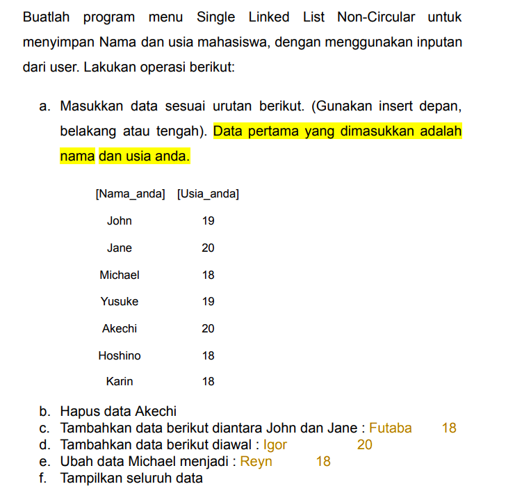
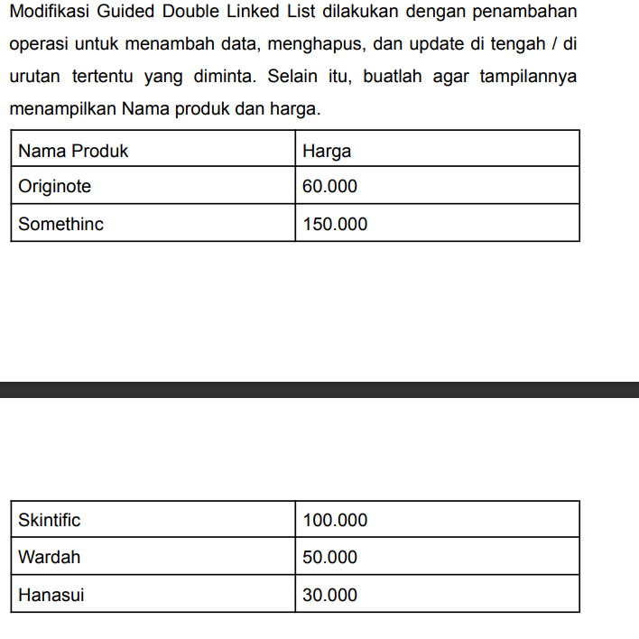
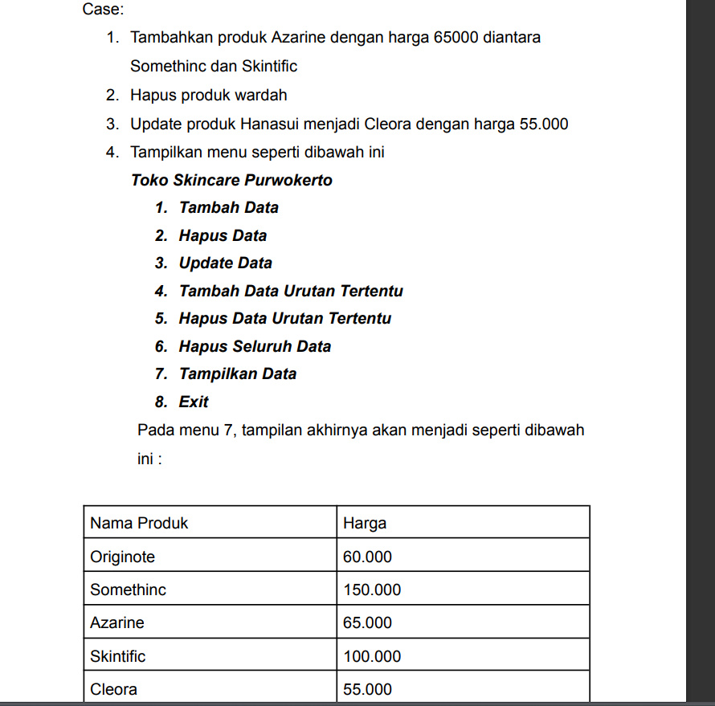

# <h1 align="center">Laporan Praktikum Modul linked list</h1>
<p align="center">Irfan Thoriq Habibi -2311102131</p>

## Dasar Teori

LINKED LIST<br/>
Linked list merupakan suatu struktur data linier. Meskipun termasuk struktur data linier, Linked list berbeda dengan array sebab linked list dibentuk secara dinamik. Elemen linked list biasanya disebut node dibentuk sambil menjalankan sesuai dengan instruksi yang diberikan. Jika array memiliki elemen array  yang dapat diakses secara langsung dengan menggunakan indeks, untuk sebuah node linked list diakses menggunakan pointer yang mengarah pada node tersebut. Linked list dibagi menjadi dua yakni single linked list dan double linked list.<br/>
single linked list<br/>
linked list merupakan sejumlah node yang terhubung secara linier dengan bantuan pointer. suatu struktur data dikatakan single linked ketika hanya ada satu pointer yang menghubungkan setiap node single. Dalam operasi Single linked list biasanya terdpat operasi penambahan dan penghapusin simpul pada awal,tengah, hingga akhir daftar. tidak hanya itu, single linked list melakukan pencarian dan pengambilan nilai pada simpul tertentu dalam daftar.<br/>
Double Linked List<br/>
pada dasarnya, double linked list hampir sama dengan lsingle linked list yakni terdapat pointer baru yaitu prev dan next. keberadaan kedua pointer tersebut menjadikan double linked list menjadi lebih fleksibel jika dibandingkan dengan single linked list. Double linked list terdiri atas elemen-elemen yang terhubung oleh dua pointer dalam satu elemen dan list serta dapat melintas dengan baik didepan maupun dibelakang. keuntungan dari double linked list memungkinkan untuk melakukan penambahan dan penghapusan dimana saja secara efisien yang sangat berguna ketika mengimplementasikan beberapa algoritma yang memerlukan operasi tersebut.


## Guided 

### 1. [Latihan Single Linked List]

```C++
#include <iostream>
using namespace std;
/// PROGRAM SINGLE LINKED LIST NON-CIRCULAR
// Deklarasi Struct Node
struct Node{
        int data;
        Node *next;
};
Node *head;
Node *tail;
// Inisialisasi Node
void init(){
        head = NULL;
        tail = NULL;
}
// Pengecekan
bool isEmpty(){
        if (head == NULL)
                return true;
        else
                return false;
}
// Tambah Depan
void insertDepan(int nilai){
        // Buat Node baru
        Node *baru = new Node;
        baru->data = nilai;
        baru->next = NULL;
        if (isEmpty() == true)
        {
                head = tail = baru;
                tail->next = NULL;
        }
        else
        {
                baru->next = head;
                head = baru;
        }
}
// Tambah Belakang
void insertBelakang(int nilai){
        // Buat Node baru
        Node *baru = new Node;
        baru->data = nilai;
        baru->next = NULL;
        if (isEmpty() == true)
        {
                head = tail = baru;
                tail->next = NULL;
        }
        else
        {
                tail->next = baru;
                tail = baru;
        }
}
// Hitung Jumlah List
int hitungList(){
        Node *hitung;
        hitung = head;
        int jumlah = 0;
        while (hitung != NULL)
        {
                jumlah++;
                hitung = hitung->next;
        }
        return jumlah;
}
// Tambah Tengah
void insertTengah(int data, int posisi){
        if (posisi < 1 || posisi > hitungList()){
         cout << "Posisi diluar jangkauan" << endl;
 }
        else if (posisi == 1){
                cout << "Posisi bukan posisi tengah" << endl;
        }
        else{
                Node *baru, *bantu;
                baru = new Node();
                baru->data = data;
                // tranversing
                bantu = head;
                int nomor = 1;
                while (nomor < posisi - 1) {
                        bantu = bantu->next;
                        nomor++;
                }
                baru->next = bantu->next;
                bantu->next = baru;
        }
}
// Hapus Depan
void hapusDepan(){
        Node *hapus;
        if (isEmpty() == false){
                if (head->next != NULL){
                  hapus = head;
                  head = head->next;
                  delete hapus;
        }
         else {
                head = tail = NULL;
         }
 }
        else {
           cout << "List kosong!" << endl;
        }
}
// Hapus Belakang
void hapusBelakang(){
        Node *hapus;
        Node *bantu;
        if (isEmpty() == false) {
        if (head != tail) {
                hapus = tail;
                bantu = head;
                while (bantu->next != tail) {
                     bantu = bantu->next;
                }
                tail = bantu;
                tail->next = NULL;
                delete hapus;
        }
        else{
                head = tail = NULL;
        }
}
        else {
                cout << "List kosong!" << endl;
        }
}
// Hapus Tengah
void hapusTengah(int posisi){
        Node *hapus, *bantu, *bantu2;
        if (posisi < 1 || posisi > hitungList()) {
                cout << "Posisi di luar jangkauan" << endl;
        }
        else if (posisi == 1){
                cout << "Posisi bukan posisi tengah" << endl;
        }
        else {
                int nomor = 1;
                bantu = head;
                while (nomor <= posisi){
                        if (nomor == posisi - 1){
                        bantu2 = bantu;
                }
                if (nomor == posisi){
                hapus = bantu;
        }
        bantu = bantu->next;
        nomor++;
        }
        bantu2->next = bantu;
        delete hapus;
}
}
// Ubah Depan
void ubahDepan(int data){
        if (isEmpty() == false){
                head->data = data;
        }
        else{
                cout << "List masih kosong!" << endl;
        }
}
// Ubah Tengah
void ubahTengah(int data, int posisi){
        Node *bantu;
        if (isEmpty() == false){
                if (posisi < 1 || posisi > hitungList()){
                        cout << "Posisi di luar jangkauan" << endl;
                }
                else if (posisi == 1){
                        cout << "Posisi bukan posisi tengah" << endl;
                }
                else{
                        bantu = head;
                        int nomor = 1;
                        while (nomor < posisi){
                                bantu = bantu->next;
                                nomor++;
                        }
                        bantu->data = data;
                }
        }
        else{
                cout << "List masih kosong!" << endl;
        }
}
// Ubah Belakang
void ubahBelakang(int data){
        if (isEmpty() == false){
                tail->data = data;
        }
        else{
                cout << "List masih kosong!" << endl;
        }
}
// Hapus List
void clearList(){
        Node *bantu, *hapus;
        bantu = head;
        while (bantu != NULL){
                hapus = bantu;
                bantu = bantu->next;
                delete hapus;
        }
        head = tail = NULL;
        cout << "List berhasil terhapus!" << endl;
}
// Tampilkan List
void tampil()
{
        Node *bantu;
        bantu = head;
        if (isEmpty() == false){
                while (bantu != NULL){
                        cout << bantu->data << ends;
                        bantu = bantu->next;
                }
                cout << endl;
        }
        else{
                cout << "List masih kosong!" << endl;
        }
}
int main()
{
        init();
        insertDepan(3);
        tampil();
        insertBelakang(5);
        tampil();
        insertDepan(2);
        tampil();
        insertDepan(1);
        tampil();
        hapusDepan();
        tampil();
        hapusBelakang();
        tampil();
        insertTengah(7, 2);
        tampil();
        hapusTengah(2);
        tampil();
        ubahDepan(1);
        tampil();
        ubahBelakang(8);
        tampil();
        ubahTengah(11, 2);
        tampil();
        return 0;
}
```
program tersebut menggunakan single linked list untuk menampilkan struktur data. didalam program ini user dapat memasukkan data didepan,ditengah,hingga dibelakang. program ini juga dapat mengubah mengubah data mulai dari didepan,tengah, hingga dibelakang. selain itu juga dapat menghapus data didepan,tengah,dan juga belakang. user hanya perlu mengubah data yang ada didalam int main agar dapat menambah,menghapus, ataupun mengubah datanya.

### 2. [Latihan Double linked List]

```C++
#include <iostream>
using namespace std;
class Node
{
public:
    int data;
    Node *prev;
    Node *next;
};
class DoublyLinkedList
{
public:
    Node *head;
    Node *tail;
    DoublyLinkedList(){
        head = nullptr;
        tail = nullptr;
    }
    void push(int data){
        Node *newNode = new Node;
        newNode->data = data;
        newNode->prev = nullptr;
        newNode->next = head;
        if (head != nullptr){
            head->prev = newNode;
    }
    else{
        tail = newNode;
        }
        head = newNode;
    }
    void pop(){
        if (head == nullptr){
            return;
        }
        Node *temp = head;
        head = head->next;
        if (head != nullptr){
            head->prev = nullptr;
        }
        else{
            tail = nullptr;
        }
    delete temp;
}
bool update(int oldData, int newData){
     Node *current = head;
     while (current != nullptr){
        if (current->data == oldData){
            current->data = newData;
            return true;
        }
        current = current->next;
    }
    return false;
}
void deleteAll(){
    Node *current = head;
    while (current != nullptr){
        Node *temp = current;
        current = current->next;
        delete temp;
        }
    head = nullptr;
    tail = nullptr;
}
void display(){
    Node *current = head;
    while (current != nullptr){
        cout << current->data << " ";
        current = current->next;
        }
        cout << endl;
    }
};
int main(){
    DoublyLinkedList list;
    while (true){
        cout << "1. Add data" << endl;
        cout << "2. Delete data" << endl;
        cout << "3. Update data" << endl;
        cout << "4. Clear data" << endl;
        cout << "5. Display data" << endl;
        cout << "6. Exit" << endl;
        int choice;
        cout << "Enter your choice: ";
        cin >> choice;
        switch (choice){
        case 1:{
            int data;
            cout << "Enter data to add: ";
            cin >> data;
            list.push(data);
            break;
        }
        case 2:{
            list.pop();
            break;
        }
        case 3:{
            int oldData, newData;
            cout << "Enter old data: ";
            cin >> oldData;
            cout << "Enter new data: ";
            cin >> newData;
            bool updated = list.update(oldData,
            newData);
            if (!updated){
                cout << "Data not found" << endl;
            }
            break;
        }
        case 4:{
            list.deleteAll();
            break;
        }
        case 5:{
            list.display();
            break;
        }
        case 6:{
            return 0;
        }
        default:{
            cout << "Invalid choice" << endl;
            break;
        }
        }
    }
    return 0;
}

```
program tersebut menggunakan double linked list untuk menmpilkan struktur datanya. jadi diprogram ini terdapat menu dengan berbagai pilihan. user dapat memilih menu tersebut sesuai dengan kebutuhannya. menu-menu tersebut dapat menambahkan data,menghapus data, mengupdate data,membersihkan data, hingga menampilkan seluruh data yang telah dimasukkan oleh user. 

## Unguided 

### 1. [Soal mengenai Single Linked List]


```C++
/*
Irfan Thoriq Habibi - 2311102131
*/
#include <iostream>
#include <iomanip>
using namespace std;

// Deklarasi Struct Node
struct Node{
    string nama_131;
    int usia_131;
    Node *next;
};

Node *head;
Node *tail;

// Inisialisasi Node
void init_131() {
    head = NULL;
    tail = NULL;
}

// Pengecekan apakah linked list kosong
bool itsEmpty(){
    return head == NULL;
}

// Menghitung jumlah Node dalam linked list
int hitungListnode(){
    Node *hitung = head;
    int jumlah = 0;
    while (hitung != NULL){
        jumlah++;
        hitung = hitung->next;
    }
    return jumlah;
}

// Menambahkan node di depan
void inputdepan_131(string nama,int usia){
    // membuat Node baru
    Node *baru = new Node;
    baru->nama_131 = nama;
    baru->usia_131 = usia;
    baru->next = NULL;
    if (itsEmpty()){
        head = tail = baru;
    } else {
        baru->next = head;
        head = baru;
    }
}

// Menambahkan node di tengah
void inputtengah_131(string nama, int usia, int posisi) {
    if (posisi < 1 || posisi > hitungListnode() + 1) {
        cout << "Posisi diluar jangkauan" << endl;
    } else if (posisi == 1) {
        inputdepan_131(nama, usia);
    } else {
        Node* baru = new Node();
        baru->nama_131 = nama;
        baru->usia_131 = usia;
        Node* bantu = head;
        int nomor = 1;
        while (nomor < posisi - 1) {
            bantu = bantu->next;
            nomor++;
        }
        baru->next = bantu->next;
        bantu->next = baru;
    }
}

// Menambahkan node di belakang
void inputbelakang_131(string nama, int usia) {
    // membuat Node baru
    Node* baru = new Node;
    baru->nama_131 = nama;
    baru->usia_131 = usia;
    baru->next = NULL;

    if (itsEmpty()) {
        head = tail = baru;
    } else {
        tail->next = baru;
        tail = baru;
    }
}

// fungsi menghapus Node di depan
void hapusDepan_131(){
    if (!itsEmpty()) {
        Node *hapus = head;
        if (head == tail) {
            head = tail = NULL;
        } else {
            head = head->next;
        }
        delete hapus;
    } else {
        cout << "Tidak ada list yang tersedia" << endl;
    }
}

// fungsi menghapus Node di tengah
void hapusTengah_131(int posisi)
{
    if (posisi < 1 || posisi > hitungListnode()) {
        cout << "Posisi diluar jangkauan" << endl;
    } else if (posisi == 1) {
        hapusDepan_131();
    } else {
        Node *bantu = head;
        int nomor = 1;
        while (nomor < posisi - 1) {
            bantu = bantu->next;
            nomor++;
        }
        Node *hapus = bantu->next;
        bantu->next = hapus->next;
        delete hapus;
    }
}

//fungsi menghapus Node di belakang
void hapusBelakang_131(){
    if (!itsEmpty()) {
        if (head == tail) {
            delete head;
            head = tail = NULL;
        } else {
            Node *bantu = head;
            while (bantu->next != tail) {
                bantu = bantu->next;
            }
            delete tail;
            tail = bantu;
            tail->next = NULL;
        }
    } else {
        cout << "List kosong!" << endl;
    }
}

// fungsi untuk mengupdate Node di tengah
void ubahTengah_131(string nama, int usia, int posisi){
    if (posisi < 1 || posisi > hitungListnode()) {
        cout << "Posisi di luar jangkauan" << endl;
    } else {
        Node *bantu = head;
        int nomor = 1;
        while (nomor < posisi) {
            bantu = bantu->next;
            nomor++;
        }
        bantu->nama_131 = nama;
        bantu->usia_131 = usia;
    }
}

// fungsi untuk mengupdate Node di belakang
void ubahBelakang_131(string nama,int usia){
    if (!itsEmpty()) {
        tail->nama_131 = nama;
        tail->usia_131 = usia;
    } else {
        cout << "Tidak ada list yang tersedia" << endl;
    }
}

// Hapus semua Node dalam linked list
void hapusList_131(){
    Node *bantu = head;
    while (bantu != NULL){
        Node *hapus = bantu;
        bantu = bantu->next;
        delete hapus;
    }
    head = tail = NULL;
    cout << "List berhasil terhapus!" << endl;
}

// Tampilkan semua Node dalam linked list
void Tampilan_131() {
    Node *bantu = head;
    cout << left << setw(10) << "Nama" << right << setw(2) << "Usia" << endl;
    if (!itsEmpty()) {
        while (bantu != NULL) {
            cout << left << setw(10) << bantu->nama_131 << right << setw(2) << bantu->usia_131 << endl;
            bantu = bantu->next;
        }
        cout << endl;
    } else {
        cout << "Tidak ada data yang tersedia!" << endl;
            }
}

int main()
{
    init_131();
    cout << "Selamat datang di program single linked list" << endl;

    // Menambahkan data awal

    inputdepan_131("Karin", 18);
    inputdepan_131("Hoshino", 18);
    inputdepan_131("Akechi", 20);
    inputdepan_131("Yusuke", 19);
    inputdepan_131("Michael", 18);
    inputdepan_131("Jane", 20);
    inputdepan_131("John", 19);

    int pilih_131;
    do {
        // Menu utama program
        cout << "1. Tambah Data" << endl;
        cout << "2. Hapus Data" << endl;
        cout << "3. Update Data" << endl;
        cout << "4. Tambah Data Urutan Tertentu" << endl;
        cout << "5. Hapus Seluruh Data" << endl;
        cout << "6. Tampilkan Data" << endl;
        cout << "7. Exit" << endl;
        cout << "Masukkan pilihanmu: ";
        cin >> pilih_131;

        switch (pilih_131) {
            case 1: {
                string nama_131;
                int usia_131;
                cout << "Masukkan nama: ";
                cin >> nama_131;
                cout << "Masukkan usia: ";
                cin >> usia_131;
                inputdepan_131(nama_131, usia_131);
                break;
            }
           case 2: {
                string namaHapus_131;
                cout << "Masukkan nama data yang ingin dihapus: ";
                cin >> namaHapus_131;
                Node* temp = head;
                 int posisi = 1;
                while (temp != NULL && temp->nama_131 != namaHapus_131) {
                temp = temp->next;
                posisi++;
             }
                if (temp != NULL) {
                hapusTengah_131(posisi);
                cout << "Data dengan nama " << namaHapus_131 << " berhasil dihapus." << endl;
    } else {
        cout << "Data dengan nama " << namaHapus_131 << " tidak ditemukan." << endl;
    }
    break;
}
            case 3: {
                string namaLama_131, namaBaru_131;
                int usiaBaru_131;
                cout << "Masukkan nama yang ingin diupdate: ";
                cin >> namaLama_131;
                cout << "Masukkan nama baru: ";
                cin >> namaBaru_131;
                cout << "Masukkan usia baru: ";
                cin >> usiaBaru_131;
                Node* temp = head;
                int posisi = 1;
                while (temp != NULL && temp->nama_131 != namaLama_131) {
                    temp = temp->next;
                    posisi++;
                }
                if (temp != NULL) {
                    ubahTengah_131(namaBaru_131, usiaBaru_131, posisi);
                } else {
                    cout << "Data tidak ditemukan" << endl;
                }
                break;
            }
            case 4: {
                string nama_131, namabaru_131;
                int usia_131;
                cout << "Masukkan nama: ";
                cin >> nama_131;
                cout << "Masukkan usia: ";
                cin >> usia_131;
                cout << "Masukkan nama setelah data baru: ";
                cin >> namabaru_131;
                Node* temp = head;
                int posisi = 1;
                while (temp != NULL && temp->nama_131 != namabaru_131) {
                    temp = temp->next;
                    posisi++;
                }
                if (temp != NULL) {
                    inputtengah_131(nama_131, usia_131, posisi + 1);
                } else {
                    cout << "Data tidak ditemukan" << endl;
                }
                break;
            }
            case 5: {
                hapusList_131();
                break;
            }
            case 6: {
                Tampilan_131();
                break;
            }
            case 7: {
                cout << "Terima kasih telah menggunakan program ini!" << endl;
                break;
            }
            default: {
                cout << "Pilihan tidak valid" << endl;
                break;
            }
        }
    } while (pilih_131!= 7);

    return 0;
}


```
#### Output 1:
_1_2311102131_irfanthoriqhabibi.png)
#### Output 2:
_2_2311102131_irfanthoriqhabibi.png)
#### Output 3:
_3_2311102131_irfanthoriqhabibi.png)
#### Output 4:
_4_2311102131_irfanthoriqhabibi.png)

program tersebut menggunakan single linked list untuk menampilkan struktur data.program ini memungkinkan penggunanya untuk menambah, menghapus,mengubah,hingga menampilkan data didalam linked list. hal tersebut dapat diakses oleh pengguna didalam menu yang ditampilkan oleh program. pada saat program dijalankan, terdapat beberapa data nama dan usia yang telah tersimpan didalamnya. user dapat menampilkan data tersebut terlebih dahulu ataupun dapat langsung mengubahnya dengan memilih menu yang tersedia.
 

### 2. [Soal mengenai double Linked List]



```C++
/*
Irfan Thoriq Habibi - 2311102131
*/
#include <iostream>
#include <iomanip>
using namespace std;

// Deklarasi kelas Node untuk memperlihatkan simpul dalam linked list
class Node {
public:
    string nama_131;
    double harga_131;
    Node* prev;
    Node* next;
};

// Deklarasi kelas DoublyLinkedList untuk menggunakan double linked list
class DoublyLinkedList {
public:
    Node* head;
    Node* tail;

    // inisialisasi linked list
    DoublyLinkedList() {
        head = nullptr;
        tail = nullptr;
    }

    // fungsi untuk menambahkan simpul baru di awal linked list
    void push(string nama_131, double harga_131) {
        Node* newNode = new Node;
        newNode->nama_131 = nama_131;
        newNode->harga_131 = harga_131;
        newNode->prev = nullptr;
        newNode->next = head;

        if (head != nullptr) {
            head->prev = newNode;
        } else {
            tail = newNode;
        }
        head = newNode;
    }

    // fungsi untuk menghapus simpul dari awal linked list
    void pop() {
        if (head == nullptr) {
            return;
        }
        Node* temp = head;
        head = head->next;
        if (head != nullptr) {
            head->prev = nullptr;
        } else {
            tail = nullptr;
        }
        delete temp;
    }

    // fungsi untuk memperbarui data produk berdasarkan nama produk yang lama
    bool update(string oldNama_131, string newNama_131, double newHarga_131) {
        Node* current = head;
        while (current != nullptr) {
            if (current->nama_131 == oldNama_131) {
                current->nama_131 = newNama_131;
                current->harga_131 = newHarga_131;
                return true;
            }
            current = current->next;
        }
        return false;
    }

    // fungsi untuk menghapus semua simpul dalam linked list
    void deleteAll() {
        Node* current = head;
        while (current != nullptr) {
            Node* temp = current;
            current = current->next;
            delete temp;
        }
        head = nullptr;
        tail = nullptr;
    }

    // fungsi untuk menampilkan semua data produk dalam linked list
    void display() {
    Node* current = head;
    cout << left << setw(20) << "Nama Produk" << setw(10) << "Harga (Rp)" << endl;
    while (current != nullptr) {
        cout << left << setw(20) << current->nama_131 << setw(10) << current->harga_131 << endl;
        current = current->next;
    }
    cout << endl;
}

    // fungsi untuk menyisipkan simpul baru setelah simpul tertentu
    void insertAfter(string namaProduk_131, double hargaProduk_131, string namaBaruProduk_131) {
        Node* newNode = new Node;
        newNode->nama_131 = namaProduk_131;
        newNode->harga_131 = hargaProduk_131;

        Node* current = head;
        while (current != nullptr && current->nama_131 != namaBaruProduk_131 ){
            current = current->next;
        }
        if (current == nullptr) {
            cout << "Produk " << namaBaruProduk_131 << " tidak tersedia" << endl;
            return;
        }
        newNode->prev = current;
        newNode->next = current->next;
        if (current->next != nullptr) {
            current->next->prev = newNode;
        } else {
            tail = newNode;
        }
        current->next = newNode;
    }

    // fungsi untuk menghapus simpul dengan nama produk tertentu
    void deleteNode(string namaProduk_131) {
        Node* current = head;
        while (current != nullptr && current->nama_131 != namaProduk_131) {
            current = current->next;
        }

        if (current == nullptr) {
            cout << "Produk " << namaProduk_131 << " tidak tersedia" << endl;
            return;
        }

        if (current->prev != nullptr) {
            current->prev->next = current->next;
        } else {
            head = current->next;
        }

        if (current->next != nullptr) {
            current->next->prev = current->prev;
        } else {
            tail = current->prev;
        }

        delete current;
    }
};

int main() {
    DoublyLinkedList list;

    // Menambahkan data saat program dimulai
    list.push("Hanasui", 30000);
    list.push("Wardah", 50000);
    list.push("Skintific", 100000);
    list.push("Somethinc", 150000);
    list.push("Originote", 60000);

    while (true) {
        //menu utama program ini
        cout << "Toko Skincare Purwokerto"<<endl;
        cout << "1. Tambah Data" << endl;
        cout << "2. Hapus Data" << endl;
        cout << "3. Update Data" << endl;
        cout << "4. Tambah Data Urutan Tertentu" << endl;
        cout << "5. Hapus Data Urutan Tertentu" << endl;
        cout << "6. Hapus Seluruh Data" << endl;
        cout << "7. Tampilkan Data" << endl;
        cout << "8. Exit" << endl;
        //memiihih menu sesuai dengan yang diinginkan user
        int pilih_131;
        cout << "masukkan pilihanmu: ";
        cin >> pilih_131;
        switch (pilih_131) {
            //menambahkan data didalam double linked list
            case 1: {
                string nama_131;
                double harga_131;
                cout << "Masukkan nama produk: ";
                cin >> nama_131;
                cout << "Masukkan harga produk: ";
                cin >> harga_131;
                list.push(nama_131, harga_131);
                break;
            }
            //menghapus data didalam double linked list
            case 2: {
                string nama_131;
                cout << "Masukkan nama produk yang ingin dihapus: ";
                cin >> nama_131;
                list.deleteNode(nama_131);
                break;
            }
            //mengupdate data didalam linked list
            case 3: {
                string oldNama_131, newNama_131;
                double newHarga_131;
                cout << "Masukkan nama produk yang ingin diupdate: ";
                cin >> oldNama_131;
                cout << "Masukkan nama produk baru: ";
                cin >> newNama_131;
                cout << "Masukkan harga produk baru: ";
                cin >> newHarga_131;
                bool updated = list.update(oldNama_131, newNama_131, newHarga_131);
                if (!updated) {
                    cout << "Data tidak tersedia" << endl;
                }
                break;
            }
            //menambahkan data dengan urutan yang diinginkan user
            case 4: {
                string namaProduk_131, namaBaruProduk_131;
                double hargaProduk_131;
                cout << "Masukkan nama produk baru: ";
                cin >> namaProduk_131;
                cout << "Masukkan harga produk baru: ";
                cin >> hargaProduk_131;
                cout << "Masukkan nama produk setelah produk yang ingin ditambahkan: ";
                cin >> namaBaruProduk_131;
                list.insertAfter(namaProduk_131, hargaProduk_131, namaBaruProduk_131);
                break;
            }
            //menghapus data dengan urutan yang diinginkan user
            case 5: {
                string namaProduk_131;
                cout << "Masukkan nama produk yang ingin dihapus: ";
                cin >> namaProduk_131;
                list.deleteNode(namaProduk_131);
                break;
            }
            //menghapus semua data yang ada didalam double linked list
            case 6: {
                list.deleteAll();
                break;
            }
            //menampilkan seluruh data yang ada didalam double linked list
            case 7: {
                list.display();
                break;
            }
            //keluar dari program double linked list
            case 8: {
                return 0;
            }
            //jika user salah menginputkan pilihan maka akan menampilkan pesan berikut
            default: {
                cout << "Pilihan tidak valid" << endl;
                break;
            }
        }
    }

    return 0;
}

```
#### Output 1:
_1_2311102131_irfanthoriqhabibi.png)
#### Output 2:
_2_2311102131_irfanthoriqhabibi.png)
#### Output 3:
_3_2311102131_irfanthoriqhabibi.png)


Program ini menggunakan Double linked list untuk menampilkan struktur data. didalam program ini terdapat menu yang dapat diakses penggunya mulai dari menambahkan,menghapus,mengupdate,menyisipkan,menghapus semua data, hingga menampilkan seluruh data. pada awal program dijalankan, sudah ada beberapa data barang beserta harganya yang tersimpan dan dapat langsung ditampilkan tanpa mengubah data apapun.

## Kesimpulan
Lingked list merupakan struktur data yang hampir mirip dengan array akan tetapi lingked list ini lebih fleksibel.Linked list memungkinkan penggunanya untuk menyimpan dan mengelola data yang mana setiap elemennya disimpan didalam memori yang terpisah dengan pointer sebagai penghubungnya.linked list memiliki keunggulan dalam penambahan dan penghapusan data yang lebih efisien tetapi harus diakses secara berurutan dari awal. Linked list terbagi menjadi single dan double linked list. kedua linked liat tersebut hampir sama hanya dibedakan dengan double linked list dapat menggunakan prev dan next.[1].

## Referensi
[1] Triase, T. (2020). Struktur Data: Diktat Edisi Revisi.<br/>
[2]Nugraha, A. S. (2019). Artikel Double Linked List Circulate.
