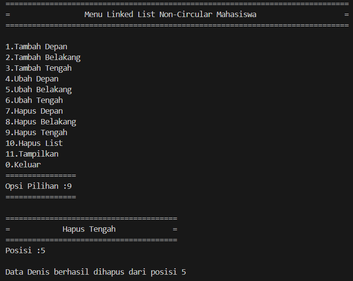

# <h1 align="center">Laporan Praktikum Modul LINKED LIST CIRCULAR DAN NON CIRCULAR</h1>
<p align="center">Irfan Thoriq Habibi - 2311102131</p>

## Dasar Teori

Linked list merupakan bentuk dari struktur data yang didalamnya terdapat kumpulan-kumpulan data yang biasa disebut node yang tersimpan dengan rapi secara sekuensial,saling menyambung,dimanis dan, tidak terbatas. setiap elemen yang tersimpan didalam linked list dihubungkan dengan elemen lainnya menggunakan pointer. Pointer merupakan alamat elemen. setiap simpul pada linked list pada dasarnya dibagi menjadi dua bagian yakni isi/informasi dan pointer/alamat dari node sebelum ataupun sesudahnya. Linked list ada dua macam yakni linked list non-circular dan linked list circular.<br/>
1. Linked List Non-Circular<br/>
 linked list non circular merupakan linked list yang head (node pertama) tidak saling terhubung dengan tail (node terakhir) yang mana pada tail selalu bernilai 'NULL' yang menjadikannya tanda terakhir didalam list.<br/>
 Operasi Linked list non circular<br/>
a. Node (Deklarasi simpul)<br/>
 struct node {<br/>
    string nama;
    node *next;
};
b. Deklarasi variabel head dan tail
node *head;
node *tail;

c. Inisialisasi linked list
void init_131() {
    head = NULL;
    tail = NULL;
}

d. Pengecekan linked list kosong
bool isempty() {
    return head == NULL;
}

e. Menambah data linked list
void insertdepan(string nama) {
    node *baru = new node;
    baru->nama = nama;
    baru->next = NULL;
    if (isempty()) {
        head = tail = baru;
    } else {
        baru->next = head;
        head = baru;
    }
}

f. menghapus data linked list
 void hapusdepan() {
    if (!isempty()) {
        node *hapus = head;
        cout << "Data " << head->nama< " berhasil dihapus dari depan" << endl;
        if (head == tail) {
            head = tail = NULL;
        } else {
            head = head->next;
        }
        delete hapus;
    } else {
        cout << "Linked list kosong!" << endl;
    }
}

g. menampilkan data linked list
 void tampil (){
    node *bantu;
    bantu = head;
    if (isempty()== false){
        while ( bantu != NULL){
            cout << bantu->data <<ends;
            bantu = bantu-> next;
        }
        cout << endl;
    }
    else {
        cout << " list masih kosong!"<<endl;
    }
}<br/>
2. Linked List Circular<br/>
 Jika linked list non circular memiliki head (node pertama) yang tidak saling terhubung dengan tailnya(node terakhir), berbeda halnya dengan linked list circular. Linked list Circular ialah linked list yang terhubung dengan head (node pertama) tetapi tak mempunyai akhiran sebab tailnya (node terakhir) tidak berupa 'NULL'.<br/>

Operasi Linked List circular
a. Node (Deklarasi simpul)<br/>
 struct node {
    string nama;
    node *next;
};
b. inisialisasi head dan tail
Node* head, * tail, * baru, * bantu, * hapus;

void init()
{
    head = NULL;
    tail = head;
}

c. Pengecekan linked list kosong
int isEmpty()
{
    if (head == NULL)
        return 1; // true
    else
        return 0; // false
}

d. membuat simpul (node)
void buatNode(string nama)
{
    baru = new Node;
    baru->nama = nama;
    baru->next = NULL;
}
e.menambahkan simpul(node)
{
    buatNode(nama);

    if (isEmpty() == 1)
    {
        head = baru;
        tail = head;
        baru->next = head;
    }
    else
    {
        while (tail->next != head)
        {
            tail = tail->next;
        }
        tail->next = baru;
        baru->next = head;
    }
}
f. menghapus simpul linked list
 // Hapus Belakang
void hapusBelakang()
{
    if (isEmpty() == 0)
    {
        hapus = head;
        tail = head;
        if (hapus->next == head)
        {
            head = NULL;
            tail = NULL;
            delete hapus;
        }
        else
        {
            while (hapus->next != head)
            {
                hapus = hapus->next;
            }
            while (tail->next != hapus)
            {
                tail = tail->next;
            }
            tail->next = head;
            hapus->next = NULL;
            delete hapus;
        }
    }
    else
    {
        cout << "List masih kosong!" << endl;
    }
}

f. menampilkan simpul
void tampil()
{
    if (isEmpty() == 0)
    {
        tail = head;
        do
        {
            cout << tail->data << ends;
            tail = tail->next;
        } while (tail != head);
        cout << endl;
    }
    else
    {
        cout << "List masih kosong!" << endl;
    }
}<br/>

## Guided 

### 1. [Linked List Non Circular]

```C++
/*
Irfan Thorqi Habibi - 23111102131
*/
#include <iostream>
using namespace std;

//PORGRAM SINGLE LINKED LIST NON-CIRCULAR
//Deklarasi Struct Node

struct node {
    int data;
    node *next;
};
node *head;
node *tail;

//inisialisasi node
void init(){
    head = NULL;
    tail = NULL;
}
//pengecekan
bool isempty(){
    if (head == NULL)
    return true;
    else
    return false;
}
// Tambah depan
void insertdepan(int nilai){
    //buat node baru
    node *baru = new node;
    baru->data = nilai;
    baru->next = NULL;
    if (isempty() ==true){
        head = tail = baru;
        tail->next = NULL;
    }
    else {
        baru->next = head;
        head = baru;
        }
}
// tambah belakang
void insertbelakang(int nilai){
    //buat node baru
    node *baru = new node;
    baru->data= nilai;
    baru->next = NULL;
    if (isempty()==true){
        head = tail = baru;
        tail-> next = NULL;
    }
    else{
        tail->next = baru;
        tail = baru;
    }
}
//hitung jumlah list
int hitunglist(){
    node *hitung;
    hitung=head;
    int jumlah=0;
    while (hitung!=NULL){
        jumlah++;
        hitung = hitung->next;
    }
    return jumlah;
}
//tambah tengah
void inserttengah(int data, int posisi){
    if (posisi <1 || posisi > hitunglist()){
        cout << "posisi diluar jangkauan"<<endl;
    }
    else if (posisi == 1){
        cout << " posisi bukan posisi tengah"<<endl;
    }
    else{
        node *baru, *bantu;
        baru = new node();
        baru->data= data;

        //transvering
        bantu = head;
        int nomor = 1;
        while ( nomor < posisi - 1){
            bantu = bantu->next;
            nomor++;
        }
        baru ->next = bantu->next;
        bantu->next = baru;
    }
}

//hapus depan
void hapusdepan(){
    node * hapus;
    if (isempty()==false){
        if ( head->next!=NULL){
            hapus = head;
            head = head-> next;
            delete hapus;
        }
        else{
            head = tail = NULL;
        }
    }
    else{
        cout << "list kosong!"<<endl;
    }
}
//hapus belakang
void hapusbelakang(){
    node *hapus;
    node *bantu;
    if (isempty()==false){
        if (head != tail){
            hapus = tail;
            bantu = head;
            while (bantu->next !=tail){
                bantu = bantu->next;
            }
            tail = bantu;
            tail->next= NULL;
            delete hapus;
        }
        else {
            head = tail = NULL;
        }
    }
    else {
        cout << " list kosong!"<<endl;
    }
}
//hapus tengah
void hapustengah(int posisi){
    node * bantu, *hapus, *sebelum;
    if (posisi < 1 || posisi > hitunglist()){
        cout << "posisi diluar jangkauan"<<endl;
    }
    else if ( posisi == 1){
        cout << " posisi bukan posisi tengah"<<endl;
    }
    else {
        int nomor = 1;
        bantu = head;
        while (nomor <= posisi){
            if (nomor==posisi -1){
                sebelum = bantu;
            }
            if (nomor == posisi){
                hapus = bantu;
            }
            bantu = bantu->next;
            nomor++;
        }
        sebelum->next = bantu;
        delete hapus;
    }
}
// ubah depan
void ubahdepan(int data){
    if (isempty()==0){
        head->data = data;
    }
    else{
        cout << "list masih kosong!"<<endl;
    }
}
// ubah tengah
void ubahtengah(int data, int posisi){
    node *bantu;
    if (isempty()==0){
        if (posisi < 1 || posisi > hitunglist()){
            cout << " posisi di luar jangkauan"<<endl;
        }
        else if (posisi==1){
            cout << " posisi bukan posisi tengah"<<endl;
        }
        else{
            bantu = head;
            int nomor = 1;
            while ( nomor < posisi){
                bantu = bantu->next;
                nomor++;
            }
            bantu->data=data;
        }
    }
    else{
        cout << " list masih kosong!"<<endl;
    }
}
//ubah belakang
void ubahbelakang(int data){
    if (isempty ()==0){
        tail->data = data;
    }
    else {
        cout << "list masih kosong!"<<endl;
    }
}
//hapus list
void clearlist(){
    node *bantu, *hapus;
    bantu = head;
    while ( bantu !=NULL){
        hapus = bantu;
        bantu= bantu-> next;
        delete hapus;
    }
    head = tail = NULL;
    cout << " list berhasil terhapus"<<endl;
}
//tampilan list
void tampil (){
    node *bantu;
    bantu = head;
    if (isempty()== false){
        while ( bantu != NULL){
            cout << bantu->data <<ends;
            bantu = bantu-> next;
        }
        cout << endl;
    }
    else {
        cout << " list masih kosong!"<<endl;
    }
}
int main (){
    init();
    insertdepan(3);
    tampil();
    insertbelakang(5);
    tampil();
    insertdepan(2);
    tampil();
    insertdepan(1);
    tampil();
    hapusdepan();
    tampil();
    hapusbelakang();
    tampil();
    inserttengah(7, 2);
    tampil();
    hapustengah(2);
    tampil();
    ubahdepan(1);
    tampil();
    ubahbelakang(8);
    tampil();
    ubahtengah(11, 2);
    tampil();
    return 0;
}

```
program diatas merupakan program linked list non circular yang mana program ini berfungsi untuk menyimpan data angka. user dapat menambahkan,mengubah,hingga menghapus data angka yang ada pada linked list non circular ini dengan cara menambahkan perintah fungsi pada int main().

### 1. [Linked List Circular]

```C++
#include <iostream>
using namespace std;

// Deklarasi Struct Node
struct Node
{
    string data;
    Node* next;
};

Node* head, * tail, * baru, * bantu, * hapus;

void init()
{
    head = NULL;
    tail = head;
}

// Pengecekan
int isEmpty()
{
    if (head == NULL)
        return 1; // true
    else
        return 0; // false
}

// Buat Node Baru
void buatNode(string data)
{
    baru = new Node;
    baru->data = data;
    baru->next = NULL;
}

// Hitung List
int hitungList()
{
    bantu = head;
    int jumlah = 0;
    while (bantu != NULL)
    {
        jumlah++;
        bantu = bantu->next;
    }
    return jumlah;
}

// Tambah Depan
void insertDepan(string data)
{
    // Buat Node baru
    buatNode(data);

    if (isEmpty() == 1)
    {
        head = baru;
        tail = head;
        baru->next = head;
    }
    else
    {
        while (tail->next != head)
        {
            tail = tail->next;
        }
        baru->next = head;
        head = baru;
        tail->next = head;
    }
}

// Tambah Belakang
void insertBelakang(string data)
{
    // Buat Node baru
    buatNode(data);

    if (isEmpty() == 1)
    {
        head = baru;
        tail = head;
        baru->next = head;
    }
    else
    {
        while (tail->next != head)
        {
            tail = tail->next;
        }
        tail->next = baru;
        baru->next = head;
    }
}

// Tambah Tengah
void insertTengah(string data, int posisi)
{
    if (isEmpty() == 1)
    {
        head = baru;
        tail = head;
        baru->next = head;
    }
    else
    {
        baru->data = data;
        // transversing
        int nomor = 1;
        bantu = head;
        while (nomor < posisi - 1)
        {
            bantu = bantu->next;
            nomor++;
        }
        baru->next = bantu->next;
        bantu->next = baru;
    }
}

// Hapus Depan
void hapusDepan()
{
    if (isEmpty() == 0)
    {
        hapus = head;
        tail = head;
        if (hapus->next == head)
        {
            head = NULL;
            tail = NULL;
            delete hapus;
        }
        else
        {
            while (tail->next != hapus)
            {
                tail = tail->next;
            }
            head = head->next;
            tail->next = head;
            hapus->next = NULL;
            delete hapus;
        }
    }
    else
    {
        cout << "List masih kosong!" << endl;
    }
}

// Hapus Belakang
void hapusBelakang()
{
    if (isEmpty() == 0)
    {
        hapus = head;
        tail = head;
        if (hapus->next == head)
        {
            head = NULL;
            tail = NULL;
            delete hapus;
        }
        else
        {
            while (hapus->next != head)
            {
                hapus = hapus->next;
            }
            while (tail->next != hapus)
            {
                tail = tail->next;
            }
            tail->next = head;
            hapus->next = NULL;
            delete hapus;
        }
    }
    else
    {
        cout << "List masih kosong!" << endl;
    }
}

// Hapus Tengah
void hapusTengah(int posisi)
{
    if (isEmpty() == 0)
    {
        // transversing
        int nomor = 1;
        bantu = head;
        while (nomor < posisi - 1)
        {
            bantu = bantu->next;
            nomor++;
        }
        hapus = bantu->next;
        bantu->next = hapus->next;
        delete hapus;
    }
    else
    {
        cout << "List masih kosong!" << endl;
    }
}

// Hapus List
void clearList()
{
    if (head != NULL)
    {
        hapus = head->next;
        while (hapus != head)
        {
            bantu = hapus->next;
            delete hapus;
            hapus = bantu;
        }
        delete head;
        head = NULL;
    }
    cout << "List berhasil terhapus!" << endl;
}

// Tampilkan List
void tampil()
{
    if (isEmpty() == 0)
    {
        tail = head;
        do
        {
            cout << tail->data << ends;
            tail = tail->next;
        } while (tail != head);
        cout << endl;
    }
    else
    {
        cout << "List masih kosong!" << endl;
    }
}

int main()
{
    init();
    insertDepan("Ayam");
    tampil();
    insertDepan("Bebek");
    tampil();
    insertBelakang("Cicak");
    tampil();
    insertBelakang("Domba");
    tampil();
    hapusBelakang();
    tampil();
    hapusDepan();
    tampil();
    insertTengah("Sapi", 2);
    tampil();
    hapusTengah(2);
    tampil();
    return 0;
}
```
program diatas merupakan program linked list circular yang mana program ini berfungsi untuk menyimpan data nama binatang. User dapat menambahkan,mengubah,hingga menghapus data nama binatang yang ada pada linked list circular ini dengan cara menambahkan perintah fungsi pada int main().

## Unguided 

### 1. [Buatlah program menu Linked List Non Circular untuk menyimpan Nama dan NIM mahasiswa, dengan menggunakan input dari user.]


```C++
/*
Irfan Thoriq Habibi - 2311102131
*/
#include <iostream>
#include <iomanip>
using namespace std;

// Deklarasi Struct Node
struct node {
    string nama_131;
    string nim_131;
    node *next;
};

// Deklarasi variabel head dan tail
node *head;
node *tail;

// Inisialisasi linked list
void init_131() {
    head = NULL;
    tail = NULL;
}

// Pengecekan apakah linked list kosong
bool isempty() {
    return head == NULL;
}
// Menghitung jumlah node dalam linked list
int hitunglist_131() {
    int jumlah = 0;
    node *bantu = head;
    while (bantu != NULL) {
        jumlah++;
        bantu = bantu->next;
    }
    return jumlah;
}

// Menambah data mahasiswa di depan linked list
void insertdepan_131(string nama_131, string nim_131) {
    // Membuat node baru
    node *baru = new node;
    baru->nama_131 = nama_131;
    baru->nim_131 = nim_131;
    baru->next = NULL;

    // Jika linked list kosong
    if (isempty()) {
        head = tail = baru;
    } else {
        baru->next = head;
        head = baru;
    }
}

// Menambah data mahasiswa di belakang linked list
void insertbelakang_131(string nama_131, string nim_131) {
    // Membuat node baru
    node *baru = new node;
    baru->nama_131 = nama_131;
    baru->nim_131 = nim_131;
    baru->next = NULL;

    // Jika linked list kosong
    if (isempty()) {
        head = tail = baru;
    } else {
        tail->next = baru;
        tail = baru;
    }
}

// Menambah data mahasiswa di tengah linked list
void inserttengah_131(string nama_131, string nim_131, int posisi_131) {
    if (posisi_131 < 1 || posisi_131 > hitunglist_131() + 1) {
        cout << "Posisi diluar jangkauan" << endl;
    } else {
        if (posisi_131 == 1) {
            insertdepan_131(nama_131, nim_131);
        } else if (posisi_131 == hitunglist_131() + 1) {
            insertbelakang_131(nama_131, nim_131);
        } else {
            node *baru = new node;
            baru->nama_131 = nama_131;
            baru->nim_131 = nim_131;

            node *bantu = head;
            for (int i = 1; i < posisi_131 - 1; ++i) {
                bantu = bantu->next;
            }

            baru->next = bantu->next;
            bantu->next = baru;
        }
    }
}

// Mengubah data mahasiswa di depan linked list
void ubahdepan_131(string nama_131, string nim_131) {
    if (!isempty()) {
        // Menyimpan data sebelum diubah
        string nama_sebelum = head->nama_131;
        string nim_sebelum = head->nim_131;

        // Mengubah data
        head->nama_131 = nama_131;
        head->nim_131 = nim_131;

        // Menampilkan informasi
        cout << "Data telah diubah dari " << nama_sebelum << " menjadi " << nama_131 << endl;
    } else {
        cout << "Linked list masih kosong!" << endl;
    }
}

// Mengubah data mahasiswa di belakang linked list
void ubahbelakang_131(string nama_131, string nim_131) {
    if (!isempty()) {
        // Menyimpan data sebelum diubah
        string nama_sebelum = tail->nama_131;
        string nim_sebelum = tail->nim_131;

        // Mengubah data
        tail->nama_131 = nama_131;
        tail->nim_131 = nim_131;

        // Menampilkan informasi
        cout << "Data telah diubah dari " << nama_sebelum << " menjadi " << nama_131 << endl;
    } else {
        cout << "Linked list masih kosong!" << endl;
    }
}

// Mengubah data mahasiswa di tengah linked list
void ubahtengah_131(string nama_131, string nim_131, int posisi_131) {
    if (posisi_131 < 1 || posisi_131 > hitunglist_131()) {
        cout << "Posisi diluar jangkauan" << endl;
    } else {
        node *bantu = head;
        for (int i = 1; i < posisi_131; ++i) {
            bantu = bantu->next;
        }

        // Menyimpan data sebelum diubah
        string nama_sebelum = bantu->nama_131;
        string nim_sebelum = bantu->nim_131;

        // Mengubah data
        bantu->nama_131 = nama_131;
        bantu->nim_131 = nim_131;

        // Menampilkan informasi
        cout << "Data pada posisi " << posisi_131 << " telah diubah dari " << nama_sebelum << " menjadi " << nama_131 << endl;
    }
}
// Menghapus data mahasiswa di depan linked list
void hapusdepan_131() {
    if (!isempty()) {
        node *hapus = head;
        cout << "Data " << head->nama_131 << " berhasil dihapus dari depan" << endl;
        if (head == tail) {
            head = tail = NULL;
        } else {
            head = head->next;
        }
        delete hapus;
    } else {
        cout << "Linked list kosong!" << endl;
    }
}

// Menghapus data mahasiswa di belakang linked list
void hapusbelakang_131() {
    if (!isempty()) {
        cout << "Data " << tail->nama_131 << " berhasil dihapus dari belakang" << endl;
        node *hapus = tail;
        if (head == tail) {
            head = tail = NULL;
        } else {
            node *bantu = head;
            while (bantu->next != tail) {
                bantu = bantu->next;
            }
            tail = bantu;
            tail->next = NULL;
        }
        delete hapus;
    } else {
        cout << "Linked list kosong!" << endl;
    }
}

// Menghapus data mahasiswa di tengah linked list
void hapustengah_131(int posisi_131) {
    if (!isempty()) {
        if (posisi_131 < 1 || posisi_131 > hitunglist_131()) {
            cout << "Posisi diluar jangkauan" << endl;
        } else {
            if (posisi_131 == 1) {
                hapusdepan_131();
            } else if (posisi_131 == hitunglist_131()) {
                hapusbelakang_131();
            } else {
                node *hapus = head;
                for (int i = 1; i < posisi_131 - 1; ++i) {
                    hapus = hapus->next;
                }
                node *hapus_node = hapus->next;
                hapus->next = hapus_node->next;
                cout << "Data " << hapus_node->nama_131 << " berhasil dihapus dari posisi " << posisi_131 << endl;
                delete hapus_node;
            }
        }
    } else {
        cout << "Linked list kosong!" << endl;
    }
}
// Menghapus seluruh data di dalam linked list
void hapuslist_131() {
    while (!isempty()) {
        hapusdepan_131();
    }
    cout << "Linked list berhasil dihapus semua!" << endl;
}

// Menampilkan seluruh data dalam linked list
void tampilkan_131() {
    if (!isempty()) {
        node *bantu = head;
        int nomor_131 = 1; // Variabel untuk nomor indeks atau nomor urut
        cout << setw(5) << left << "No" << setw(15) << left << "NAMA" << "NIM" << endl;
        while (bantu != NULL) {
            cout << setw(5) << left << nomor_131 << setw(15) << left << bantu->nama_131 << bantu->nim_131 << endl;
            bantu = bantu->next;
            nomor_131++; // Menginkremen nomor indeks atau nomor urut
        }
    } else {
        cout << "Linked list kosong!" << endl;
    }
}
int main() {
    init_131();
    int pilihan_131;
    string nama_131;
    string nim_131;
    int posisi_131;

    do {
        // Menampilkan menu yang terdiri dari tambah (depan,belakang,tengah),ubah (depan,belakang,tengah),hapus (depan,nelakang,tengah,list)dan,tampilkan semua list.
        cout << "=============================================================================="<<endl;
        cout << "=                 Menu Linked List Non-Circular Mahasiswa                    ="<<endl;
        cout << "=============================================================================="<<endl;
        cout <<endl;
        cout << "1.Tambah Depan" << endl;
        cout << "2.Tambah Belakang" << endl;
        cout << "3.Tambah Tengah" << endl;
        cout << "4.Ubah Depan" << endl;
        cout << "5.Ubah Belakang" << endl;
        cout << "6.Ubah Tengah" << endl;
        cout << "7.Hapus Depan" << endl;
        cout << "8.Hapus Belakang" << endl;
        cout << "9.Hapus Tengah" << endl;
        cout << "10.Hapus List" << endl;
        cout << "11.Tampilkan" << endl;
        cout << "0.Keluar" << endl;
        cout << "================"<<endl;
        cout << "Opsi Pilihan :";cin >> pilihan_131;
        cout << "================"<<endl;
        cout <<endl;

        switch (pilihan_131) {
            //merupakan menu 1 yang berfungsi untuk menginputkan nama dan nim ke depan data linked list
            case 1:
                cout << "======================================="<<endl;
                cout << "=            Tambah Depan             ="<<endl;
                cout << "======================================="<<endl;
                cout << "Masukkan Nama :";
                cin >> nama_131;
                cout << "Masukkan NIM :";
                cin >> nim_131;
                cout<<endl;
                cout << "Data "<<nama_131<<" telah ditambahkan"<<endl;
                cout << endl;
                insertdepan_131(nama_131, nim_131);
                break;
                //merupakan menu 2 yang berfungsi untuk menginputkan nama dan nim ke bagian belakang dari data linked list
            case 2:
                cout << "======================================="<<endl;
                cout << "=           Tambah Belakang           ="<<endl;
                cout << "======================================="<<endl;
                cout << "Masukkan Nama :";
                cin >> nama_131;
                cout << "Masukkan NIM :";
                cin >> nim_131;
                cout<<endl;
                cout << "Data "<<nama_131<<" telah ditambahkan"<<endl;
                cout << endl;
                insertbelakang_131(nama_131, nim_131);
                break;
                //merupakan menu 3 yang berfungsi untuk menginputkan nama dan nim ke bagian tengah ataupun posisi manapun yang diinginkan oleh user dari data linked list
            case 3:
                cout << "======================================="<<endl;
                cout << "=            Tambah Tengah            ="<<endl;
                cout << "======================================="<<endl;
                cout << "Masukkan Nama :";
                cin >> nama_131;
                cout << "Masukkan NIM :";
                cin >> nim_131;
                cout << "Masukkan Posisi :";
                cin >> posisi_131;
                cout<<endl;
                cout << "Data "<<nama_131<<" telah ditambahkan"<<endl;
                cout << endl;
                inserttengah_131(nama_131, nim_131, posisi_131);
                break;
                //merupakan menu 4 yang berfungsi untuk mengubah data di posisi belakang pada linked list 
            case 4:
                cout << "====================================="<<endl;
                cout << "=            Ubah Depan             ="<<endl;
                cout << "====================================="<<endl;
                cout << "Masukkan Nama :";
                cin >> nama_131;
                cout << "Masukkan NIM :";
                cin >> nim_131;
                cout << endl;
                ubahdepan_131(nama_131, nim_131);
                break;
                //merupakan menu 5 yang berfungsi untuk mengubah data di posisi belakang pada linked list 
            case 5:
                cout << "====================================="<<endl;
                cout << "=           Ubah Belakang           ="<<endl;
                cout << "====================================="<<endl;
                cout << "Masukkan Nama :";
                cin >> nama_131;
                cout << "Masukkan NIM :";
                cin >> nim_131;
                cout << endl;
                ubahbelakang_131(nama_131, nim_131);
                break;
                //merupakan menu 6 yang berfungsi untuk mengubah data di posisi tengah atau posisi manapun yang diinginkan oleh user pada linked list 
            case 6:
                cout << "====================================="<<endl;
                cout << "=            Ubah Tengah            ="<<endl;
                cout << "====================================="<<endl;
                cout << "Masukkan Nama :";
                cin >> nama_131;
                cout << "Masukkan NIM :";
                cin >> nim_131;
                cout << "Masukkan Posisi :";
                cin >> posisi_131;
                cout << endl;
                ubahtengah_131(nama_131, nim_131, posisi_131);
                break;
                //merupakan menu 5 yang berfungsi untuk menghapus data di posisi depan pada linked list 
            case 7:
                cout << "======================================="<<endl;
                cout << "=            Hapus Depan              ="<<endl;
                cout << "======================================="<<endl;
                cout <<endl;
                hapusdepan_131();
                break;
                //merupakan menu 5 yang berfungsi untuk menghapus data di posisi belakang pada linked list 
            case 8:
                cout << "======================================="<<endl;
                cout << "=          Hapus Belakang             ="<<endl;
                cout << "======================================="<<endl;
                cout <<endl;
                hapusbelakang_131();
                break;
                //merupakan menu 5 yang berfungsi untuk menghapus data di posisi tengah atau posisi manapun yang diinginkan user pada linked list 
            case 9:
                cout << "======================================="<<endl;
                cout << "=            Hapus Tengah             ="<<endl;
                cout << "======================================="<<endl;
                cout <<"Posisi :";
                cin >>posisi_131;
                cout <<endl;
                hapustengah_131(posisi_131);
                break;
                //merupakan menu 10 yang memiliki fungsi untuk menghapus seluruh data yang berada didalam list yang telah diinputkan oleh user
            case 10:
                cout << "====================================="<<endl;
                cout << "=            Hapus List             ="<<endl;
                cout << "====================================="<<endl;
                hapuslist_131();
                break;
                //merupakan menu 11 yang memiliki fungsi untuk menampilkan seluruh data yang telah di tambahkan oleh user
            case 11:
                cout << "=============================================================================="<<endl;
                cout << "                        Menampilkan Semua data mahasiswa                     ="<<endl;
                cout << "=============================================================================="<<endl;
                cout << "======================================="<<endl;
                cout << "=           Data Mahasiswa            ="<<endl;
                cout << "======================================="<<endl;
                tampilkan_131();
                break;
                //merupakan menu 0 yang berfungsi untuk menutup atau menghentikan program
            case 0:
                cout << "============================================="<<endl;
                cout << "=            Keluar Dari Program            ="<<endl;
                cout << "============================================="<<endl;
                break;
                //merupakan fungsi apabila user menginputkan angka selain yang ada di menu
            default:
                cout << "=============================================="<<endl;
                cout << "=            Pilihan Tidak Valid             ="<<endl;
                cout << "=============================================="<<endl;
        }
    } while (pilihan_131 != 0);

    return 0;
}

```
#### Output 1:

menambahkan keqing didepan
#### Output 2:

menambahkan ayaka dibelakang
#### Output 3:

menambahkan fischl di tengah
#### Output 4:

menambahkan jean di belakang
#### Output 5:

menampilkan semua data yang telah ditambahkan
#### Output 6:

mengubah data didepan yang sebelumnya keqing menjadi hoshino 
#### Output 7:

mengubah data dibelakang yang sebelumnya jean menjadi azusa
#### Output 8:

mengubah data ditengah (posisi 2) yang sebelumnya fischl menjadi mika
#### Output 9:

menampilkan seluruh data setelah diubah
#### Output 10:

menghapus data didepan (hoshino) dari linked list 
#### Output 11:

menghapus data dibelakang (azusa) dari linked list 
#### Output 12:

menghapus data ditengah (posisi 2) (ayaka) dari linked list 
#### Output 13:

menampilkan semua data setelah menghapus beberapa
#### Output 14:

menghapus semua list yang berada di linked list
#### Output 15:

menampilkan semua data yang telah di hapus semuanya sebelumnya yang akan menampilkan pesan "linked list kosong!"

berikut ini merupakan tampilan menu dari program single linked list non-circular yang telah dibuat. didalam program ini terdapat 11 menu yang terdiri dari tambah depan,tambah belakang,tambah tengah berfungsi untuk menambahkan data pada linked list non-circular ini.Ubah depan,ubah belakang dan,ubah tengah memiliki fungsi untuk mengubah data yang telah di inputkan sebelumnya.Hapus depan,hapus belakang,hapus tengah dan,hapus list berfungsi untuk menghapus data yang sudah diinputkan sebelumnya.Tampilkan berfungsi untuk menampilkan semua data yang telah diinputkan oleh user.dan keluar berfungsi untuk menghentikan program.

### 2. [Setelah membuat menu tersebut, masukkan data sesuai urutan berikut, lalu tampilkan data yang telah dimasukkan. (Gunakan insert depan, belakang atau tengah)]


```C++
/*
Irfan Thoriq Habibi - 2311102131
*/
#include <iostream>
#include <iomanip>
using namespace std;

// Deklarasi Struct Node
struct node {
    string nama_131;
    string nim_131;
    node *next;
};

// Deklarasi variabel head dan tail
node *head;
node *tail;

// Inisialisasi linked list
void init_131() {
    head = NULL;
    tail = NULL;
}

// Pengecekan apakah linked list kosong
bool isempty() {
    return head == NULL;
}
// Menghitung jumlah node dalam linked list
int hitunglist_131() {
    int jumlah = 0;
    node *bantu = head;
    while (bantu != NULL) {
        jumlah++;
        bantu = bantu->next;
    }
    return jumlah;
}

// Menambah data mahasiswa di depan linked list
void insertdepan_131(string nama_131, string nim_131) {
    // Membuat node baru
    node *baru = new node;
    baru->nama_131 = nama_131;
    baru->nim_131 = nim_131;
    baru->next = NULL;

    // Jika linked list kosong
    if (isempty()) {
        head = tail = baru;
    } else {
        baru->next = head;
        head = baru;
    }
}

// Menambah data mahasiswa di belakang linked list
void insertbelakang_131(string nama_131, string nim_131) {
    // Membuat node baru
    node *baru = new node;
    baru->nama_131 = nama_131;
    baru->nim_131 = nim_131;
    baru->next = NULL;

    // Jika linked list kosong
    if (isempty()) {
        head = tail = baru;
    } else {
        tail->next = baru;
        tail = baru;
    }
}

// Menambah data mahasiswa di tengah linked list
void inserttengah_131(string nama_131, string nim_131, int posisi_131) {
    if (posisi_131 < 1 || posisi_131 > hitunglist_131() + 1) {
        cout << "Posisi diluar jangkauan" << endl;
    } else {
        if (posisi_131 == 1) {
            insertdepan_131(nama_131, nim_131);
        } else if (posisi_131 == hitunglist_131() + 1) {
            insertbelakang_131(nama_131, nim_131);
        } else {
            node *baru = new node;
            baru->nama_131 = nama_131;
            baru->nim_131 = nim_131;

            node *bantu = head;
            for (int i = 1; i < posisi_131 - 1; ++i) {
                bantu = bantu->next;
            }

            baru->next = bantu->next;
            bantu->next = baru;
        }
    }
}

// Mengubah data mahasiswa di depan linked list
void ubahdepan_131(string nama_131, string nim_131) {
    if (!isempty()) {
        // Menyimpan data sebelum diubah
        string nama_sebelum = head->nama_131;
        string nim_sebelum = head->nim_131;

        // Mengubah data
        head->nama_131 = nama_131;
        head->nim_131 = nim_131;

        // Menampilkan informasi
        cout << "Data telah diubah dari " << nama_sebelum << " menjadi " << nama_131 << endl;
    } else {
        cout << "Linked list masih kosong!" << endl;
    }
}

// Mengubah data mahasiswa di belakang linked list
void ubahbelakang_131(string nama_131, string nim_131) {
    if (!isempty()) {
        // Menyimpan data sebelum diubah
        string nama_sebelum = tail->nama_131;
        string nim_sebelum = tail->nim_131;

        // Mengubah data
        tail->nama_131 = nama_131;
        tail->nim_131 = nim_131;

        // Menampilkan informasi
        cout << "Data telah diubah dari " << nama_sebelum << " menjadi " << nama_131 << endl;
    } else {
        cout << "Linked list masih kosong!" << endl;
    }
}

// Mengubah data mahasiswa di tengah linked list
void ubahtengah_131(string nama_131, string nim_131, int posisi_131) {
    if (posisi_131 < 1 || posisi_131 > hitunglist_131()) {
        cout << "Posisi diluar jangkauan" << endl;
    } else {
        node *bantu = head;
        for (int i = 1; i < posisi_131; ++i) {
            bantu = bantu->next;
        }

        // Menyimpan data sebelum diubah
        string nama_sebelum = bantu->nama_131;
        string nim_sebelum = bantu->nim_131;

        // Mengubah data
        bantu->nama_131 = nama_131;
        bantu->nim_131 = nim_131;

        // Menampilkan informasi
        cout << "Data pada posisi " << posisi_131 << " telah diubah dari " << nama_sebelum << " menjadi " << nama_131 << endl;
    }
}
// Menghapus data mahasiswa di depan linked list
void hapusdepan_131() {
    if (!isempty()) {
        node *hapus = head;
        cout << "Data " << head->nama_131 << " berhasil dihapus dari depan" << endl;
        if (head == tail) {
            head = tail = NULL;
        } else {
            head = head->next;
        }
        delete hapus;
    } else {
        cout << "Linked list kosong!" << endl;
    }
}

// Menghapus data mahasiswa di belakang linked list
void hapusbelakang_131() {
    if (!isempty()) {
        cout << "Data " << tail->nama_131 << " berhasil dihapus dari belakang" << endl;
        node *hapus = tail;
        if (head == tail) {
            head = tail = NULL;
        } else {
            node *bantu = head;
            while (bantu->next != tail) {
                bantu = bantu->next;
            }
            tail = bantu;
            tail->next = NULL;
        }
        delete hapus;
    } else {
        cout << "Linked list kosong!" << endl;
    }
}

// Menghapus data mahasiswa di tengah linked list
void hapustengah_131(int posisi_131) {
    if (!isempty()) {
        if (posisi_131 < 1 || posisi_131 > hitunglist_131()) {
            cout << "Posisi diluar jangkauan" << endl;
        } else {
            if (posisi_131 == 1) {
                hapusdepan_131();
            } else if (posisi_131 == hitunglist_131()) {
                hapusbelakang_131();
            } else {
                node *hapus = head;
                for (int i = 1; i < posisi_131 - 1; ++i) {
                    hapus = hapus->next;
                }
                node *hapus_node = hapus->next;
                hapus->next = hapus_node->next;
                cout << "Data " << hapus_node->nama_131 << " berhasil dihapus dari posisi " << posisi_131 << endl;
                delete hapus_node;
            }
        }
    } else {
        cout << "Linked list kosong!" << endl;
    }
}
// Menghapus seluruh data di dalam linked list
void hapuslist_131() {
    while (!isempty()) {
        hapusdepan_131();
    }
    cout << "Linked list berhasil dihapus semua!" << endl;
}

// Menampilkan seluruh data dalam linked list
void tampilkan_131() {
    if (!isempty()) {
        node *bantu = head;
        int nomor_131 = 1; // Variabel untuk nomor indeks atau nomor urut
        cout << setw(5) << left << "No" << setw(15) << left << "NAMA" << "NIM" << endl;
        while (bantu != NULL) {
            cout << setw(5) << left << nomor_131 << setw(15) << left << bantu->nama_131 << bantu->nim_131 << endl;
            bantu = bantu->next;
            nomor_131++; // Menginkremen nomor indeks atau nomor urut
        }
    } else {
        cout << "Linked list kosong!" << endl;
    }
}
int main() {
    init_131();
    int pilihan_131;
    string nama_131;
    string nim_131;
    int posisi_131;

    do {
        // Menampilkan menu yang terdiri dari tambah (depan,belakang,tengah),ubah (depan,belakang,tengah),hapus (depan,nelakang,tengah,list)dan,tampilkan semua list.
        cout << "=============================================================================="<<endl;
        cout << "=                 Menu Linked List Non-Circular Mahasiswa                    ="<<endl;
        cout << "=============================================================================="<<endl;
        cout <<endl;
        cout << "1.Tambah Depan" << endl;
        cout << "2.Tambah Belakang" << endl;
        cout << "3.Tambah Tengah" << endl;
        cout << "4.Ubah Depan" << endl;
        cout << "5.Ubah Belakang" << endl;
        cout << "6.Ubah Tengah" << endl;
        cout << "7.Hapus Depan" << endl;
        cout << "8.Hapus Belakang" << endl;
        cout << "9.Hapus Tengah" << endl;
        cout << "10.Hapus List" << endl;
        cout << "11.Tampilkan" << endl;
        cout << "0.Keluar" << endl;
        cout << "================"<<endl;
        cout << "Opsi Pilihan :";cin >> pilihan_131;
        cout << "================"<<endl;
        cout <<endl;

        switch (pilihan_131) {
            //merupakan menu 1 yang berfungsi untuk menginputkan nama dan nim ke depan data linked list
            case 1:
                cout << "======================================="<<endl;
                cout << "=            Tambah Depan             ="<<endl;
                cout << "======================================="<<endl;
                cout << "Masukkan Nama :";
                cin >> nama_131;
                cout << "Masukkan NIM :";
                cin >> nim_131;
                cout<<endl;
                cout << "Data "<<nama_131<<" telah ditambahkan"<<endl;
                cout << endl;
                insertdepan_131(nama_131, nim_131);
                break;
                //merupakan menu 2 yang berfungsi untuk menginputkan nama dan nim ke bagian belakang dari data linked list
            case 2:
                cout << "======================================="<<endl;
                cout << "=           Tambah Belakang           ="<<endl;
                cout << "======================================="<<endl;
                cout << "Masukkan Nama :";
                cin >> nama_131;
                cout << "Masukkan NIM :";
                cin >> nim_131;
                cout<<endl;
                cout << "Data "<<nama_131<<" telah ditambahkan"<<endl;
                cout << endl;
                insertbelakang_131(nama_131, nim_131);
                break;
                //merupakan menu 3 yang berfungsi untuk menginputkan nama dan nim ke bagian tengah ataupun posisi manapun yang diinginkan oleh user dari data linked list
            case 3:
                cout << "======================================="<<endl;
                cout << "=            Tambah Tengah            ="<<endl;
                cout << "======================================="<<endl;
                cout << "Masukkan Nama :";
                cin >> nama_131;
                cout << "Masukkan NIM :";
                cin >> nim_131;
                cout << "Masukkan Posisi :";
                cin >> posisi_131;
                cout<<endl;
                cout << "Data "<<nama_131<<" telah ditambahkan"<<endl;
                cout << endl;
                inserttengah_131(nama_131, nim_131, posisi_131);
                break;
                //merupakan menu 4 yang berfungsi untuk mengubah data di posisi belakang pada linked list 
            case 4:
                cout << "====================================="<<endl;
                cout << "=            Ubah Depan             ="<<endl;
                cout << "====================================="<<endl;
                cout << "Masukkan Nama :";
                cin >> nama_131;
                cout << "Masukkan NIM :";
                cin >> nim_131;
                cout << endl;
                ubahdepan_131(nama_131, nim_131);
                break;
                //merupakan menu 5 yang berfungsi untuk mengubah data di posisi belakang pada linked list 
            case 5:
                cout << "====================================="<<endl;
                cout << "=           Ubah Belakang           ="<<endl;
                cout << "====================================="<<endl;
                cout << "Masukkan Nama :";
                cin >> nama_131;
                cout << "Masukkan NIM :";
                cin >> nim_131;
                cout << endl;
                ubahbelakang_131(nama_131, nim_131);
                break;
                //merupakan menu 6 yang berfungsi untuk mengubah data di posisi tengah atau posisi manapun yang diinginkan oleh user pada linked list 
            case 6:
                cout << "====================================="<<endl;
                cout << "=            Ubah Tengah            ="<<endl;
                cout << "====================================="<<endl;
                cout << "Masukkan Nama :";
                cin >> nama_131;
                cout << "Masukkan NIM :";
                cin >> nim_131;
                cout << "Masukkan Posisi :";
                cin >> posisi_131;
                cout << endl;
                ubahtengah_131(nama_131, nim_131, posisi_131);
                break;
                //merupakan menu 5 yang berfungsi untuk menghapus data di posisi depan pada linked list 
            case 7:
                cout << "======================================="<<endl;
                cout << "=            Hapus Depan              ="<<endl;
                cout << "======================================="<<endl;
                cout <<endl;
                hapusdepan_131();
                break;
                //merupakan menu 5 yang berfungsi untuk menghapus data di posisi belakang pada linked list 
            case 8:
                cout << "======================================="<<endl;
                cout << "=          Hapus Belakang             ="<<endl;
                cout << "======================================="<<endl;
                cout <<endl;
                hapusbelakang_131();
                break;
                //merupakan menu 5 yang berfungsi untuk menghapus data di posisi tengah atau posisi manapun yang diinginkan user pada linked list 
            case 9:
                cout << "======================================="<<endl;
                cout << "=            Hapus Tengah             ="<<endl;
                cout << "======================================="<<endl;
                cout <<"Posisi :";
                cin >>posisi_131;
                cout <<endl;
                hapustengah_131(posisi_131);
                break;
                //merupakan menu 10 yang memiliki fungsi untuk menghapus seluruh data yang berada didalam list yang telah diinputkan oleh user
            case 10:
                cout << "====================================="<<endl;
                cout << "=            Hapus List             ="<<endl;
                cout << "====================================="<<endl;
                hapuslist_131();
                break;
                //merupakan menu 11 yang memiliki fungsi untuk menampilkan seluruh data yang telah di tambahkan oleh user
            case 11:
                cout << "=============================================================================="<<endl;
                cout << "                        Menampilkan Semua data mahasiswa                     ="<<endl;
                cout << "=============================================================================="<<endl;
                cout << "======================================="<<endl;
                cout << "=           Data Mahasiswa            ="<<endl;
                cout << "======================================="<<endl;
                tampilkan_131();
                break;
                //merupakan menu 0 yang berfungsi untuk menutup atau menghentikan program
            case 0:
                cout << "============================================="<<endl;
                cout << "=            Keluar Dari Program            ="<<endl;
                cout << "============================================="<<endl;
                break;
                //merupakan fungsi apabila user menginputkan angka selain yang ada di menu
            default:
                cout << "=============================================="<<endl;
                cout << "=            Pilihan Tidak Valid             ="<<endl;
                cout << "=============================================="<<endl;
        }
    } while (pilihan_131 != 0);

    return 0;
}

```
#### Output 1:

menambahkan data Jawab di bagian depan linked list
#### Output 2:

menambahkan data Budi di bagian belakang linked list
#### Output 3:

menambahkan data Farrel di bagian tengah (posisi 2) linked list
#### Output 4:

menambahkan data Denis di bagian tengah (posisi 3) linked list
#### Output 5:

menambahkan data Anis di bagian tengah (posisi 4) linked list
#### Output 6:

menambahkan data Bowo di bagian tengah (posisi 5) linked list
#### Output 7:

menambahkan data Gahar di bagian tengah (posisi 6) linked list
#### Output 8:

menambahkan data Udin di bagian tengah (posisi 7) linked list
#### Output 9:

menambahkan data Ucok di bagian tengah (posisi 8) linked list
#### Output 10:

menambahkan data irfan (sendiri) di bagian tengah (posisi 2) linked list
#### Output 11:

Menampilkan seluruh data yang telah di masukkan kedalam linked list

program ini merupakan program yang sama dengan program unguided1. disini user telah menginput kan data sesuai dengan yang diminta oleh soal dengan menggunakan insertdepan,insertbelakang,inserttengah. setelah menginputkan semua data yang sesuai dengan soal, user memilih menu 11 untuk menampilkan seluruh data yang telah diinputkan sebelumnya.
### 3. [ Lakukan perintah berikut:]


```C++
/*
Irfan Thoriq Habibi - 2311102131
*/
#include <iostream>
#include <iomanip>
using namespace std;

// Deklarasi Struct Node
struct node {
    string nama_131;
    string nim_131;
    node *next;
};

// Deklarasi variabel head dan tail
node *head;
node *tail;

// Inisialisasi linked list
void init_131() {
    head = NULL;
    tail = NULL;
}

// Pengecekan apakah linked list kosong
bool isempty() {
    return head == NULL;
}
// Menghitung jumlah node dalam linked list
int hitunglist_131() {
    int jumlah = 0;
    node *bantu = head;
    while (bantu != NULL) {
        jumlah++;
        bantu = bantu->next;
    }
    return jumlah;
}

// Menambah data mahasiswa di depan linked list
void insertdepan_131(string nama_131, string nim_131) {
    // Membuat node baru
    node *baru = new node;
    baru->nama_131 = nama_131;
    baru->nim_131 = nim_131;
    baru->next = NULL;

    // Jika linked list kosong
    if (isempty()) {
        head = tail = baru;
    } else {
        baru->next = head;
        head = baru;
    }
}

// Menambah data mahasiswa di belakang linked list
void insertbelakang_131(string nama_131, string nim_131) {
    // Membuat node baru
    node *baru = new node;
    baru->nama_131 = nama_131;
    baru->nim_131 = nim_131;
    baru->next = NULL;

    // Jika linked list kosong
    if (isempty()) {
        head = tail = baru;
    } else {
        tail->next = baru;
        tail = baru;
    }
}

// Menambah data mahasiswa di tengah linked list
void inserttengah_131(string nama_131, string nim_131, int posisi_131) {
    if (posisi_131 < 1 || posisi_131 > hitunglist_131() + 1) {
        cout << "Posisi diluar jangkauan" << endl;
    } else {
        if (posisi_131 == 1) {
            insertdepan_131(nama_131, nim_131);
        } else if (posisi_131 == hitunglist_131() + 1) {
            insertbelakang_131(nama_131, nim_131);
        } else {
            node *baru = new node;
            baru->nama_131 = nama_131;
            baru->nim_131 = nim_131;

            node *bantu = head;
            for (int i = 1; i < posisi_131 - 1; ++i) {
                bantu = bantu->next;
            }

            baru->next = bantu->next;
            bantu->next = baru;
        }
    }
}

// Mengubah data mahasiswa di depan linked list
void ubahdepan_131(string nama_131, string nim_131) {
    if (!isempty()) {
        // Menyimpan data sebelum diubah
        string nama_sebelum = head->nama_131;
        string nim_sebelum = head->nim_131;

        // Mengubah data
        head->nama_131 = nama_131;
        head->nim_131 = nim_131;

        // Menampilkan informasi
        cout << "Data telah diubah dari " << nama_sebelum << " menjadi " << nama_131 << endl;
    } else {
        cout << "Linked list masih kosong!" << endl;
    }
}

// Mengubah data mahasiswa di belakang linked list
void ubahbelakang_131(string nama_131, string nim_131) {
    if (!isempty()) {
        // Menyimpan data sebelum diubah
        string nama_sebelum = tail->nama_131;
        string nim_sebelum = tail->nim_131;

        // Mengubah data
        tail->nama_131 = nama_131;
        tail->nim_131 = nim_131;

        // Menampilkan informasi
        cout << "Data telah diubah dari " << nama_sebelum << " menjadi " << nama_131 << endl;
    } else {
        cout << "Linked list masih kosong!" << endl;
    }
}

// Mengubah data mahasiswa di tengah linked list
void ubahtengah_131(string nama_131, string nim_131, int posisi_131) {
    if (posisi_131 < 1 || posisi_131 > hitunglist_131()) {
        cout << "Posisi diluar jangkauan" << endl;
    } else {
        node *bantu = head;
        for (int i = 1; i < posisi_131; ++i) {
            bantu = bantu->next;
        }

        // Menyimpan data sebelum diubah
        string nama_sebelum = bantu->nama_131;
        string nim_sebelum = bantu->nim_131;

        // Mengubah data
        bantu->nama_131 = nama_131;
        bantu->nim_131 = nim_131;

        // Menampilkan informasi
        cout << "Data pada posisi " << posisi_131 << " telah diubah dari " << nama_sebelum << " menjadi " << nama_131 << endl;
    }
}
// Menghapus data mahasiswa di depan linked list
void hapusdepan_131() {
    if (!isempty()) {
        node *hapus = head;
        cout << "Data " << head->nama_131 << " berhasil dihapus dari depan" << endl;
        if (head == tail) {
            head = tail = NULL;
        } else {
            head = head->next;
        }
        delete hapus;
    } else {
        cout << "Linked list kosong!" << endl;
    }
}

// Menghapus data mahasiswa di belakang linked list
void hapusbelakang_131() {
    if (!isempty()) {
        cout << "Data " << tail->nama_131 << " berhasil dihapus dari belakang" << endl;
        node *hapus = tail;
        if (head == tail) {
            head = tail = NULL;
        } else {
            node *bantu = head;
            while (bantu->next != tail) {
                bantu = bantu->next;
            }
            tail = bantu;
            tail->next = NULL;
        }
        delete hapus;
    } else {
        cout << "Linked list kosong!" << endl;
    }
}

// Menghapus data mahasiswa di tengah linked list
void hapustengah_131(int posisi_131) {
    if (!isempty()) {
        if (posisi_131 < 1 || posisi_131 > hitunglist_131()) {
            cout << "Posisi diluar jangkauan" << endl;
        } else {
            if (posisi_131 == 1) {
                hapusdepan_131();
            } else if (posisi_131 == hitunglist_131()) {
                hapusbelakang_131();
            } else {
                node *hapus = head;
                for (int i = 1; i < posisi_131 - 1; ++i) {
                    hapus = hapus->next;
                }
                node *hapus_node = hapus->next;
                hapus->next = hapus_node->next;
                cout << "Data " << hapus_node->nama_131 << " berhasil dihapus dari posisi " << posisi_131 << endl;
                delete hapus_node;
            }
        }
    } else {
        cout << "Linked list kosong!" << endl;
    }
}
// Menghapus seluruh data di dalam linked list
void hapuslist_131() {
    while (!isempty()) {
        hapusdepan_131();
    }
    cout << "Linked list berhasil dihapus semua!" << endl;
}

// Menampilkan seluruh data dalam linked list
void tampilkan_131() {
    if (!isempty()) {
        node *bantu = head;
        int nomor_131 = 1; // Variabel untuk nomor indeks atau nomor urut
        cout << setw(5) << left << "No" << setw(15) << left << "NAMA" << "NIM" << endl;
        while (bantu != NULL) {
            cout << setw(5) << left << nomor_131 << setw(15) << left << bantu->nama_131 << bantu->nim_131 << endl;
            bantu = bantu->next;
            nomor_131++; // Menginkremen nomor indeks atau nomor urut
        }
    } else {
        cout << "Linked list kosong!" << endl;
    }
}
int main() {
    init_131();
    int pilihan_131;
    string nama_131;
    string nim_131;
    int posisi_131;

    do {
        // Menampilkan menu yang terdiri dari tambah (depan,belakang,tengah),ubah (depan,belakang,tengah),hapus (depan,nelakang,tengah,list)dan,tampilkan semua list.
        cout << "=============================================================================="<<endl;
        cout << "=                 Menu Linked List Non-Circular Mahasiswa                    ="<<endl;
        cout << "=============================================================================="<<endl;
        cout <<endl;
        cout << "1.Tambah Depan" << endl;
        cout << "2.Tambah Belakang" << endl;
        cout << "3.Tambah Tengah" << endl;
        cout << "4.Ubah Depan" << endl;
        cout << "5.Ubah Belakang" << endl;
        cout << "6.Ubah Tengah" << endl;
        cout << "7.Hapus Depan" << endl;
        cout << "8.Hapus Belakang" << endl;
        cout << "9.Hapus Tengah" << endl;
        cout << "10.Hapus List" << endl;
        cout << "11.Tampilkan" << endl;
        cout << "0.Keluar" << endl;
        cout << "================"<<endl;
        cout << "Opsi Pilihan :";cin >> pilihan_131;
        cout << "================"<<endl;
        cout <<endl;

        switch (pilihan_131) {
            //merupakan menu 1 yang berfungsi untuk menginputkan nama dan nim ke depan data linked list
            case 1:
                cout << "======================================="<<endl;
                cout << "=            Tambah Depan             ="<<endl;
                cout << "======================================="<<endl;
                cout << "Masukkan Nama :";
                cin >> nama_131;
                cout << "Masukkan NIM :";
                cin >> nim_131;
                cout<<endl;
                cout << "Data "<<nama_131<<" telah ditambahkan"<<endl;
                cout << endl;
                insertdepan_131(nama_131, nim_131);
                break;
                //merupakan menu 2 yang berfungsi untuk menginputkan nama dan nim ke bagian belakang dari data linked list
            case 2:
                cout << "======================================="<<endl;
                cout << "=           Tambah Belakang           ="<<endl;
                cout << "======================================="<<endl;
                cout << "Masukkan Nama :";
                cin >> nama_131;
                cout << "Masukkan NIM :";
                cin >> nim_131;
                cout<<endl;
                cout << "Data "<<nama_131<<" telah ditambahkan"<<endl;
                cout << endl;
                insertbelakang_131(nama_131, nim_131);
                break;
                //merupakan menu 3 yang berfungsi untuk menginputkan nama dan nim ke bagian tengah ataupun posisi manapun yang diinginkan oleh user dari data linked list
            case 3:
                cout << "======================================="<<endl;
                cout << "=            Tambah Tengah            ="<<endl;
                cout << "======================================="<<endl;
                cout << "Masukkan Nama :";
                cin >> nama_131;
                cout << "Masukkan NIM :";
                cin >> nim_131;
                cout << "Masukkan Posisi :";
                cin >> posisi_131;
                cout<<endl;
                cout << "Data "<<nama_131<<" telah ditambahkan"<<endl;
                cout << endl;
                inserttengah_131(nama_131, nim_131, posisi_131);
                break;
                //merupakan menu 4 yang berfungsi untuk mengubah data di posisi belakang pada linked list 
            case 4:
                cout << "====================================="<<endl;
                cout << "=            Ubah Depan             ="<<endl;
                cout << "====================================="<<endl;
                cout << "Masukkan Nama :";
                cin >> nama_131;
                cout << "Masukkan NIM :";
                cin >> nim_131;
                cout << endl;
                ubahdepan_131(nama_131, nim_131);
                break;
                //merupakan menu 5 yang berfungsi untuk mengubah data di posisi belakang pada linked list 
            case 5:
                cout << "====================================="<<endl;
                cout << "=           Ubah Belakang           ="<<endl;
                cout << "====================================="<<endl;
                cout << "Masukkan Nama :";
                cin >> nama_131;
                cout << "Masukkan NIM :";
                cin >> nim_131;
                cout << endl;
                ubahbelakang_131(nama_131, nim_131);
                break;
                //merupakan menu 6 yang berfungsi untuk mengubah data di posisi tengah atau posisi manapun yang diinginkan oleh user pada linked list 
            case 6:
                cout << "====================================="<<endl;
                cout << "=            Ubah Tengah            ="<<endl;
                cout << "====================================="<<endl;
                cout << "Masukkan Nama :";
                cin >> nama_131;
                cout << "Masukkan NIM :";
                cin >> nim_131;
                cout << "Masukkan Posisi :";
                cin >> posisi_131;
                cout << endl;
                ubahtengah_131(nama_131, nim_131, posisi_131);
                break;
                //merupakan menu 5 yang berfungsi untuk menghapus data di posisi depan pada linked list 
            case 7:
                cout << "======================================="<<endl;
                cout << "=            Hapus Depan              ="<<endl;
                cout << "======================================="<<endl;
                cout <<endl;
                hapusdepan_131();
                break;
                //merupakan menu 5 yang berfungsi untuk menghapus data di posisi belakang pada linked list 
            case 8:
                cout << "======================================="<<endl;
                cout << "=          Hapus Belakang             ="<<endl;
                cout << "======================================="<<endl;
                cout <<endl;
                hapusbelakang_131();
                break;
                //merupakan menu 5 yang berfungsi untuk menghapus data di posisi tengah atau posisi manapun yang diinginkan user pada linked list 
            case 9:
                cout << "======================================="<<endl;
                cout << "=            Hapus Tengah             ="<<endl;
                cout << "======================================="<<endl;
                cout <<"Posisi :";
                cin >>posisi_131;
                cout <<endl;
                hapustengah_131(posisi_131);
                break;
                //merupakan menu 10 yang memiliki fungsi untuk menghapus seluruh data yang berada didalam list yang telah diinputkan oleh user
            case 10:
                cout << "====================================="<<endl;
                cout << "=            Hapus List             ="<<endl;
                cout << "====================================="<<endl;
                hapuslist_131();
                break;
                //merupakan menu 11 yang memiliki fungsi untuk menampilkan seluruh data yang telah di tambahkan oleh user
            case 11:
                cout << "=============================================================================="<<endl;
                cout << "                        Menampilkan Semua data mahasiswa                     ="<<endl;
                cout << "=============================================================================="<<endl;
                cout << "======================================="<<endl;
                cout << "=           Data Mahasiswa            ="<<endl;
                cout << "======================================="<<endl;
                tampilkan_131();
                break;
                //merupakan menu 0 yang berfungsi untuk menutup atau menghentikan program
            case 0:
                cout << "============================================="<<endl;
                cout << "=            Keluar Dari Program            ="<<endl;
                cout << "============================================="<<endl;
                break;
                //merupakan fungsi apabila user menginputkan angka selain yang ada di menu
            default:
                cout << "=============================================="<<endl;
                cout << "=            Pilihan Tidak Valid             ="<<endl;
                cout << "=============================================="<<endl;
        }
    } while (pilihan_131 != 0);

    return 0;
}

```
#### Output 1:

menambahkan data Wati di bagian tengah (posisi 4) linked list
#### Output 2:

menghapus data Denis (posisi 5) didalam linked list
#### Output 3:

menambahkan data Owi di bagian depan linked list
#### Output 4:

menambahkan data David di bagian Belakang linked list
#### Output 5:

mengubah data udin (posisi 9) menjadi Idin 
#### Output 6:

menambahkan data Lucy di bagian belakang linked list
#### Output 7:

menghapus data Owi dibagian depan linked list
#### Output 8:

mengubah data Jawad menjadi Bagas
#### Output 9:

menghapus data Lucy dibagian belakang linked list
#### Output 10:

menampilkan seluruh data yang telah diinputkan ke dalam linked list
#### Output 11:

program diatas melanjutkan dari unguided 2 yakni menambahkan data wati diantara Farrel dan Denis. lalu menghapus data Denis. menambahkan data Owi di bagian depan linked list. menambahkan data David dibagian belakang linked list. mengubah data Udin menjadi Idin. mengubah data terakhir menjadi lucy. menghapus data didepan(awal). mengubah data diawal menjadi Bagas. menghapus data terakhir ( paling belakang). dan terakhir menampilkan seluruh data yang telah diedit sebelumnya.

## Kesimpulan
Linked list terbagi menjadi dua yakni circular dan non circular. Linked list non circular ialah struktur data yang dimulai dari head (node pertama) dan diakhiri dengan tail (node terakhir).sedangkan linked list circural merupakan struktur data yang tailnya (simpul terakhir) mengarah kembali ke head (simpul pertamanya) .[1].

## Referensi
[1] kurniman Putra, Agung. (2019). Single linked list.<br/>
[2]Triase, T. (2020). Struktur Data: Diktat Edisi Revisi.<br/>
[3]Nugraha, A. S. (2019). Artikel Double Linked List Circulate.