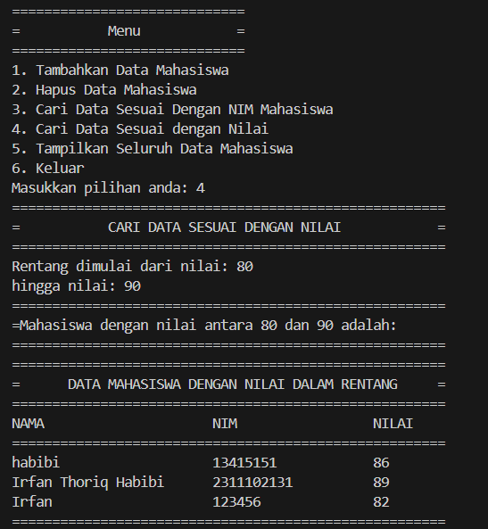

# <h1 align="center">Laporan Praktikum Modul Hashtable</h1>
<p align="center">Irfan Thoriq Habibi - 2311102131</p>

## Dasar Teori

HASHTABLE<br/>
a. Perngertian Hashtable<br/>
hash table merupakan struktur data yang mengatur data kedalam pasangan key-value. Data-data tersebut disimpan kedalam format array yang mana pada setiap nilainya memiliki indeks uniknya sendiri. Hash table sendiri menggunakan array atau vector dalam menyimpan data.<br/>

b.Fungsi Hashtable<br/>
Hash table memiliki fungsi utama yakni mempercepat proses dalam mengakses suatu data yang membuatnya menjadi suatu solusi dalam membuat proses data lebih cepat dan efisien.<br/>

c.Operasi Hashtable<br/>
hashtable memiliki berbagai macam operasi didalamnya. berikut ini ialah macam macam operasi hashtable.<br/>
1.insertion (memasukkan data)<br/>
2.searching (mencari data)<br/>
3.deletion (menghapus data)<br/>
4.update (memperbaharui data)<br/>
5.tranversal (menampilkan seluruh data)<br/>

d. contoh pengoperasian hashtable<br/>
berikut ini merupakan contoh dari pengoperasian hashtable.<br/>

a. Struktur Data Hashtable
```C++
struct Node{
    int key;
    int value;
    Node *next;
    Node(int key, int value) : key(key), value(value),next(nullptr) {}
};
```
b. Class hashtable
```C++
class HashTable{
private:
    Node **table;
public:
    HashTable(){
        table = new Node *[MAX_SIZE]();
    }
    ~HashTable(){
        for (int i = 0; i < MAX_SIZE; i++){
            Node *current = table[i];
            while (current != nullptr){
                Node *temp = current;
                current = current->next;
                delete temp;
            }
        }
        delete[] table;
    }
};
```
c.Menambahkan Data ke dalam hashtable
```C++
void insert(int key, int value){
        int index = hash_func(key);
        Node *current = table[index];
        while (current != nullptr){
            if (current->key == key){
                current->value = value;
                return;
            }
            current = current->next;
        }
        Node *node = new Node(key, value);
        node->next = table[index];
        table[index] = node;
    }
```
d. Mencari data didalam Hashtable
```C++
    int get(int key){
        int index = hash_func(key);
        Node *current = table[index];
        while (current != nullptr){
            if (current->key == key){
                return current->value;
            }
            current = current->next;
        }
        return -1;
    }
```
e. Menghapus data didalam hashtable
```C++
    void remove(int key){
        int index = hash_func(key);
        Node *current = table[index];
        Node *prev = nullptr;
        while (current != nullptr){
            if (current->key == key){
                if (prev == nullptr){
                    table[index] = current->next;
                }else{
                    prev->next = current->next;
                }
                delete current;
                return;
            }
            prev = current;
            current = current->next;
        }
    }
```
f. node deklarasi
```C++
struct Node{
    int key;
    int value;
    Node *next;
    Node(int key, int value) : key(key), value(value),next(nullptr) {}
};
```
g. Menampilkan data
```C++
    void traverse(){
        for (int i = 0; i < MAX_SIZE; i++){
            Node *current = table[i];
            while (current != nullptr){
                cout << current->key << ": " << current->value<< endl;
                current = current->next;
            }
        }
    }
```

## Guided 

### 1. [Guided 1]

```C++
/*
Irfan Thoriq Habibi - 2311102131
*/
#include <iostream>
using namespace std;
const int MAX_SIZE = 10;
// Fungsi hash sederhana
int hash_func(int key){
    return key % MAX_SIZE;
}
// Struktur data untuk setiap node
struct Node{
    int key;
    int value;
    Node *next;
    Node(int key, int value) : key(key), value(value),next(nullptr) {}
};
// Class hash table
class HashTable{
private:
    Node **table;
public:
    HashTable(){
        table = new Node *[MAX_SIZE]();
    }
    ~HashTable(){
        for (int i = 0; i < MAX_SIZE; i++){
            Node *current = table[i];
            while (current != nullptr){
                Node *temp = current;
                current = current->next;
                delete temp;
            }
        }
        delete[] table;
    }
    // Insertion
    void insert(int key, int value){
        int index = hash_func(key);
        Node *current = table[index];
        while (current != nullptr){
            if (current->key == key){
                current->value = value;
                return;
            }
            current = current->next;
        }
        Node *node = new Node(key, value);
        node->next = table[index];
        table[index] = node;
    }

    // Searching
    int get(int key){
        int index = hash_func(key);
        Node *current = table[index];
        while (current != nullptr){
            if (current->key == key){
                return current->value;
            }
            current = current->next;
        }
        return -1;
    }
    // Deletion
    void remove(int key){
        int index = hash_func(key);
        Node *current = table[index];
        Node *prev = nullptr;
        while (current != nullptr){
            if (current->key == key){
                if (prev == nullptr){
                    table[index] = current->next;
                }else{
                    prev->next = current->next;
                }
                delete current;
                return;
            }
            prev = current;
            current = current->next;
        }
    }
    // Traversal
    void traverse(){
        for (int i = 0; i < MAX_SIZE; i++){
            Node *current = table[i];
            while (current != nullptr){
                cout << current->key << ": " << current->value<< endl;
                current = current->next;
            }
        }
    }
};

int main()
{
    HashTable ht;
    // Insertion
    ht.insert(1, 10);
    ht.insert(2, 20);
    ht.insert(3, 30);
    // Searching
    cout << "Get key 1: " << ht.get(1) << endl;
    cout << "Get key 4: " << ht.get(4) << endl;
    // Deletion
    ht.remove(4);
    // Traversal
    ht.traverse();
    return 0;
}
```
kode di atas merupakan program hashtable sederhana yang memiliki fungsi mencari,menambahkan dan menghapus data.program ini digunakan untuk menyimpan data key dan value. pada program ini, user dapat menambahkan, mencari, serta menghapus data yang ingin ditampilkan dengan cara mengubah data pada bagian int main(). 

###  2. [Guided 2]

```C++
/*
Irfan Thoriq Habibi
*/
#include <iostream>
#include <string>
#include <vector>
using namespace std;

const int TABLE_SIZE = 11;
string name;
string phone_number;
class HashNode{
public:
    string name;
    string phone_number;
    HashNode(string name, string phone_number){
        this->name = name;
        this->phone_number = phone_number;
    }
};
class HashMap{
private:
    vector<HashNode *> table[TABLE_SIZE];

public:
    int hashFunc(string key){
        int hash_val = 0;
        for (char c : key){
            hash_val += c;
        }
        return hash_val % TABLE_SIZE;
    }
    void insert(string name, string phone_number) {
        int hash_val = hashFunc(name);
        for (auto node : table[hash_val]){
            if (node->name == name){
                node->phone_number = phone_number;
                return;
            }
        }
        table[hash_val].push_back(new HashNode(name,phone_number));
    }
    void remove(string name){
        int hash_val = hashFunc(name);
        for (auto it = table[hash_val].begin(); it != table[hash_val].end();
             it++){
            if ((*it)->name == name){
                table[hash_val].erase(it);
                return;
            }
        }
    }
    string searchByName(string name){
        int hash_val = hashFunc(name);
        for (auto node : table[hash_val]){
            if (node->name == name){
                return node->phone_number;
            }
        }
        return "";
    }
    void print() {
        for (int i = 0; i < TABLE_SIZE; i++){
            cout << i << ": ";
            for (auto pair : table[i]){
                if (pair != nullptr){
                    cout << "[" << pair->name << ", " << pair->phone_number << "]";
                }
            }
            cout << endl;
        }
    }
};
int main(){
    HashMap employee_map;
    employee_map.insert("Mistah", "1234");
    employee_map.insert("Pastah", "5678");
    employee_map.insert("Ghana", "91011");
    cout << "Nomer Hp Mistah : "
         << employee_map.searchByName("Mistah") << endl;
    cout << "Phone Hp Pastah : "
         << employee_map.searchByName("Pastah") << endl;
    employee_map.remove("Mistah");
    cout << "Nomer Hp Mistah setelah dihapus : "
         << employee_map.searchByName("Mistah") << endl << endl;
    cout << "Hash Table : " << endl;
    employee_map.print();
    return 0;
}

```
kode di atas merupakan program hashtable sederhana yang memiliki fungsi mencari data sesuai nama,menambahkan data,menghapus data,hingga menampilkan data. program ini digunakan untuk menyimpan data nama beserta nomor telpon yang dimasukkan oleh user.pada program ini, user dapat menambahkan, mencari sesuai nama, menghapus,hingga menampilkan data yang ingin ditampilkan dengan cara mengubah data pada bagian int main().

## Unguided 

### 1. [Implementasikan hash table untuk menyimpan data mahasiswa. Setiap mahasiswa memiliki NIM dan nilai. Implementasikan fungsi untuk menambahkan data baru,menghapus data, mencari data berdasarkan NIM, dan mencari data berdasarkannilai. Dengan ketentuan :]


```C++
/*
Irfan Thoriq Habibi - 2311102131
*/
#include <iostream>
#include <iomanip>
using namespace std;

const int MAX_SIZE = 10;

// Fungsi hash sederhana untuk menghasilkan indeks dari kunci (NIM)
int hash_func(string key) {
    int sum = 0;
    for (char c : key) {
        sum += c;
    }
    return sum % MAX_SIZE;
}

// Struktur data untuk menyimpan informasi mahasiswa
struct data_131 {
    string nama_131;
    string nim_131;
    int nilai_131;
    data_131* next;
    data_131(string nama_131, string nim_131, int nilai_131) : nama_131(nama_131),nim_131(nim_131), nilai_131(nilai_131), next(nullptr) {}
};

// Kelas HashTable
class HashTable {
private:
    data_131** table; 

public:
    // Konstruktor untuk inisialisasi tabel hash
    HashTable() {
        table = new data_131*[MAX_SIZE]();
    }

    // Destruktor untuk membebaskan memori yang dialokasikan
    ~HashTable() {
        for (int i = 0; i < MAX_SIZE; i++) {
            data_131* current = table[i];
            while (current != nullptr) {
                data_131* temp = current;
                current = current->next;
                delete temp;
            }
        }
        delete[] table;
    }

    // Fungsi untuk menambahkan data mahasiswa ke hashtable
    void insertdata_131(string nama_131, string nim_131, int nilai_131) {
        int index = hash_func(nim_131);
        data_131* current = table[index];
        while (current != nullptr) {
            if (current->nim_131 == nim_131) {
                current->nilai_131 = nilai_131;
                return;
            }
            current = current->next;
        }
        data_131* data = new data_131(nama_131, nim_131, nilai_131);
        data->next = table[index];
        table[index] = data;
    }

    // Fungsi untuk mencari data mahasiswa berdasarkan NIM
    data_131* carinim_131(string nim_131) {
        int index = hash_func(nim_131);
        data_131* current = table[index];
        while (current != nullptr) {
            if (current->nim_131 == nim_131) {
                return current;
            }
            current = current->next;
        }
        return nullptr; // Mengembalikan null jika data tidak ditemukan
    }

    // Fungsi untuk mencari dan menampilkan data mahasiswa berdasarkan rentang nilai
    void carinilai_131(int dari_131, int hingga_131) {
        cout << "======================================================"<<endl;
        cout << "=      DATA MAHASISWA DENGAN NILAI DALAM RENTANG     ="<<endl;
        cout << "======================================================"<<endl;
        cout << setw(25) << left << "NAMA" << setw(20) << left << "NIM" << setw(10) << left << "NILAI" << endl;
        cout << "======================================================"<<endl;
        for (int i = 0; i < MAX_SIZE; i++) {
            data_131* current = table[i];
            while (current != nullptr) {
            if (current->nilai_131 >= dari_131 && current->nilai_131 <= hingga_131) {
                cout << setw(25) << left << current->nama_131 << setw(20) << left << current->nim_131 << setw(10) << left << current->nilai_131 << endl;
            }
            current = current->next;
        }
    }
    cout << "======================================================"<<endl;
}

    // Fungsi untuk menghapus data mahasiswa berdasarkan nama
    void hapusdata_131(string nama_131) {
        for (int i = 0; i < MAX_SIZE; i++) {
            data_131* current = table[i];
            data_131* prev = nullptr;
            while (current != nullptr) {
                if (current->nama_131 == nama_131) {
                    if (prev == nullptr) {
                        table[i] = current->next;
                    } else {
                        prev->next = current->next;
                    }
                    delete current;
                    cout << "==================================================" << endl;
                    cout << "Data dengan nama " << nama_131 << " telah dihapus!" << endl;
                    cout << "==================================================" << endl;
                    return;
                }
                prev = current;
                current = current->next;
            }
        }
        cout << "Data dengan nama " << nama_131 << " tidak tersedia!" << endl;
    }

    // Fungsi untuk menampilkan seluruh data mahasiswa dalam hashtable
    void Traverse_131()
    {
        cout << "======================================================"<<endl;
        cout << "=      DATA MAHASISWA DENGAN NILAI DALAM RENTANG     ="<<endl;
        cout << "======================================================"<<endl;
        cout << setw(25) << left << "NAMA" << setw(20) << left << "NIM" << setw(10) << left << "NILAI" << endl;
        cout << "======================================================" << endl;
        for (int i = 0; i < MAX_SIZE; i++)
        {
            data_131 *current = table[i];
            while (current != nullptr)
            {
                cout << setw(25) << left << current->nama_131 << setw(20) << left << current->nim_131 << setw(10) << left << current->nilai_131 << endl;
                current = current->next;
            }
        }
        cout << "=======================================================" << endl;
    }
};

// Fungsi utama
int main() {
    HashTable ht;

    cout << "=============================================================================="<<endl;
    cout << "=                    PROGRAM HASH TABLE DATA DARI MAHASISWA                  ="<<endl;
    cout << "=============================================================================="<<endl;
    while (true) {
        cout << "============================="<<endl;
        cout << "=           Menu            ="<<endl;
        cout << "============================="<<endl;
        cout << "1. Tambahkan Data Mahasiswa"<<endl;
        cout << "2. Hapus Data Mahasiswa"<<endl;
        cout << "3. Cari Data Sesuai Dengan NIM Mahasiswa"<<endl;
        cout << "4. Cari Data Sesuai dengan Nilai"<<endl;
        cout << "5. Tampilkan Seluruh Data Mahasiswa"<<endl;
        cout << "6. Keluar"<<endl;
        cout << "Masukkan pilihan anda: ";
        int pilih_131;
        cin >> pilih_131;

        switch (pilih_131) {
            case 1: {
                cout << "================================================="<<endl;
                cout << "=           TAMBAHKAN DATA MAHASISWA            ="<<endl;
                cout << "================================================="<<endl;
                string nim_131;
                string nama_131;
                int nilai_131;
                cout << "Inputkan Nama: ";
                cin.ignore();
                getline(cin , nama_131);
                cout << "Inputkan NIM: ";
                cin >> nim_131;
                cout << "Inputkan Nilai: ";
                cin >> nilai_131;
                ht.insertdata_131(nama_131,nim_131, nilai_131);
                cout <<endl;
                cout << "Data mahasiswa dengan nama " << nama_131 << ", NIM " << nim_131 << ", Nilai " << nilai_131 << " berhasil ditambahkan." << endl;
                break;
            }
            case 2: {
                cout << "============================================" << endl;
                cout << "=           HAPUS DATA MAHASISWA           =" << endl;
                cout << "============================================" << endl;
                string nama_131;
                cout << "Inputkan Nama yang akan dihapus: ";
                cin.ignore();
                getline(cin, nama_131);
                ht.hapusdata_131(nama_131);
                break;
            }
            case 3: {
                cout << "==============================================================" << endl;
                cout << "=           CARI DATA SESUAI DENGAN NIM MAHASISWA            =" << endl;
                cout << "==============================================================" << endl;
                string nim_131;
                cout << "Inputkan NIM: ";
                cin >> nim_131;
                data_131* data = ht.carinim_131(nim_131);
                if (data != nullptr)
                    cout << "NIM " << nim_131 << " dimiliki oleh " << data->nama_131 << " dengan nilai " << data->nilai_131 << endl;
                else
                    cout << "Data tidak ditemukan!" << endl;
                break;
            }
            case 4: {
                cout << "======================================================" << endl;
                cout << "=           CARI DATA SESUAI DENGAN NILAI            =" << endl;
                cout << "======================================================" << endl;
                int dari_131, hingga_131;
                cout << "Rentang dimulai dari nilai: ";
                cin >> dari_131;
                cout << "hingga nilai: ";
                cin >> hingga_131;
                cout << "======================================================" << endl;
                cout << "=Mahasiswa dengan nilai antara " << dari_131 << " dan " << hingga_131 << " adalah: "<<endl;
                cout << "======================================================" << endl;
                ht.carinilai_131(dari_131, hingga_131);
                break;
            }
            case 5: {
                cout << "========================================================" << endl;
                cout << "=           TAMPILKAN SELURUH DATA MAHASISWA           =" << endl;
                cout << "========================================================" << endl;
                ht.Traverse_131();
                break;
            }
            case 6:
                cout << "==================================================================" << endl;
                cout << "=           Terima Kasih Telah Menggunakan Program Ini           =" << endl;
                cout << "==================================================================" << endl;
                return 0;
            default:
                cout << "==================================================================" << endl;
                cout << "=       Input tidak valid Mohon masukkan angka 1 hingga 6.       =" << endl;
                cout << "==================================================================" << endl;
        }
    }
}

```
#### Output:
<br/>
menambahkan data Irfan Thoriq Habibi ke dalam hash table<br/>
<br/>
menambahkan data Irfan dan thoriq ke dalam hashtable<br/>
<br/>
menambahkan data habibi ke dalam hash table<br/>
<br/>
menampilkan seluruh data yang telah tersimpan didalam hashtable<br/>
<br/>
mencari data dengan nim 2311102131 pada hash table<br/>
<br/>
mencari data dengan rentang nilai 80-90 pada hash table<br/>
<br/>
menghapus data thoriq dari hash table dan terakhir menampilkan seluruh data yang telah tersimpan pada hashtable.

kode diatas merupakan program hashtable yang berfungsi untuk menambahkan data,mencari data menggunakan nim,mencari data dengan rentang nilai,menghapus data,hingga menampilkan seluruh data mahasiswa. program ini digunakan untuk menyimpan data yang terdiri dari nama,nim dan juga nilai mahasiswa. user dapat memilih apapun yang berada didalam menu. apabila user menginputkan angka yang tidak sesuai dengan menu, program akan menampilkan pesan "Input tidak valid Mohon masukkan angka 1 hingga 6".

## Kesimpulan
Hashtable merupakan suatu struktur data yang kuat lagi efisien dalam menyimpan serta mengelola data array maupun vector.salah satu keunggulan dari hashtable ialah kecepatan dalam mengakses operasi pencarian,penyisipan hingga penghapusan data yang tidak bergantung pada ukuran data yang disimpannya.[1].

## Referensi
[1] Tapia-Fernández, Santiago, Daniel García-García, and Pablo García-Hernandez. "Key Concepts, Weakness and Benchmark on Hash Table Data Structures." Algorithms 15.3 (2022): 100.<br/>
[2] Zheng, Tianqi, Zhibin Zhang, and Xueqi Cheng. "Saha: a string adaptive hash table for analytical databases." Applied Sciences 10.6 (2020): 1915.