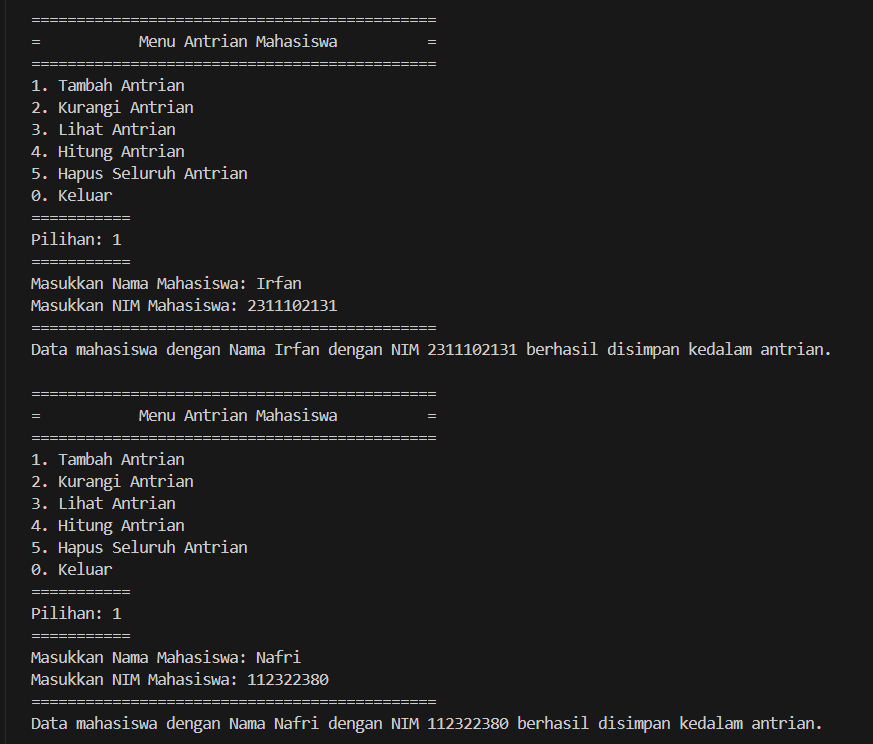

# <h1 align="center">Laporan Praktikum Modul QUEUE</h1>
<p align="center">Irfan Thoriq Habibi - 2311102131</p>

## Dasar Teori
A. Pengertian QUEUE<br/>
Queue merupakan salah satu dari struktur data yang memiliki fungsi untuk meniru dari antrion orang yang sedang menunggu didalam antrian. Queue sendiri menggunakan metode FIFO (First-In First-Out) yang mana pada penambahan orang di antrian selalu dilakukan dari belakang (rear of queue) serta pelayanan yang selalu dilakukan pada urutan depan.<br/>
B. Contoh pengopreasian QUEUE<br/>
berikut ini merupakan contoh pengoprasian queue pada c++ antara lain :<br/>
a. IsFull()<br/>
berfungsi untuk mengecek suatu queue apakah penuh atau tidak.<br/>
```C++
bool isFull(){
    if(back == MaksimalAntrian){
        return true;
    } else {
        return false;
    }
}
```
b. IsEmpty()<br/>
berfungsi untuk mengecek suatu queue apakah kosong atau tidak.<br/>
```C++
bool isEmpty(){
    if(back == 0){
        return true;
    } else {
        return false;
    }
}
```
c. Enqueue()<br/>
berfungsi untuk menambahkan data ke dalam suatu queue.<br/>
```C++
void TambahData(string nama){
    if(isFull()){
        cout << "Antrian sudah penuh" << endl;
    } else if(!isFull()){
        if(isEmpty()){
            QueueTeller[0] = nama;
            front++;
            back++;
        } else if(!isEmpty()){
            QueueTeller[back] = nama;
            back++;
        }
    }
}
```
d. dequeue()<br/>
berfungsi untuk mengurangi atau mengeluarkan suatu data dari queue.<br/>
```C++
void KurangAntrian(){
    if(isEmpty()){
        cout << "Antrian masih kosong" << endl;
    } else if(!isEmpty()){
        for(int i = 0; i < back; i++){
            QueueTeller[i] =  QueueTeller[i+1];
        }
        back--;
    }
}
```
## Guided 

### 1. [Queue]

```C++
/*
Irfan Thoriq Habibi - 2311102131
*/
#include<iostream>

using namespace std;

const int MaksimalAntrian = 5;
int front = 0;
int back = 0;
string QueueTeller[5];

//Mengecek apakah antrian sudah penuh atau belum
bool isFull(){
    if(back == MaksimalAntrian){
        return true;
    } else {
        return false;
    }
}

//Mengecek apakah antrian masih kosong atau tidak
bool isEmpty(){
    if(back == 0){
        return true;
    } else {
        return false;
    }
}

//Menambah antrian
void TambahData(string nama){
    if(isFull()){
        cout << "Antrian sudah penuh" << endl;
    } else if(!isFull()){
        if(isEmpty()){
            QueueTeller[0] = nama;
            front++;
            back++;
        } else if(!isEmpty()){
            QueueTeller[back] = nama;
            back++;
        }
    }
}

//Mengurangi antrian
void KurangAntrian(){
    if(isEmpty()){
        cout << "Antrian masih kosong" << endl;
    } else if(!isEmpty()){
        for(int i = 0; i < back; i++){
            QueueTeller[i] =  QueueTeller[i+1];
        }
        back--;
    }
}

//Menghitung banyak antrian
int Count(){
    return back;
}

//Menghapus seluruh antrian
void ClearQueue(){
    if(isEmpty()){
        cout << "Antrian masih kosong" << endl;
    } else if(!isEmpty()){
        for(int i = 0; i < back; i++){
            QueueTeller[i] = "";
        }
        back = 0;
        front = 0;
    }
}

//Melihat Antrian
void ViewQueue(){
    cout << "Data antrian = " << endl;
    for(int i = 0; i < MaksimalAntrian; i++){
        if(QueueTeller[i] != ""){
            cout << i+1 << ". " << QueueTeller[i] << endl;
        } else {
            cout << i+1 << ". " << "(kosong)" << endl;
        }
    }
}

//main fungsi
int main(){
    //Menambah 3 data nama kedalam antrian
    TambahData("Alya");
    TambahData("Kiki");
    TambahData("Artika");

    //menampilkan data yang sudah ditambahkan
    ViewQueue();

    //mengurangi data
    KurangAntrian();

    //menampilkan data setelah dikurangi
    ViewQueue();

    //menghapus seluruh antrian
    ClearQueue();

    //menampilkan data setelah dihapus
    ViewQueue();
}
```
jadi pada guided ini berisi program queue yang menampilkan data antrian. pada program queue ini, dibatasi hanya 5 data yang dapat tersimpan didalam array.program ini akan menampikan data yang telah diinputkan oleh user pada int main() sehingga, jika ada array yang belum terisi, maka pada saat dijalankan program akan menampilkan "kosong". 
## Unguided 

### 1. [ubahlah konsep queue pada bagian guided dari array menjadi linked list]

```C++
/*
Irfan Thoriq Habibi - 2311102131
*/
#include <iostream>
#include <iomanip> 

using namespace std;

// Deklarasi struct node
struct node {
    string NamaMahasiswa_131;
    string NIM_131;
    node *next;
};

node *front;
node *back;

// Prosedur inisialisasi node front dan back sebagai NULL
void Inisialisasi_131() {
    front = NULL;
    back = NULL;
}

// Fungsi untuk mengecek apakah queue kosong atau tidak
bool isEmpty_131() {
    return front == NULL;
}

// Prosedur untuk menambahkan data pada antrian
void TambahData_131(string NamaMahasiswa_131, string NIM_131) {
    node *baru = new node;
    baru->NamaMahasiswa_131 = NamaMahasiswa_131;
    baru->NIM_131 = NIM_131;
    baru->next = NULL;
    if (isEmpty_131()) {
        front = back = baru;
    } else {
        back->next = baru;
        back = baru;
    }
}

// Prosedur untuk mengurangi antrian (lanjut ke antrian selanjutnya)
void KurangiAntrian_131(){
    if (!isEmpty_131()) {
        node *hapus = front;
        if (front == back) {
            front = back = NULL;
        } else {
            front = front->next;
        }
        delete hapus;
        cout << "Antrian pertama telah dihapus." << endl;
    } else {
        cout << "Antrian masih kosong!" << endl;
    }
}

// Fungsi untuk menghitung jumlah antrian
int HitungAntrian_131() {
    int jumlah_131 = 0;
    node *hitung = front;
    while (hitung != NULL) {
        hitung = hitung->next;
        jumlah_131++;
    }
    return jumlah_131;
}

// Prosedur untuk menghapus seluruh antrian
void HapusAntrian_131() {
    while (!isEmpty_131()) {
        KurangiAntrian_131();
    }
}

// Prosedur untuk menampilkan antrian
void LihatAntrian_131() {
    if (isEmpty_131()) {
        cout << "Antrian kosong!" << endl;
    } else {
        cout << "=== Antrian Saat Ini ===" << endl;
        cout << left << setw(5) << "No" << setw(30) << "Nama Mahasiswa" << setw(15) << "NIM" << endl;
        cout << "============================================="<<endl;
        int NomorAntrian_131 = 1;
        node *bantu = front;
        while (bantu != NULL) {
            cout << left << setw(5) << NomorAntrian_131 << setw(30) << bantu->NamaMahasiswa_131 << setw(15) << bantu->NIM_131 << endl;
            bantu = bantu->next;
            NomorAntrian_131++;
        }
    }
}

int main() {
    Inisialisasi_131(); // Inisialisasi antrian
    int pilih_131;
    string nama_131, nim_131;

    do {
        cout << "============================================="<<endl;
        cout << "=           Menu Antrian Mahasiswa          ="<<endl;
        cout << "============================================="<<endl;
        cout << "1. Tambah Antrian" << endl;
        cout << "2. Kurangi Antrian" << endl;
        cout << "3. Lihat Antrian" << endl;
        cout << "4. Hitung Antrian" << endl;
        cout << "5. Hapus Seluruh Antrian" << endl;
        cout << "0. Keluar" << endl;
        cout << "==========="<<endl;
        cout << "Pilihan: ";
        cin >> pilih_131;
        cout << "==========="<<endl;

        switch (pilih_131) {
            case 1:
                cout << "Masukkan Nama Mahasiswa: ";
                cin.ignore();
                cin>>nama_131;
                cout << "Masukkan NIM Mahasiswa: ";
                cin >> nim_131;
                TambahData_131(nama_131, nim_131);
                cout << "============================================="<<endl;
                cout << "Data mahasiswa dengan Nama " << nama_131 << " dengan NIM " << nim_131 << " berhasil disimpan kedalam antrian." << endl;
                break;
            case 2:
                KurangiAntrian_131();
                break;
            case 3:
                LihatAntrian_131();
                break;
            case 4:
                cout << "Jumlah antrian saat ini: " << HitungAntrian_131() << endl;
                break;
            case 5:
                HapusAntrian_131();
                cout << "Seluruh antrian telah dihapus." << endl;
                break;
            case 0:
                cout << "Keluar dari program." << endl;
                break;
            default:
                cout << "Pilihan tidak valid. Silakan coba lagi." << endl;
        }
        cout << endl;
    } while (pilih_131 != 0);

    return 0;
}
```
#### Output:
<br/>
tampilan awal guided yang menggunakan array<br/>
<br/>
tampilan awal unguided yang mengubah bagian array menjadi linkedlist.<br/>

program ini merupakan program yang telah dimodifikasi dari program yang ada pada guided. pada program ini, user telah mengubah array menjadi linkedlist. user juga menambahkan menu pada bagian int main sehingga ketika di jalankan, user hanya perlu memilih menu yang tersedia pada program.

### 2. [Dari nomor 1 buatlah konsep antri dengan atribut Nama mahasiswa dan NIM Mahasiswa]

```C++
/*
Irfan Thoriq Habibi - 2311102131
*/
#include <iostream>
#include <iomanip> 

using namespace std;

// Deklarasi struct node
struct node {
    string NamaMahasiswa_131;
    string NIM_131;
    node *next;
};

node *front;
node *back;

// Prosedur inisialisasi node front dan back sebagai NULL
void Inisialisasi_131() {
    front = NULL;
    back = NULL;
}

// Fungsi untuk mengecek apakah queue kosong atau tidak
bool isEmpty_131() {
    return front == NULL;
}

// Prosedur untuk menambahkan data pada antrian
void TambahData_131(string NamaMahasiswa_131, string NIM_131) {
    node *baru = new node;
    baru->NamaMahasiswa_131 = NamaMahasiswa_131;
    baru->NIM_131 = NIM_131;
    baru->next = NULL;
    if (isEmpty_131()) {
        front = back = baru;
    } else {
        back->next = baru;
        back = baru;
    }
}

// Prosedur untuk mengurangi antrian (lanjut ke antrian selanjutnya)
void KurangiAntrian_131(){
    if (!isEmpty_131()) {
        node *hapus = front;
        if (front == back) {
            front = back = NULL;
        } else {
            front = front->next;
        }
        delete hapus;
        cout << "Antrian pertama telah dihapus." << endl;
    } else {
        cout << "Antrian masih kosong!" << endl;
    }
}

// Fungsi untuk menghitung jumlah antrian
int HitungAntrian_131() {
    int jumlah_131 = 0;
    node *hitung = front;
    while (hitung != NULL) {
        hitung = hitung->next;
        jumlah_131++;
    }
    return jumlah_131;
}

// Prosedur untuk menghapus seluruh antrian
void HapusAntrian_131() {
    while (!isEmpty_131()) {
        KurangiAntrian_131();
    }
}

// Prosedur untuk menampilkan antrian
void LihatAntrian_131() {
    if (isEmpty_131()) {
        cout << "Antrian kosong!" << endl;
    } else {
        cout << "=== Antrian Saat Ini ===" << endl;
        cout << left << setw(5) << "No" << setw(30) << "Nama Mahasiswa" << setw(15) << "NIM" << endl;
        cout << "============================================="<<endl;
        int NomorAntrian_131 = 1;
        node *bantu = front;
        while (bantu != NULL) {
            cout << left << setw(5) << NomorAntrian_131 << setw(30) << bantu->NamaMahasiswa_131 << setw(15) << bantu->NIM_131 << endl;
            bantu = bantu->next;
            NomorAntrian_131++;
        }
    }
}

int main() {
    Inisialisasi_131(); // Inisialisasi antrian
    int pilih_131;
    string nama_131, nim_131;

    do {
        cout << "============================================="<<endl;
        cout << "=           Menu Antrian Mahasiswa          ="<<endl;
        cout << "============================================="<<endl;
        cout << "1. Tambah Antrian" << endl;
        cout << "2. Kurangi Antrian" << endl;
        cout << "3. Lihat Antrian" << endl;
        cout << "4. Hitung Antrian" << endl;
        cout << "5. Hapus Seluruh Antrian" << endl;
        cout << "0. Keluar" << endl;
        cout << "==========="<<endl;
        cout << "Pilihan: ";
        cin >> pilih_131;
        cout << "==========="<<endl;

        switch (pilih_131) {
            case 1:
                cout << "Masukkan Nama Mahasiswa: ";
                cin.ignore();
                cin>>nama_131;
                cout << "Masukkan NIM Mahasiswa: ";
                cin >> nim_131;
                TambahData_131(nama_131, nim_131);
                cout << "============================================="<<endl;
                cout << "Data mahasiswa dengan Nama " << nama_131 << " dengan NIM " << nim_131 << " berhasil disimpan kedalam antrian." << endl;
                break;
            case 2:
                KurangiAntrian_131();
                break;
            case 3:
                LihatAntrian_131();
                break;
            case 4:
                cout << "Jumlah antrian saat ini: " << HitungAntrian_131() << endl;
                break;
            case 5:
                HapusAntrian_131();
                cout << "Seluruh antrian telah dihapus." << endl;
                break;
            case 0:
                cout << "Keluar dari program." << endl;
                break;
            default:
                cout << "Pilihan tidak valid. Silakan coba lagi." << endl;
        }
        cout << endl;
    } while (pilih_131 != 0);

    return 0;
}
```
#### Output:
<br/>
menambahkan data irfan dan nafri kedalam antrian.<br/>
<br/>
menampilkan antrian dan melihat jumlah antrian yang tersedia.<br/>
<br/>
mengurangi antrian dan melihat antrian yang tersimpan.<br/>
<br/>
menampilkan jumlah antrian dan menghapus seluruh antrian yang tersimpan.<br/>
<br/>
semua antrian telah terhapus.<br/>
<br/>
semua antrian telah terhapus dan keluar dari program.<br/>

program ini merupakan lanjutan dari unguided 1. disini terdapat 6 menu yang dapat digunakan yakni  Tambah Antrian,Kurangi Antrian,Lihat Antrian,Hitung Antrian,Hapus Seluruh Antrian,dan Keluar. tambah antrian berfungsi untuk menambahkan antrian mahasiswa. kurangi antrian berfungsi untuk mengurangi antrian mahasiswa.lihat antrian berfungsi untuk melihat data mahasiswa apa saja yang telah tersimpan didalam antrian. hitung antrian berfungsi untuk menampilkan jumlah antrian yang tersimpan didalam antrian. hapus seluruh antrian berfungsi untuk menghapus seluruh antrian yang berada pada program. keluar berfungsi untuk menghentikan program. 
## Kesimpulan
Queue merupakan suatu struktur data yang mengikuti prinsif FIFO ( First-In First-Out) yang mana pada nilai/elemen yang pertama diinputkan maka akan ditempatkan paling awal ( seperti contohnya pada antrian. siapa yang datang lebih awal,maka ia akan dilayanin terlebih dahulu). Queue sendiri biasanya digunakan untuk mengatur serta mengelola data dalam urutan tertentu seperti antrian pelanggan, pengiriman pesan, dll.[1].

## Referensi
[1] Triase, Triase. "Struktur Data: Diktat Edisi Revisi." (2020).<br/>
[2] Sihombing, Johnson. "Penerapan stack dan queue pada array dan linked list dalam java." INFOKOM (Informatika & Komputer) 7.2 (2019): 15-24.