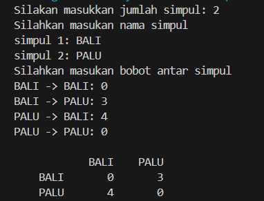
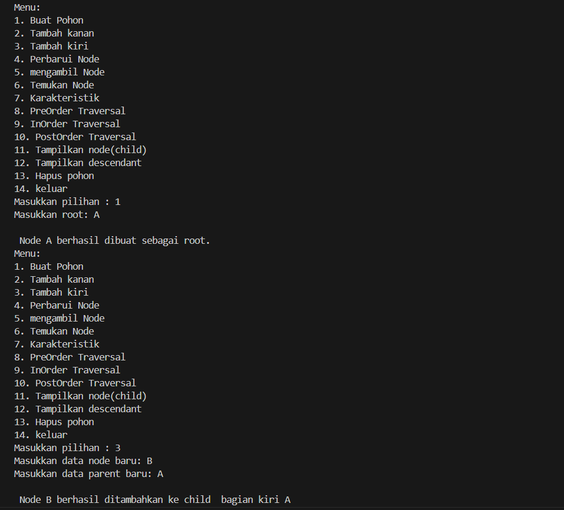
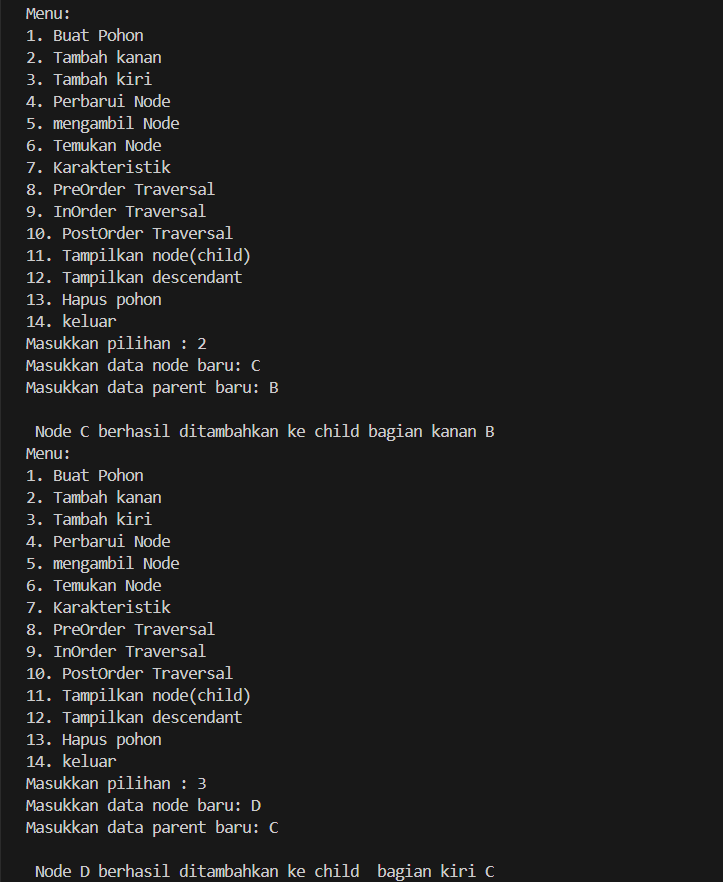
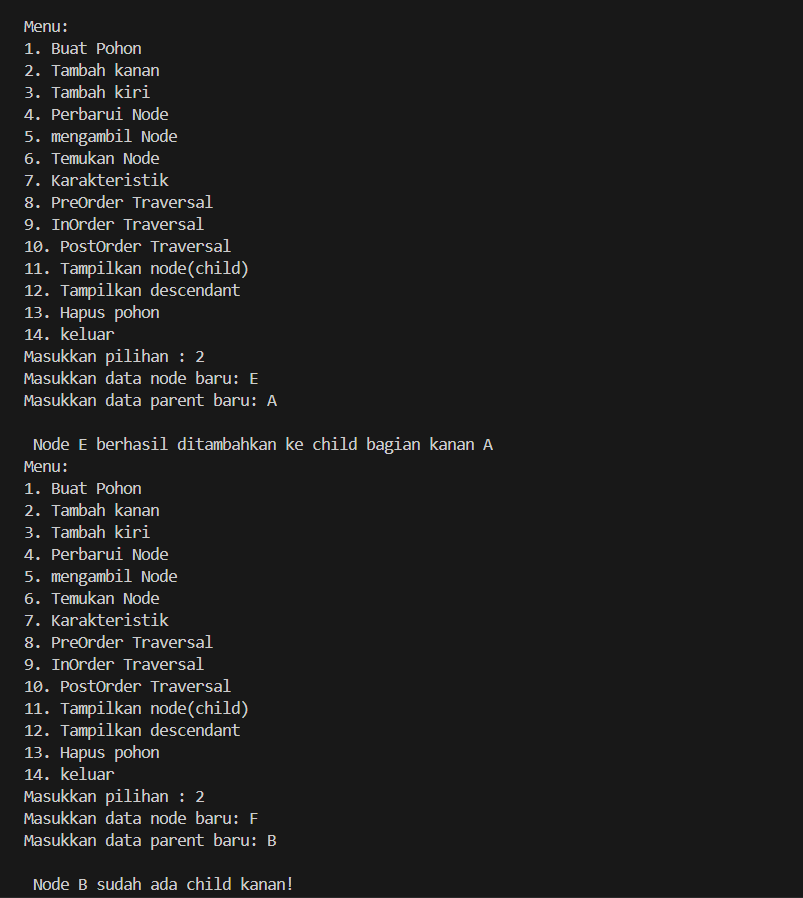
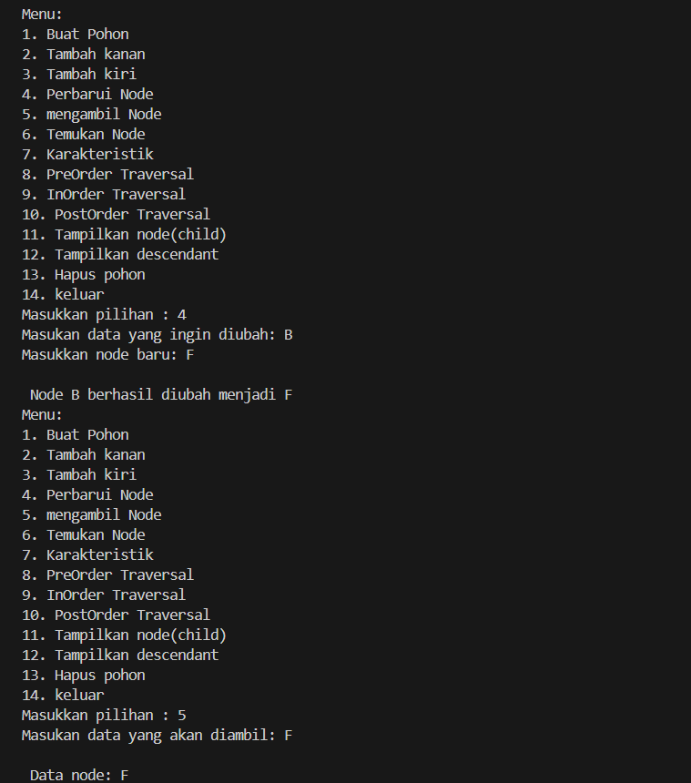
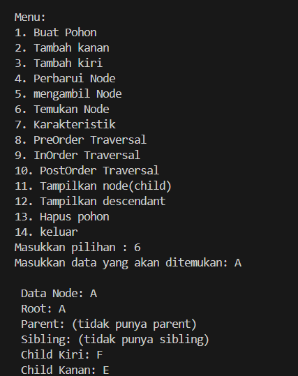
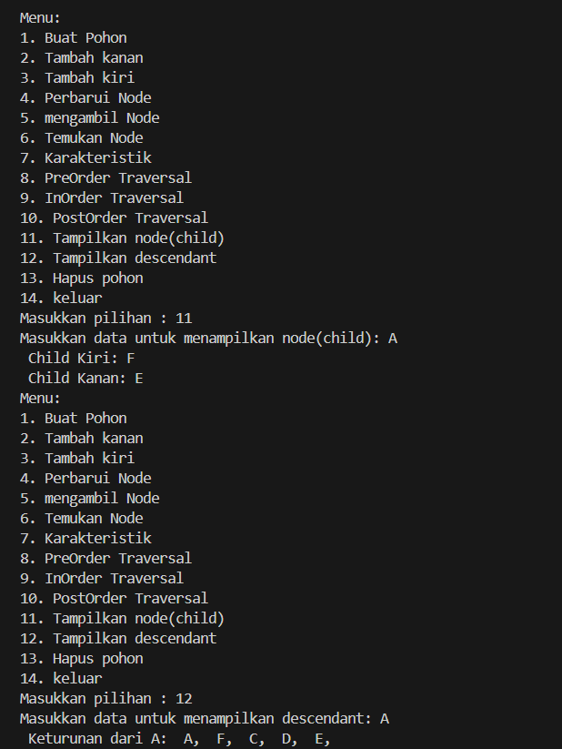
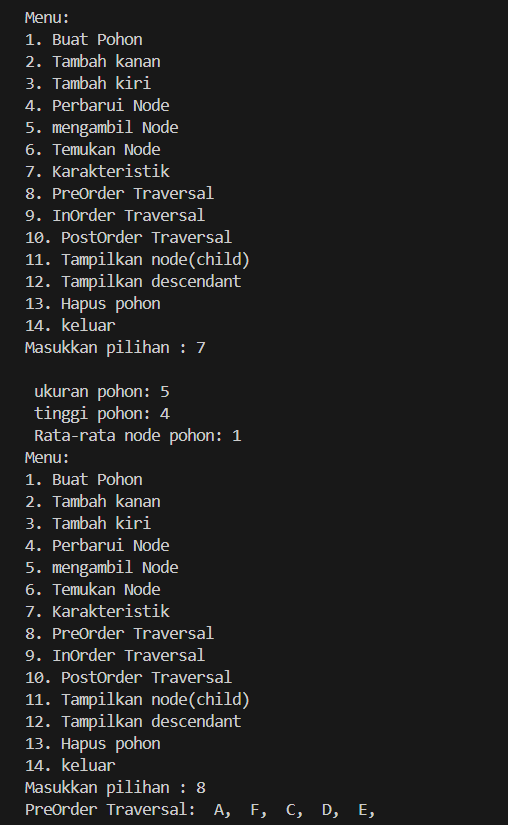
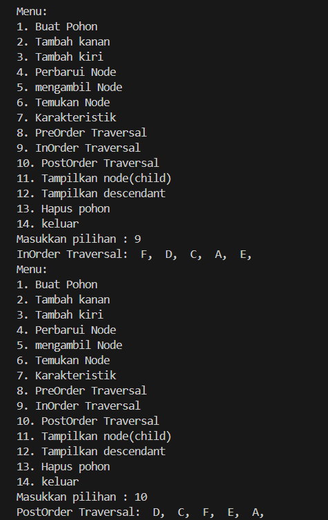
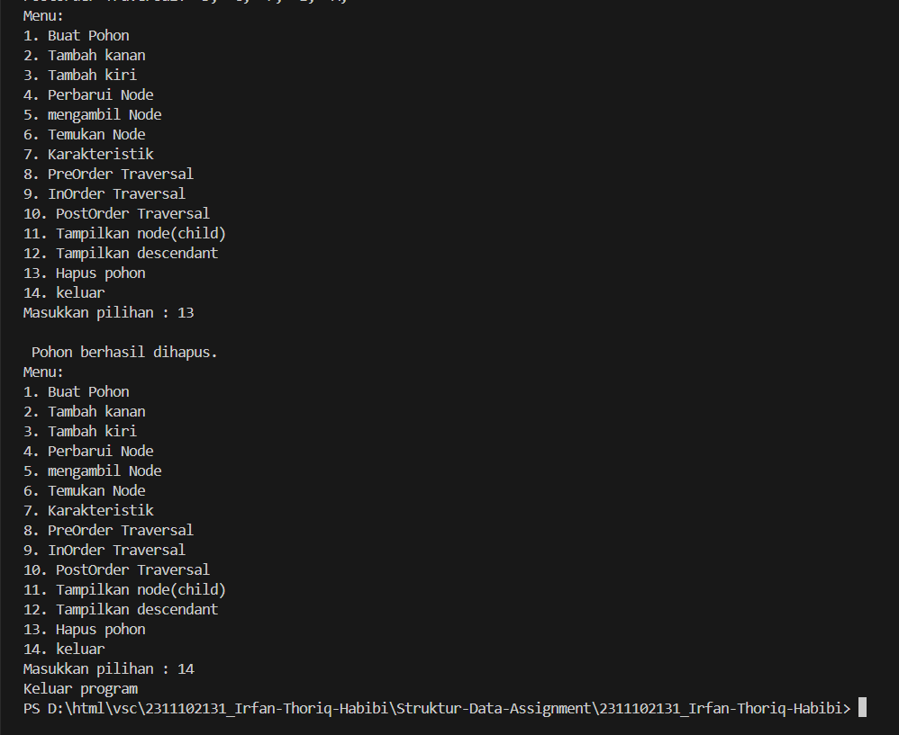

# <h1 align="center">Laporan Praktikum Modul GRAPH AND TREE</h1>
<p align="center">Irfan Thoriq Habibi - 2311102131</p>

## Dasar Teori
A. Pengertian Graph <br/>
Graf merupakan suatu perkumpulkan simpul (noktah) yang tersimpan pada bidang dua dimensi(2d) yang dihubungkan dengan sekumpulan sisi. Didalam graph terdapat suatu cabang ilmu yang didalamnya terdapat banyak terapan. Dengan menggunakan graph, banyak sekali struktur yang dapat direpresentasikan dan diselesaikan.<br/>
Graph memiliki bebecara macam cara untuk menyimpannya kedalam sistem komputer.Berikut ini merupakan beberapa cara dalam menyimpan graph ke dalam komputer antara lain :<br/>
1.Graph Tak Berarah<br/>
2.Graph Berarah<br/>
3.Graph Berbobot<br/>
B.Pengertian Tree<br/>
Tree merupakan suatu struktur data non linear yang digunakan untuk merepresentasikan habungan data yang bersifat hierarkis diantara elemen didalamnya. Didalam suatu Tree, terdapat elemen elemen yang salah satunya disebut sebagai root(akar) dan elemen lainnya disebut simpul (node) yang terpecah menjadi himpunan yang tidak memiliki hubungan sama sekali yang disebut subtree/cabang.<br/>
Adapun perbedaan Graph dengan Tree yakni (pada Tree tidak terdapat cycle) dan (pada graph tidak memiliki root (akar)).

## Guided 

### 1. [Program Graph]

```C++
/*
Irfan Thoriq Habibi - 2311102131
*/
#include <iostream>
#include <iomanip>

using namespace std;

string simpul [7] = {
    "ciamis", "bandung","bekasi","tasikmalaya","cianjur","purwokerto","yogyakarta"
};
int busur[7][7] = {
    {0,7,8,0,0,0,0},
    {0,0,5,0,0,15,0},
    {0,6,0,0,5,0,0},
    {0,5,0,0,2,4,0},
    {23,0,0,10,0,0,8},
    {0,0,0,0,7,0,3},
    {0,0,0,0,9,4,0}
};
void tampilGraph(){
    for (int baris=0; baris <7;baris++){
        cout << " "<< setiosflags(ios::left)<<setw(15)<<simpul[baris]<<" : ";
        for ( int kolom = 0;kolom<7;kolom++){
            if (busur[baris][kolom] !=0){
                cout << " "<<simpul[kolom]<<"("<< busur[baris][kolom]<<")"; 
            }
        }cout <<endl;
    }
}
int main(){
    tampilGraph();
    return 0;
}
```
program ini merupakan graph yang berfungsi untuk menampilkan jarak antara satu kota ke kota lainnya kota. setiap kota memiliki jarak yang berbeda dengan kota terdekatnya dan memiliki bobotnya masing-masing. 

### 2. [Program Tree]

```C++
/*
Irfan Thoriq Habibi - 2311102131
*/
#include <iostream>
#include <iomanip>
using namespace std;
struct Pohon
{
    char data;
    Pohon *left, *right, *parent;
};
Pohon *root, *baru;
void init()
{
    root = NULL;
}
bool isEmpty()
{
    return root == NULL;
}
void buatNode(char data)
{
    if (isEmpty())
    {
        root = new Pohon();
        root->data = data;
        root->left = NULL;
        root->right = NULL;
        root->parent = NULL;
        cout << "\n Node " << data << " berhasil dibuat sebagai root."
<< endl;
    }
    else
    {
        cout << "\n Tree sudah ada!" << endl;
    }
}
Pohon *insertLeft(char data, Pohon *node)
{
    if (isEmpty())
    {
        cout << "\n Buat tree terlebih dahulu!" << endl;
        return NULL;
    }
    else
    {
        if (node->left != NULL)
        {
            cout << "\n Node " << node->data << " sudah ada child kiri !" << endl; 
                return NULL;
        }
        else
        {
            Pohon *baru = new Pohon();
            baru->data = data;
            baru->left = NULL;
            baru->right = NULL;
            baru->parent = node;
            node->left = baru;
            cout << "\n Node " << data << " berhasil ditambahkan ke child kiri " << baru->parent->data << endl; 
                return baru;
        }
    }
}
Pohon *insertRight(char data, Pohon *node)
{
    if (isEmpty())
    {
        cout << "\n Buat tree terlebih dahulu!" << endl;
        return NULL;
    }
    else
    {
        if (node->right != NULL)
        {
            cout << "\n Node " << node->data << " sudah ada child kanan !" << endl; 
                return NULL;
        }
        else
        {
            Pohon *baru = new Pohon();
            baru->data = data;
            baru->left = NULL;
            baru->right = NULL;
            baru->parent = node;
            node->right = baru;
            cout << "\n Node " << data << " berhasil ditambahkan ke child kanan " << baru->parent->data << endl; 
                return baru;
        }
    }
}
void update(char data, Pohon *node)
{
    if (isEmpty())
    {
        cout << "\n Buat tree terlebih dahulu!" << endl;
    }
    else
    {
        if (!node)
        {
            cout << "\n Node yang ingin diganti tidak ada!!" << endl;
        }
        else
        {
            char temp = node->data;
            node->data = data;
            cout << "\n Node " << temp << " berhasil diubah menjadi "<< data << endl;
        }
    }
}
void retrieve(Pohon *node)
{
    if (isEmpty())
    {
        cout << "\n Buat tree terlebih dahulu!" << endl;
    }
    else
    {
        if (!node)
        {
            cout << "\n Node yang ditunjuk tidak ada!" << endl;
        }
        else
        {
            cout << "\n Data node : " << node->data << endl;
        }
    }
}
void find(Pohon *node)
{
    if (isEmpty())
    {
        cout << "\n Buat tree terlebih dahulu!" << endl;
    }
    else
    {
        if (!node)
        {
            cout << "\n Node yang ditunjuk tidak ada!" << endl;
        }
        else
        {
            cout << "\n Data Node : " << node->data << endl;
            cout << " Root : " << root->data << endl;

            if (!node->parent)
                cout << " Parent : (tidak punya parent)" << endl;
            else
                cout << " Parent : " << node->parent->data << endl;

            if (node->parent != NULL && node->parent->left != node &&
                node->parent->right == node)
                cout << " Sibling : " << node->parent->left->data << endl;
            else if (node->parent != NULL && node->parent->right != node && node->parent->left == node)
                cout << " Sibling : " << node->parent->right->data << endl;
            else
                cout << " Sibling : (tidak punya sibling)" << endl;

            if (!node->left)
                cout << " Child Kiri : (tidak punya Child kiri)" << endl;
            else
                cout << " Child Kiri : " << node->left->data << endl;

            if (!node->right)
                cout << " Child Kanan : (tidak punya Child kanan)" << endl;
            else
                cout << " Child Kanan : " << node->right->data << endl;
        }
    }
}

// Penelusuran (Traversal)
// preOrder
void preOrder(Pohon *node = root)
{
    if (isEmpty())
    {
        cout << "\n Buat tree terlebih dahulu!" << endl;
    }
    else
    {
        if (node != NULL)
        {
            cout << " " << node->data << ", ";
            preOrder(node->left);
            preOrder(node->right);
        }
    }
}
// inOrder
void inOrder(Pohon *node = root)
{
    if (isEmpty())
    {
        cout << "\n Buat tree terlebih dahulu!" << endl;
    }
    else
    {
        if (node != NULL)
        {
            inOrder(node->left);
            cout << " " << node->data << ", ";
            inOrder(node->right);
        }
    }
}

// postOrder
void postOrder(Pohon *node = root)
{
    if (isEmpty())
    {
        cout << "\n Buat tree terlebih dahulu!" << endl;
    }
    else
    {
        if (node != NULL)
        {
            postOrder(node->left);
            postOrder(node->right);
            cout << " " << node->data << ", ";
        }
    }
}
// Hapus Node Tree
void deleteTree(Pohon *node)
{
    if (isEmpty())
    {
        cout << "\n Buat tree terlebih dahulu!" << endl;
    }
    else
    {
        if (node != NULL)
        {
            if (node != root)
            {
                node->parent->left = NULL;
                node->parent->right = NULL;
            }
            deleteTree(node->left);
            deleteTree(node->right);
            if (node == root)
            {
                delete root;
                root = NULL;
            }
            else
            {
                delete node;
            }
        }
    }
}
// Hapus SubTree
void deleteSub(Pohon *node)
{
    if (isEmpty())
    {
        cout << "\n Buat tree terlebih dahulu!" << endl;
    }
    else
    {
        deleteTree(node->left);
        deleteTree(node->right);
        cout << "\n Node subtree " << node->data << " berhasil dihapus." << endl; 
    }
}
// Hapus Tree
void clear()
{
    if (isEmpty())
    {
        cout << "\n Buat tree terlebih dahulu!!" << endl;
    }
    else
    {
        deleteTree(root);
        cout << "\n Pohon berhasil dihapus." << endl;
    }
}

// Cek Size Tree
int size(Pohon *node = root)
{
    if (isEmpty())
    {
        cout << "\n Buat tree terlebih dahulu!!" << endl;
        return 0;
    }
    else
    {
        if (!node)
        {
            return 0;
        }
        else
        {
            return 1 + size(node->left) + size(node->right);
        }
    }
}
// Cek Height Level Tree
int height(Pohon *node = root)
{
    if (isEmpty())
    {
        cout << "\n Buat tree terlebih dahulu!" << endl;
        return 0;
    }
    else
    {
        if (!node)
        {
            return 0;
        }
        else
        {
            int heightKiri = height(node->left);
            int heightKanan = height(node->right);
            if (heightKiri >= heightKanan)
            {
                return heightKiri + 1;
            }
            else
            {
                return heightKanan + 1;
            }
        }
    }
}
// Karakteristik Tree
void characteristic()
{
    cout << "\n Size Tree : " << size() << endl;
    cout << " Height Tree : " << height() << endl;
    cout << " Average Node of Tree : " << size() / height() << endl;
}

int main()
{
    buatNode('A');
    Pohon *nodeB, *nodeC, *nodeD, *nodeE, *nodeF, *nodeG, *nodeH, *nodeI, *nodeJ;
    
    nodeB = insertLeft('B', root),
    nodeC =  insertRight('C', root),
    nodeD = insertLeft('D', nodeB), 
    nodeE = insertRight('E', nodeB), 
    nodeF = insertLeft('F', nodeC), 
    nodeG = insertLeft('G', nodeE), 
    nodeH = insertRight('H', nodeE),
    nodeI = insertLeft('I', nodeG), 
    nodeJ = insertRight('J', nodeG);

    update('Z', nodeC);
    update('C', nodeC);

    retrieve(nodeC);

    find(nodeC);

    characteristic();

    cout << "PreOrder : " << endl;
    preOrder(root);
    cout << "\n" << endl;

    cout << "InOrder : " << endl;
    inOrder(root);
    cout << "\n" << endl;

    cout << "PostOrder : " << endl;
    postOrder(root);
    cout << "\n" << endl;

    return 0;
}
```
Program di atas merupakan struktur data pohon biner dalam C++. Program ini memiliki berbagai fungsi untuk mengelola dan menelusuri pohon biner, termasuk penambahan node, pembaruan data node, penelusuran (traversal), dan pengecekan karakteristik pohon. program ini juga menampilkan data PreOreder,InOrder,dan PostOrder didalamnya.
## Unguided 

### 1. [Buatlah program graph dengan menggunakan inputan user untuk menghitung 
jarak dari sebuah kota ke kota lainnya.]

```C++
/*
Irfan Thoriq Habibi - 2311102131
*/
#include <iostream>
#include <iomanip>
#include <vector>

using namespace std;

int main() {
  // Menentukan jumlah simpul
  int jumlahSimpul_131;
  cout << "Silakan masukkan jumlah simpul: ";
  cin >> jumlahSimpul_131;

  // Membuat vektor untuk menyimpan nama simpul
  vector<string> namaSimpul_131(jumlahSimpul_131);

  // Memasukkan nama simpul
    cout << "Silahkan masukan nama simpul "<<endl;
    for (int i = 0; i < jumlahSimpul_131; i++) {
    cout << "simpul " << i + 1 << ": ";
    cin >> namaSimpul_131[i];
  }

  // Membuat matriks untuk menyimpan bobot antar simpul
  vector<vector<int>> bobotSimpul_131(jumlahSimpul_131, vector<int>(jumlahSimpul_131));

  // Memasukkan bobot antar simpul
  cout << "Silahkan masukan bobot antar simpul " << endl;
  for (int i = 0; i < jumlahSimpul_131; i++) {
    for (int j = 0; j < jumlahSimpul_131; j++) {
      cout << namaSimpul_131[i] << " -> " << namaSimpul_131[j] << ": ";
      cin >> bobotSimpul_131[i][j];
    }
  }

  cout<<endl;
  // Menampilkan header baris
  cout << setw(8) << " ";
  for (int i = 0; i < jumlahSimpul_131; i++) {
    cout << setw(8) << namaSimpul_131[i];
  }
  cout << endl;
  // Menampilkan isi matriks
  for (int i = 0; i < jumlahSimpul_131; i++) {
    cout << setw(8) << namaSimpul_131[i];
    for (int j = 0; j < jumlahSimpul_131; j++) {
      cout << setw(8) << bobotSimpul_131[i][j];
    }
    cout << endl;
  }

  return 0;
}

```
#### Output:


Berikut ini merupakan program graph yang berfungsi untuk menampilkan. hasil matriks dari data yang telah diinputkan oleh user. disini user menginputkan 2 simpul dengan nama BALI pada simpul 1 dan PALU di simpul 2. Lalu user menginputkan bobot diantara simpul sehingga program akan menampilkan matriks dari setiap bobot yang diinputkan oleh user.

### 2. [ Modifikasi guided tree diatas dengan program menu menggunakan input data tree dari user dan berikan fungsi tambahan untuk menampilkan node child dan descendant dari node yang diinput kan!]

```C++
/*
Irfan Thoriq Habibi - 2311102131
*/
#include <iostream>
#include <iomanip>
using namespace std;

struct Pohon{
    char data;
    Pohon *left, *right, *parent;
};
Pohon *root, *baru;

// Inisialisasi tree(pohon)
void init_131(){
    root = NULL;
}
// Cek apakah tree kosong
bool isEmpty_131(){
    return root == NULL;
}
// Buat node root(akar)
void buatNode_131(char data){
    if (isEmpty_131()){
        root = new Pohon();
        root->data = data;
        root->left = NULL;
        root->right = NULL;
        root->parent = NULL;
        cout << "\n Node " << data << " berhasil dibuat sebagai root." << endl;
    }else{
        cout << "\n Tree telah tersedia!" << endl;
    }
}
// Tambah node child di sebelah kiri
Pohon *insertLeft_131(char data, Pohon *node){
    if (isEmpty_131()){
        cout << "\n Buat tree terlebih dahulu!" << endl;
        return NULL;
    }else{
        if (node->left != NULL){
            cout << "\n Node " << node->data << " sudah ada child kiri!" << endl;
            return NULL;
        }else{
            Pohon *baru = new Pohon();
            baru->data = data;
            baru->left = NULL;
            baru->right = NULL;
            baru->parent = node;
            node->left = baru;
            cout << "\n Node " << data << " berhasil ditambahkan ke child  bagian kiri " << baru->parent->data << endl;
            return baru;
        }
    }
}
// Tambah node child di sebelah kanan
Pohon *insertRight_131(char data, Pohon *node){
    if (isEmpty_131()){
        cout << "\n Buat tree terlebih dahulu!" << endl;
        return NULL;
    }else{
        if (node->right != NULL){
            cout << "\n Node " << node->data << " sudah ada child kanan!" << endl;
            return NULL;
        }else{
            Pohon *baru = new Pohon();
            baru->data = data;
            baru->left = NULL;
            baru->right = NULL;
            baru->parent = node;
            node->right = baru;
            cout << "\n Node " << data << " berhasil ditambahkan ke child bagian kanan " << baru->parent->data << endl;
            return baru;
        }
    }
}
// Update nilai pada node
void update_131(char data, Pohon *node){
    if (isEmpty_131()){
        cout << "\n Buat tree terlebih dahulu!" << endl;
    }else{
        if (!node){
            cout << "\n Node yang ingin diganti tidak ada!!" << endl;
        }else{
            char temp = node->data;
            node->data = data;
            cout << "\n Node " << temp << " berhasil diubah menjadi " << data << endl;
        }
    }
}
// Ambil nilai dari sebuah node
void retrieve_131(Pohon *node){
    if (isEmpty_131()){
        cout << "\n Buat tree terlebih dahulu!" << endl;
    }else{
        if (!node){
            cout << "\n Node yang ditunjuk tidak ada!" << endl;
        }else{
            cout << "\n Data node: " << node->data << endl;
        }
    }
}
// Temukan dan tampilkan informasi sebuah node
void find_131(Pohon *node){
    if (isEmpty_131()){
        cout << "\n Buat tree terlebih dahulu!" << endl;
    }else{
        if (!node){
            cout << "\n Node yang ditunjuk tidak ada!" << endl;
        }else{
            cout << "\n Data Node: " << node->data << endl;
            cout << " Root: " << root->data << endl;

            if (!node->parent)
                cout << " Parent: (tidak punya parent)" << endl;
            else
                cout << " Parent: " << node->parent->data << endl;
            if (node->parent != NULL && node->parent->left != node && node->parent->right == node)
                cout << " Sibling: " << node->parent->left->data << endl;
            else if (node->parent != NULL && node->parent->right != node && node->parent->left == node)
                cout << " Sibling: " << node->parent->right->data << endl;
            else
                cout << " Sibling: (tidak punya sibling)" << endl;
            if (!node->left)
                cout << " Child Kiri: (tidak punya Child kiri)" << endl;
            else
                cout << " Child Kiri: " << node->left->data << endl;
            if (!node->right)
                cout << " Child Kanan: (tidak punya Child kanan)" << endl;
            else
                cout << " Child Kanan: " << node->right->data << endl;
        }
    }
}
// PreOrder traversal
void preOrder_131(Pohon *node){
    if (isEmpty_131()){
        cout << "\n Buat tree terlebih dahulu!" << endl;
    }else{
        if (node != NULL){
            cout << " " << node->data << ", ";
            preOrder_131(node->left);
            preOrder_131(node->right);
        }
    }
}
// InOrder traversal
void inOrder_131(Pohon *node){
    if (isEmpty_131()){
        cout << "\n Buat tree terlebih dahulu!" << endl;
    }else{
        if (node != NULL){
            inOrder_131(node->left);
            cout << " " << node->data << ", ";
            inOrder_131(node->right);
        }
    }
}
// PostOrder traversal
void postOrder_131(Pohon *node){
    if (isEmpty_131()){
        cout << "\n Buat tree terlebih dahulu!" << endl;
    }else{
        if (node != NULL){
            postOrder_131(node->left);
            postOrder_131(node->right);
            cout << " " << node->data << ", ";
        }
    }
}
// Hapus tree(pohon) dan semua nodenya
void deleteTree_131(Pohon *node){
    if (isEmpty_131()){
        cout << "\n Buat tree terlebih dahulu!" << endl;
    }else{
        if (node != NULL){
            if (node != root){
                node->parent->left = NULL;
                node->parent->right = NULL;
            }
            deleteTree_131(node->left);
            deleteTree_131(node->right);
            if (node == root){
                delete root;
                root = NULL;
            }else{
                delete node;
            }
        }
    }
}
// Hapus subtree dari sebuah node
void deleteSub_131(Pohon *node){
    if (isEmpty_131()){
        cout << "\n Buat tree terlebih dahulu!" << endl;
    }else{
        deleteTree_131(node->left);
        deleteTree_131(node->right);
        cout << "\n Node subtree " << node->data << " berhasil dihapus." << endl;
    }
}
// Hapus seluruh pohon
void clear(){
    if (isEmpty_131()){
        cout << "\n Buat tree terlebih dahulu!" << endl;
    }else{
        deleteTree_131(root);
        cout << "\n Pohon berhasil dihapus." << endl;
    }
}
// Menghitung jumlah node dalam pohon
int size(Pohon *node){
    if (isEmpty_131()){
        cout << "\n Buat tree terlebih dahulu!" << endl;
        return 0;
    }else{
        if (!node){
            return 0;
        }else{
            return 1 + size(node->left) + size(node->right);
        }
    }
}
// Menghitung tinggi pohon
int height(Pohon *node){
    if (isEmpty_131()){
        cout << "\n Buat tree terlebih dahulu!" << endl;
        return 0;
    }else{
        if (!node){
            return 0;
        }else{
            int heightKiri = height(node->left);
            int heightKanan = height(node->right);
            if (heightKiri >= heightKanan){
                return heightKiri + 1;
            }else{
                return heightKanan + 1;
            }
        }
    }
}
// Menampilkan karakteristik dari pohon
void characteristic_131(){
    cout << "\n ukuran pohon: " << size(root) << endl;
    cout << " tinggi pohon: " << height(root) << endl;
    cout << " Rata-rata node pohon: " << size(root) / height(root) << endl;
}
// Menampilkan child node
void displayChildren_131(Pohon *node){
    if (isEmpty_131()){
        cout << "\n Buat tree terlebih dahulu!" << endl;
    }else if (!node){
        cout << "\n Node yang ditunjuk tidak ada!" << endl;
    }else{
        if (node->left)
            cout << " Child Kiri: " << node->left->data << endl;
        else
            cout << " Child Kiri: (tidak punya Child kiri)" << endl;
        if (node->right)
            cout << " Child Kanan: " << node->right->data << endl;
        else
            cout << " Child Kanan: (tidak punya Child kanan)" << endl;
    }
}

// Menampilkan turunan(descendant) dari sebuah node
void displayDescendants_131(Pohon *node){
    if (isEmpty_131()){
        cout << "\n Buat tree terlebih dahulu!" << endl;
    }else if (!node){
        cout << "\n Node yang ditunjuk tidak ada!" << endl;
    }else{
        cout << " Keturunan dari " << node->data << ": ";
        preOrder_131(node);
        cout << endl;
    }
}
// Mencari dan mengembalikan node dengan nilai tertentu
Pohon *findNode(Pohon *node, char data){
    if (node == NULL)
        return NULL;
    if (node->data == data)
        return node;

    Pohon *leftNode = findNode(node->left, data);
    if (leftNode != NULL)
        return leftNode;

    return findNode(node->right, data);
}

int main(){
    init_131();
    int pilih_131;
    char data_131;
    Pohon *node = nullptr;
    do{
        cout << "Menu:"<<endl;
        cout << "1. Buat Pohon"<<endl;
        cout << "2. Tambah kanan"<<endl;
        cout << "3. Tambah kiri"<<endl;
        cout << "4. Perbarui Node"<<endl;
        cout << "5. mengambil Node"<<endl;
        cout << "6. Temukan Node"<<endl;
        cout << "7. Karakteristik"<<endl;
        cout << "8. PreOrder Traversal"<<endl;;
        cout << "9. InOrder Traversal"<<endl;
        cout << "10. PostOrder Traversal"<<endl;
        cout << "11. Tampilkan node(child)"<<endl;
        cout << "12. Tampilkan descendant"<<endl;
        cout << "13. Hapus pohon"<<endl;
        cout << "14. keluar"<<endl;
        cout << "Masukkan pilihan : ";
        cin >> pilih_131;
        switch (pilih_131){
        case 1:
            cout << "Masukkan root: ";
            cin >> data_131;
            buatNode_131(data_131);
            break;
        case 2:
            cout << "Masukkan data node baru: ";
            cin >> data_131;
            cout << "Masukkan data parent baru: ";
            char parentDataRight;
            cin >> parentDataRight;
            node = findNode(root, parentDataRight);
            if (node != nullptr)
                insertRight_131(data_131, node);
            break;
        case 3:
            cout << "Masukkan data node baru: ";
            cin >> data_131;
            cout << "Masukkan data parent baru: ";
            char parentDataLeft;
            cin >> parentDataLeft;
            node = findNode(root, parentDataLeft);
            if (node != nullptr)
                insertLeft_131(data_131, node);
            break;
        case 4:
            cout << "Masukan data yang ingin diubah: ";
            cin >> data_131;
            cout << "Masukkan node baru: ";
            char newData;
            cin >> newData;
            node = findNode(root, data_131);
            if (node != nullptr)
                update_131(newData, node);
            break;
        case 5:
            cout << "Masukan data yang akan diambil: ";
            cin >> data_131;
            node = findNode(root, data_131);
            retrieve_131(node);
            break;
        case 6:
            cout << "Masukkan data yang akan ditemukan: ";
            cin >> data_131;
            node = findNode(root, data_131);
            find_131(node);
            break;
        case 7:
            characteristic_131();
            break;
        case 8:
            cout << "PreOrder Traversal: ";
            preOrder_131(root);
            cout << endl;
            break;
        case 9:
            cout << "InOrder Traversal: ";
            inOrder_131(root);
            cout << endl;
            break;
        case 10:
            cout << "PostOrder Traversal: ";
            postOrder_131(root);
            cout << endl;
            break;
        case 11:
            cout << "Masukkan data untuk menampilkan node(child): ";
            cin >> data_131;
            node = findNode(root, data_131);
            displayChildren_131(node);
            break;
        case 12:
            cout << "Masukkan data untuk menampilkan descendant: ";
            cin >> data_131;
            node = findNode(root, data_131);
            displayDescendants_131(node);
            break;
        case 13:
            clear();
            break;
        case 14:
            cout << "Keluar program" << endl;
            break;
        default:
            cout << "pilihan tidak tersedia" << endl;
        }
    } while (pilih_131 != 14);

    return 0;
}
```
#### Output:
<br/>
membuat root A dan membuat node baru B(kiri) dengan parent A<br/>
<br/>
membuat node baru C(kanan) dengan parent B dan membuat node baru D (kiri) dengan parent C<br/>
<br/>
membuat node baru E(kanan)dengan parent A dan membuat node baru F (kanan) dengan parent B ( tetapi node B sudah ada child kanan)<br/>
<br/>
mengubah data B menjadi F dan mengambil data F<br/>
<br/>
menemukan Node A (yang telah terisi data)<br/>
<br/>
menampilkan Node A (kiri ada F dan kanan ada E) dan menampilkan descendent (keturunan)dari A (A,F,C,D,E)<br/>
<br/>
menampilkan karakteristik dari pohon dan menampilkan preOrder Tranversal (A,F,C,D,E)<br/>
<br/>
menampilkan inOrder (F,C,D,A,E)dan postOrder (D,C,F,E,A)<br/>
<br/>
menghapus pohon dan keluar dari program<br/>

program ini merupakan modifikasi dari guided 2 yang mana pada unguided 2 ini program telah ditambahkan menu serta menambahkan menu menampilkan node (child) dan descendant pada menu. jadi di program ini user hanya perlu memilih menu yang tersedia (jika di guided user harus mengedit pada int main()). untuk penjelasan fitur pada menu telah dijelaskan pada setiap gambar

## Kesimpulan
Graph merupakan struktur data yang didalamnya terdiri dari simpul dan sisi. Tree merupakan jenis khusus graph yang tidak terdapat siklus didalamnya.meskipun mirip, keduanya memiliki perbedaan yakni pada Tree tidak terdapat cycle dan pada graph tidak memiliki root (akar).[1].

## Referensi
[1] Triase, Triase. "Struktur Data: Diktat Edisi Revisi." (2020).<br/>
[2] Nugraha, Wahyu, Muhamad Syarif, and Raja Sabaruddin. "ANALISA MODEL POHON DAN GRAF PADA GAME PERFECT WORLD 2 ONLINE." JTIK (Jurnal Teknik Informatika Kaputama) 5.1 (2021): 1-8.